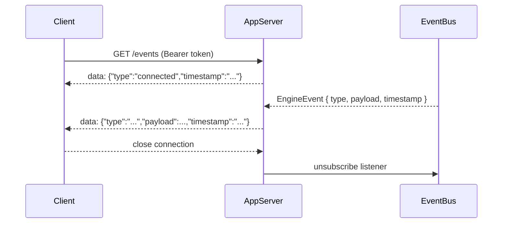

# Daycare App API

Date: 2026-03-01

## Overview
Authenticated requests require:

`Authorization: Bearer <token>`

Response envelope convention:
- Success: `{ ok: true, ... }`
- Failure: `{ ok: false, error: string }`

## API Flow
```mermaid
flowchart TD
    A[App Client] --> B[AppServer.requestHandle]
    B --> C[appAuthExtract]
    C --> D[ctx = contextForUser]

    D --> E[/events SSE]
    D --> F[apiRouteHandle]

    F --> G[/profile]
    F --> H[/agents]
    F --> I[/tasks]
    F --> J[/skills]
    F --> K[/documents]
    F --> L[/prompts]
    F --> M[/costs]
```

## SSE Lifecycle


## Auth Routes
- `POST /auth/validate`
- `POST /auth/refresh`
- `POST /auth/telegram`

Example:
```json
{ "token": "<jwt>" }
```

## Profile Routes
- `GET /profile`
- `POST /profile/update`

`GET /profile` response:
```json
{
    "ok": true,
    "profile": {
        "firstName": "Ada",
        "lastName": "Lovelace",
        "bio": null,
        "about": null,
        "country": "UK",
        "timezone": "Europe/London",
        "systemPrompt": null,
        "memory": true,
        "nametag": "ada"
    }
}
```

`POST /profile/update` body (all optional):
```json
{
    "firstName": "Ada",
    "lastName": null,
    "bio": "Short bio",
    "about": "More about me",
    "country": "UK",
    "timezone": "Europe/London",
    "systemPrompt": "Be concise.",
    "memory": true
}
```

## Agent Routes
- `GET /agents`
- `GET /agents/:id/history?limit=N`
- `POST /agents/:id/message`

`POST /agents/:id/message` body:
```json
{ "text": "Summarize yesterday's updates" }
```

## Events Route
- `GET /events` (SSE)

Event frame format:
```text
data: {"type":"connected","timestamp":"2026-03-01T12:00:00.000Z"}

data: {"type":"agent.created","payload":{"agentId":"a1"},"timestamp":"2026-03-01T12:00:05.000Z"}

```

## Task Routes
- `GET /tasks/active`
- `POST /tasks/create`
- `GET /tasks/:id`
- `POST /tasks/:id/update`
- `POST /tasks/:id/delete`
- `POST /tasks/:id/run`
- `POST /tasks/:id/triggers/add`
- `POST /tasks/:id/triggers/remove`

Create body:
```json
{
    "title": "Morning report",
    "code": "print('generate report')",
    "description": "Daily report",
    "parameters": [
        { "name": "team", "type": "string", "nullable": false }
    ]
}
```

Run body:
```json
{
    "agentId": "optional-agent-id",
    "parameters": { "team": "core" },
    "sync": true
}
```

Trigger add body:
```json
{
    "type": "cron",
    "schedule": "0 9 * * 1-5",
    "timezone": "America/New_York",
    "agentId": "optional-agent-id",
    "parameters": { "team": "core" }
}
```

Trigger remove body:
```json
{ "type": "cron" }
```

## Skills Routes
- `GET /skills`
- `GET /skills/:id/content`

`GET /skills` response (example):
```json
{
    "ok": true,
    "skills": [
        {
            "id": "user:my-skill",
            "name": "My Skill",
            "description": "Custom helper",
            "sandbox": true,
            "permissions": ["@read:/tmp"],
            "source": "user"
        }
    ]
}
```

`GET /skills/:id/content` response:
```json
{
    "ok": true,
    "skill": {
        "id": "user:my-skill",
        "name": "My Skill",
        "description": "Custom helper"
    },
    "content": "# My Skill\n..."
}
```

## Document Routes
- `GET /documents/tree`
- `GET /documents/:id`
- `POST /documents`
- `PUT /documents/:id`
- `DELETE /documents/:id`

## Prompt Routes
- `GET /prompts`
- `GET /prompts/:filename`
- `PUT /prompts/:filename`

Allowed prompt filenames: `SOUL.md`, `USER.md`, `AGENTS.md`, `TOOLS.md`.

## Costs Routes
- `GET /costs/token-stats?from=<ms>&to=<ms>&agentId=<id>&model=<name>&limit=<n>`

## Public Webhook Route
- `POST /v1/webhooks/:token`

This route is token-authenticated via the signed path token and does not require Bearer auth.
