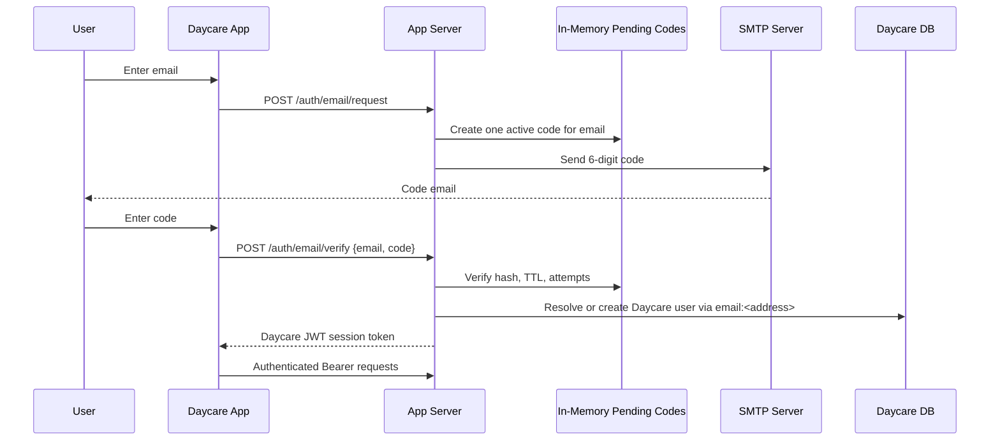
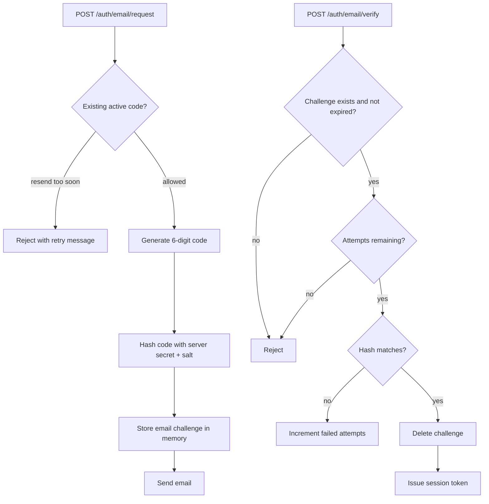
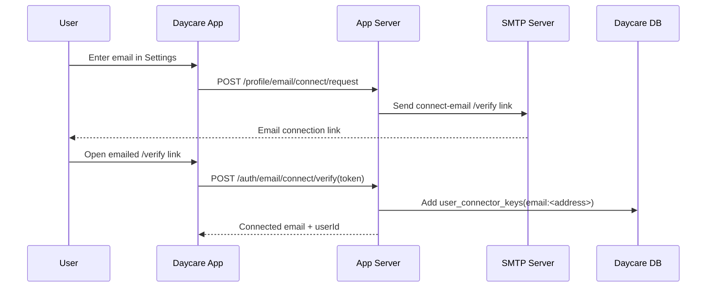

# Email Auth Codes

This change replaces email magic-link sign-in with six-digit email codes while keeping the existing Daycare JWT session model for authenticated API access.

## Sign-In Flow

## Challenge State

Pending email codes live only in app-server memory. Each email address has at most one active code.

## Security Notes

- Codes are always six digits and never start with `0`.
- Pending codes are stored hashed in memory, not in the database and not as plaintext.
- Only one code stays active per email; a new request replaces the prior code.
- Verification enforces expiration, resend throttling, and bounded failed attempts.
- Server restarts clear pending codes, so users must request a new code after a restart.

## Connect Existing Account Email

Authenticated users still connect additional emails through a short-lived `/verify` link because that flow links an address to an already-authenticated account rather than signing in.

