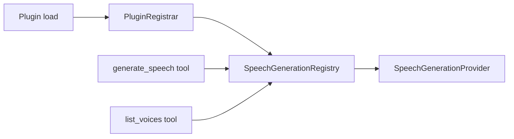
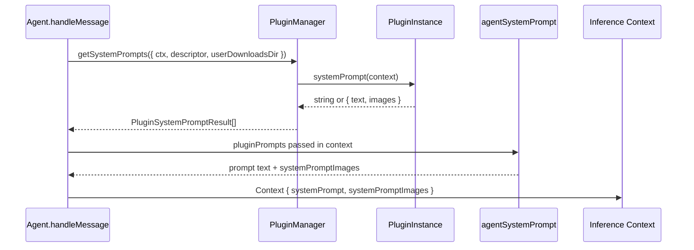
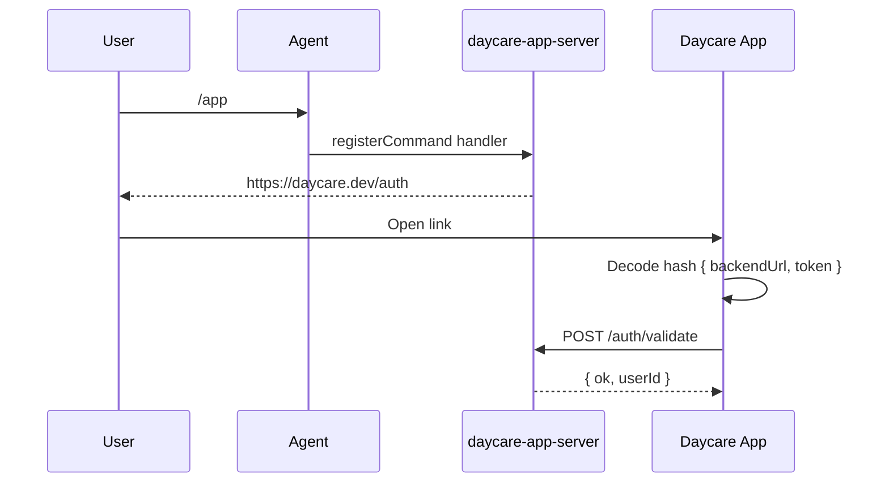

# Plugins

This file documents plugin development notes that are relevant to runtime behavior changes.
For full plugin API details, see [internals/plugins.md](./internals/plugins.md).

## Plugin Skill Registration

Plugins register skills by absolute `SKILL.md` path via `registerSkill(path)`.

At runtime, registered plugin skills are:

1. Listed with all other skill sources in `Skills.list()`
2. Assigned an activation key from `skill.id`
3. Copied into per-user active runtime storage:
   `users/<userId>/skills/active/<activationKey>/SKILL.md`
4. Exposed in Docker at `/shared/skills/<activationKey>` through a read-only bind mount

```mermaid
flowchart LR
    P[Plugin registerSkill] --> L[Skills.list]
    L --> K[activationKey from skill.id]
    K --> A[skills/active/<activationKey>]
    A --> D[/shared/skills mount ro]
```

## Plugin Speech Registration

Plugins can register speech providers via `registerSpeechProvider(provider)` and remove them with `unregisterSpeechProvider(id)`.

`generate_speech` resolves providers from `SpeechGenerationRegistry`, and `list_voices` queries optional voice discovery support.



## Plugin Media Analysis Registration

Plugins can register multi-modal file analyzers via `registerMediaAnalysisProvider(provider)`.

Each provider declares `supportedTypes` (`image`, `video`, `audio`, `pdf`), and core `media_analyze` tool routing uses these capabilities.

```mermaid
flowchart LR
    Plugin[Plugin load] --> Registrar[PluginRegistrar]
    Registrar --> Registry[MediaAnalysisRegistry]
    Tool[media_analyze tool] --> Registry
    Registry --> Provider[MediaAnalysisProvider analyze()]
```

## Plugin System Prompt Context

Plugins can provide dynamic system prompt fragments via `PluginInstance.systemPrompt`.

- `systemPrompt` may be a static string or function:
  `(context: PluginSystemPromptContext) => Promise<string | PluginSystemPromptResult | null> | string | PluginSystemPromptResult | null`
- `PluginSystemPromptContext` includes:
  - `ctx` (user-scoped runtime context)
  - `descriptor` (current agent descriptor, when available)
  - `userDownloadsDir` (absolute path to user-visible downloads folder)
- `PluginSystemPromptResult` includes:
  - `text` (markdown/text prompt fragment)
  - `images` (optional absolute image paths for multimodal system prompt context)



## Daycare App Server Plugin

The `daycare-app-server` plugin exposes app authentication and static app hosting directly from the runtime.

- Registers `app_auth_link` tool for user-scoped magic links.
- Registers `/app` slash command to send a direct launch URL.
- Supports `appEndpoint` (default `https://daycare.dev`) and optional `serverEndpoint` endpoint settings for split app/backend link targets.
- Verifies JWTs through `POST /auth/validate`.
- Proxies `/api/*` requests to the engine unix socket.
- Serves static SPA assets from `packages/daycare-app/dist` (or `web-build`) with path traversal guards.


