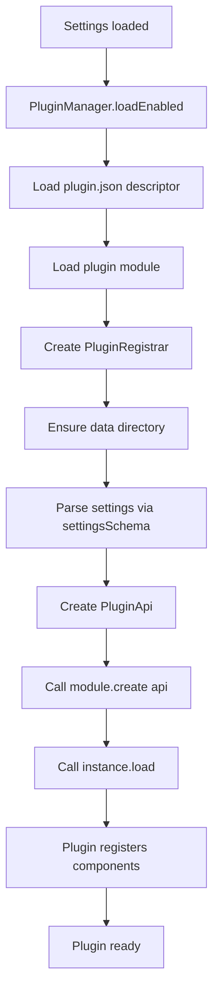
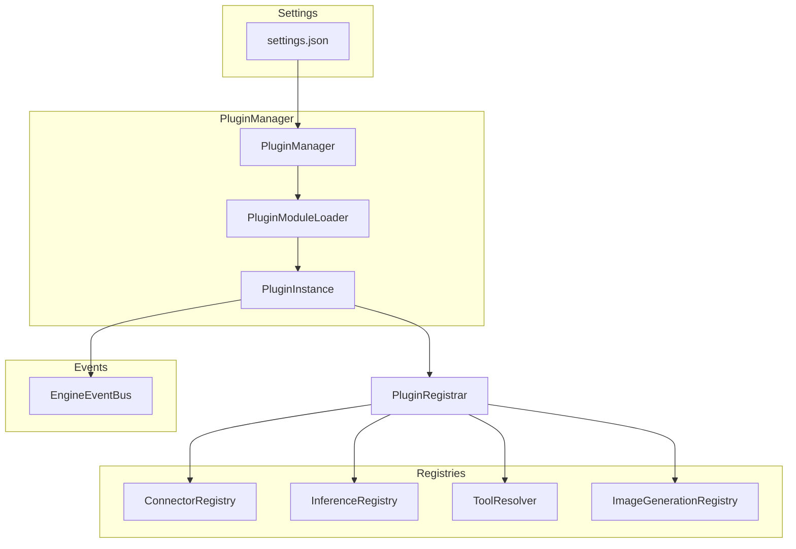

# Claybot Plugin Development Guide

This guide explains how to write plugins for Claybot and how the plugin system works.

## Overview

Plugins are first-class runtime modules that extend Claybot's functionality. They execute in the same Node.js process as the engine (no VM isolation), so module caches and globals are shared. Treat plugins as trusted code.

Plugins can register:
- **Connectors** - Bridge messaging platforms (Telegram, Discord, etc.)
- **Tools** - Functions callable by the LLM
- **Inference Providers** - Custom LLM backends
- **Image Providers** - Image generation backends

## Plugin Structure

Each plugin lives in its own folder under `sources/plugins/`:

```
plugins/<plugin-id>/
├── plugin.json           # Plugin descriptor (metadata)
├── README.md             # Implementation documentation (required)
└── sources/              # All implementation code
    ├── plugin.ts         # Main entry point
    ├── plugin.spec.ts    # Tests (live next to source)
    └── *.ts              # Additional modules (tools, connectors, etc.)
```

Implementation files and tests must be kept in the `sources/` subfolder. This keeps the plugin root clean with only metadata and documentation.

## Plugin Descriptor (`plugin.json`)

Every plugin requires a JSON descriptor:

```json
{
  "id": "my-plugin",
  "name": "My Plugin",
  "description": "Brief description of what the plugin does.",
  "entry": "./sources/plugin.js",
  "exclusive": false
}
```

| Field | Type | Required | Description |
|-------|------|----------|-------------|
| `id` | string | yes | Unique plugin identifier |
| `name` | string | yes | Display name |
| `description` | string | yes | Brief explanation |
| `entry` | string | yes | Path to compiled entry point |
| `exclusive` | boolean | no | When `true`, only this plugin can be enabled; exclusive plugins always use bare `id` as `instanceId` |

## Plugin Module

The entry point (`sources/plugin.ts`) exports a `PluginModule` using the `definePlugin()` helper:

```typescript
import { definePlugin } from "../../../engine/plugins/types.js";
import { z } from "zod";

const settingsSchema = z.object({
  myOption: z.string().optional()
}).passthrough();

export const plugin = definePlugin({
  settingsSchema,
  onboarding: async (api) => {
    // Optional: interactive setup wizard
  },
  create: (api) => {
    // Required: create plugin instance
    return {
      load: async () => { /* register components */ },
      unload: async () => { /* cleanup */ },
      systemPrompt: "Optional prompt injected into LLM context"
    };
  }
});
```

### PluginModule Interface

```typescript
type PluginModule<TSettings> = {
  settingsSchema: ZodType<TSettings>;
  create: (api: PluginApi<TSettings>) => PluginInstance | Promise<PluginInstance>;
  onboarding?: (api: PluginOnboardingApi) => Promise<PluginOnboardingResult | null>;
};
```

### PluginInstance Interface

```typescript
type PluginInstance = {
  load?: () => Promise<void>;
  unload?: () => Promise<void>;
  systemPrompt?: (() => Promise<string | null> | string | null) | string | null;
};
```

## Plugin API

Each plugin receives a `PluginApi` object in its `create()` function:

```typescript
type PluginApi<TSettings> = {
  instance: PluginInstanceSettings;      // { instanceId, pluginId, enabled }
  settings: TSettings;                    // Validated settings for this instance
  engineSettings: SettingsConfig;         // Full engine configuration
  logger: Logger;                         // Per-plugin pino logger
  auth: AuthStore;                        // Credentials storage
  dataDir: string;                        // Plugin's data directory
  registrar: PluginRegistrar;             // Component registration
  fileStore: FileStore;                   // Shared file storage
  inference: PluginInference;             // LLM inference API
  mode: "runtime" | "validate";           // Execution context
  engineEvents?: EngineEventBus;          // Engine event bus
  events: { emit: (event: PluginEventInput) => void };
};
```

### Key API Members

#### `auth` - Credentials Storage

```typescript
await api.auth.setApiKey(api.instance.instanceId, "my-api-key");
const key = await api.auth.getApiKey(api.instance.instanceId);

await api.auth.setToken(id, token);
const token = await api.auth.getToken(id);
```

Credentials are stored in `.claybot/auth.json` (mode `0o600`).

#### `dataDir` - Plugin Data Directory

Each plugin instance gets exclusive storage at `.claybot/plugins/<instanceId>/`. Use this for databases, state files, or any persistent data.

#### `inference` - LLM Inference

Run inference without tools:

```typescript
const result = await api.inference.complete({
  systemPrompt: "You are a helpful assistant.",
  messages: [{ role: "user", content: "Hello" }],
  providerId: "openai",           // optional
  strategy: "small"               // optional: "default" | "small" | "normal" | "large"
});
```

Strategies:
- `default` - Use provider defaults from settings
- `small` - Prefer smallest model; fall back to normal, then large
- `normal` - Prefer normal model; fall back to large, then small
- `large` - Prefer largest model; fall back to normal, then small

#### `events` - Plugin Events

```typescript
api.events.emit({
  type: "my_event",
  payload: { data: "value" }
});
```

Events are emitted immediately with metadata (`id`, `pluginId`, `instanceId`, `createdAt`)
and forwarded to the engine event bus.

#### `mode` - Execution Context

- `"runtime"` - Normal operation
- `"validate"` - Testing/validation (during `claybot add`)

Skip expensive operations in validate mode:

```typescript
if (api.mode === "validate") {
  return;
}
```

## Registrar API

The `PluginRegistrar` is the gateway for registering components:

```typescript
type PluginRegistrar = {
  // Connectors
  registerConnector(id: string, connector: Connector): void;
  unregisterConnector(id: string): Promise<void>;

  // Inference Providers
  registerInferenceProvider(provider: InferenceProvider): void;
  unregisterInferenceProvider(id: string): void;

  // Tools
  registerTool(definition: ToolDefinition): void;
  unregisterTool(name: string): void;

  // Image Providers
  registerImageProvider(provider: ImageGenerationProvider): void;
  unregisterImageProvider(id: string): void;

  // Skills
  registerSkill(path: string): void; // SKILL.md must follow the Agent Skills specification.
  unregisterSkill(path: string): void;

  // Cleanup all registrations
  unregisterAll(): Promise<void>;
};
```

All registrations are automatically cleaned up when the plugin unloads.

---

## Module Types

### Connectors

Connectors bridge external messaging platforms and the engine. They normalize incoming messages and handle outgoing responses.

```typescript
interface Connector {
  capabilities: ConnectorCapabilities;
  onMessage(handler: MessageHandler): MessageUnsubscribe;
  onPermission?: (handler: PermissionHandler) => MessageUnsubscribe;
  sendMessage(targetId: string, message: ConnectorMessage): Promise<void>;
  requestPermission?: (targetId: string, request: PermissionRequest, context: MessageContext) => Promise<void>;
  startTyping?: (targetId: string) => () => void;
  setReaction?: (targetId: string, messageId: string, reaction: string) => Promise<void>;
  shutdown?: (reason?: string) => void | Promise<void>;
}
```

#### ConnectorCapabilities

```typescript
type ConnectorCapabilities = {
  sendText: boolean;
  sendFiles?: {
    modes: ("document" | "photo" | "video")[];
  };
  messageFormatPrompt?: string;
  reactions?: boolean;
  typing?: boolean;
};
```

#### ConnectorMessage

```typescript
type ConnectorMessage = {
  text: string | null;
  rawText?: string | null;
  files?: ConnectorFile[];
  replyToMessageId?: string;
};
```

#### MessageContext

```typescript
type MessageContext = {
  channelId: string;
  channelType?: "private" | "group" | "supergroup" | "channel" | "unknown";
  userId: string;
  userFirstName?: string;
  userLastName?: string;
  username?: string;
  commands?: ConnectorCommand[];
  agentId?: string;
  messageId?: string;
  providerId?: string;
  agent?: { kind: "background"; parentAgentId?: string; name?: string };
  cron?: { taskId: string; taskName: string; memoryPath: string; filesPath: string };
};
```

### Tools

Tools are functions the LLM can call to perform actions.

```typescript
type ToolDefinition<TParams extends TSchema = TSchema> = {
  tool: Tool<TParams>;
  execute: (
    args: unknown,
    context: ToolExecutionContext,
    toolCall: { id: string; name: string }
  ) => Promise<ToolExecutionResult>;
};

type Tool = {
  name: string;
  description: string;
  parameters: TSchema;  // TypeBox schema
};

type ToolExecutionResult = {
  toolMessage: ToolResultMessage;
  files: FileReference[];
};
```

#### ToolExecutionContext

```typescript
type ToolExecutionContext = {
  connectorRegistry: ConnectorRegistry;
  fileStore: FileStore;
  auth: AuthStore;
  logger: Logger;
  assistant: AssistantSettings | null;
  permissions: SessionPermissions;
  agent: Agent;
  source: string;
  messageContext: MessageContext;
  agentSystem: AgentSystem;
  heartbeats: Heartbeats;
};
```

The `agentSystem` provides:
- `post(target, item)` and `postAndAwait(target, item)` for agent messaging
- `agentFor(strategy)` for selecting a target agent id

The `heartbeats` facade provides:
- `runNow({ ids? })` to trigger heartbeat tasks
- `addTask(...)`, `listTasks()`, and `removeTask(...)` for task management

### Inference Providers

Register custom LLM backends:

```typescript
type InferenceProvider = {
  id: string;
  label: string;
  createClient: (options: InferenceProviderOptions) => Promise<InferenceClient>;
};

type InferenceClient = {
  modelId: string;
  complete: (context: Context, options?: ProviderStreamOptions) => Promise<AssistantMessage>;
  stream: (context: Context, options?: ProviderStreamOptions) => AssistantMessageEventStream;
};

type InferenceProviderOptions = {
  model?: string;
  config?: Record<string, unknown>;
  auth: AuthStore;
  logger: Logger;
};
```

### Image Generation Providers

Register image generation backends:

```typescript
type ImageGenerationProvider = {
  id: string;
  label: string;
  generate: (request: ImageGenerationRequest, context: ImageGenerationContext) => Promise<ImageGenerationResult>;
};

type ImageGenerationRequest = {
  prompt: string;
  size?: string;
  count?: number;
  format?: "b64_json" | "url";
  model?: string;
};

type ImageGenerationResult = {
  files: FileReference[];
};

type ImageGenerationContext = {
  fileStore: FileStore;
  auth: AuthStore;
  logger: Logger;
};
```

---

## Onboarding API

Interactive setup wizard for first-time configuration:

```typescript
type PluginOnboardingApi = {
  instanceId: string;
  pluginId: string;
  auth: AuthStore;
  prompt: PluginPrompt;
  note: (message: string, title?: string) => void;
};

type PluginPrompt = {
  input: (config: PromptInputConfig) => Promise<string | null>;
  confirm: (config: PromptConfirmConfig) => Promise<boolean | null>;
  select: <TValue extends string>(config: PromptSelectConfig<TValue>) => Promise<TValue | null>;
};

type PluginOnboardingResult = {
  settings?: Record<string, unknown>;
};
```

Return `null` to cancel onboarding.

---

## Plugin Configuration

Plugins are configured in `.claybot/settings.json`:

```json
{
  "plugins": [
    {
      "instanceId": "my-plugin",
      "pluginId": "my-plugin",
      "enabled": true,
      "settings": {
        "myOption": "value"
      }
    }
  ]
}
```

**Instance ID naming:**
- First instance uses bare `pluginId` (e.g., `"my-plugin"`)
- Subsequent instances use `-2`, `-3`, etc. (e.g., `"my-plugin-2"`)
- Exclusive plugins always use bare `pluginId`

Multiple instances of the same plugin are fully independent, each with:
- Separate `instanceId`
- Separate data directory
- Separate settings
- Separate credentials

---

## Plugin Lifecycle



On shutdown or disable:
1. `instance.unload()` is called
2. `registrar.unregisterAll()` cleans up all registrations

---

## Complete Example: Tool Plugin

Here's a complete example of a tool plugin:

```
my-search/
├── plugin.json
├── README.md
└── sources/
    ├── plugin.ts
    └── plugin.spec.ts
```

**plugin.json:**
```json
{
  "id": "my-search",
  "name": "My Search",
  "description": "Custom search tool.",
  "entry": "./sources/plugin.js"
}
```

**sources/plugin.ts:**
```typescript
import { Type, type Static } from "@sinclair/typebox";
import type { ToolResultMessage } from "@mariozechner/pi-ai";
import { z } from "zod";
import { definePlugin } from "../../../engine/plugins/types.js";

// Settings schema (validated on load)
const settingsSchema = z.object({
  toolName: z.string().min(1).optional()
}).passthrough();

// Tool parameters schema
const searchSchema = Type.Object({
  query: Type.String({ minLength: 1 }),
  count: Type.Optional(Type.Number({ minimum: 1, maximum: 10 }))
}, { additionalProperties: false });

type SearchArgs = Static<typeof searchSchema>;

export const plugin = definePlugin({
  settingsSchema,

  // Interactive setup
  onboarding: async (api) => {
    const apiKey = await api.prompt.input({
      message: "API key for search service"
    });
    if (!apiKey) return null;
    await api.auth.setApiKey(api.instanceId, apiKey);
    return { settings: {} };
  },

  // Plugin creation
  create: (api) => {
    const toolName = api.settings.toolName ?? "my_search";
    const instanceId = api.instance.instanceId;

    return {
      load: async () => {
        api.registrar.registerTool({
          tool: {
            name: toolName,
            description: "Search using my custom search service.",
            parameters: searchSchema
          },
          execute: async (args, toolContext, toolCall) => {
            // Check permissions
            if (!toolContext.permissions.web) {
              throw new Error("Web access not granted.");
            }

            const payload = args as SearchArgs;
            const apiKey = await api.auth.getApiKey(instanceId);
            if (!apiKey) {
              throw new Error("Missing API key");
            }

            // Perform search...
            const results = await doSearch(payload.query, apiKey);

            // Return result
            const toolMessage: ToolResultMessage = {
              role: "toolResult",
              toolCallId: toolCall.id,
              toolName: toolCall.name,
              content: [{ type: "text", text: results }],
              isError: false,
              timestamp: Date.now()
            };

            return { toolMessage };
          }
        });
      },

      unload: async () => {
        api.registrar.unregisterTool(toolName);
      }
    };
  }
});
```

---

## Built-in Plugins

| Plugin | Type | Purpose |
|--------|------|---------|
| `telegram` | Connector | Telegram messaging integration |
| `brave-search` | Tool | Web search via Brave Search API |
| `memory` | Tool + Storage | Structured entity storage as Markdown |
| `database` | Tool + Storage | PGlite SQL database |
| `shell` | Tools | File system operations (read/write/edit/exec) |
| `nano-banana-pro` | Image Provider | Image generation |

---

## Best Practices

1. **Keep implementation in `sources/`** - All TypeScript files go in the `sources/` subfolder
2. **Tests next to source** - Place `*.spec.ts` files alongside the code they test in `sources/`
3. **Document with README.md** - Every plugin folder must include implementation documentation
4. **Use TypeBox for tool schemas** - Provides type safety and JSON Schema generation
5. **Handle cleanup in unload** - Always unregister components when unloading
6. **Store credentials via auth API** - Never hardcode secrets
7. **Use validate mode checks** - Skip expensive operations when `api.mode === "validate"`
8. **Emit events for observability** - Use `api.events.emit()` for important state changes
9. **Inject systemPrompt when needed** - Provide context to the LLM about plugin capabilities

---

## Architecture Diagram



---

## Key Source Files

Core plugin infrastructure:
- `sources/engine/plugins/types.ts` - Plugin interfaces and `definePlugin()`
- `sources/engine/plugins/manager.ts` - Plugin lifecycle management
- `sources/engine/plugins/loader.ts` - Module loading
- `sources/engine/plugins/registry.ts` - PluginRegistrar implementation
- `sources/engine/plugins/catalog.ts` - Plugin discovery
- `sources/engine/plugins/events.ts` - Event metadata types

Module type definitions:
- `sources/engine/connectors/types.ts` - Connector interface
- `sources/engine/tools/types.ts` - Tool interface
- `sources/engine/inference/types.ts` - Inference provider interface
- `sources/engine/images/types.ts` - Image generation interface
