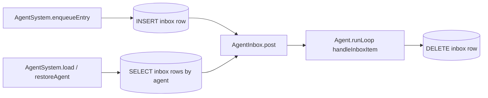
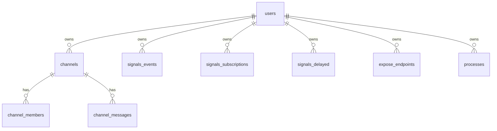
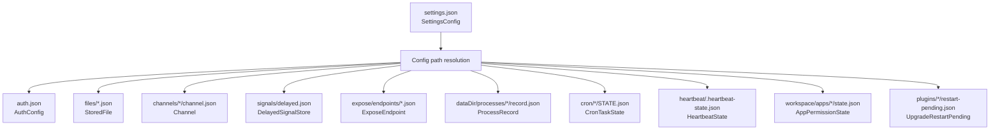
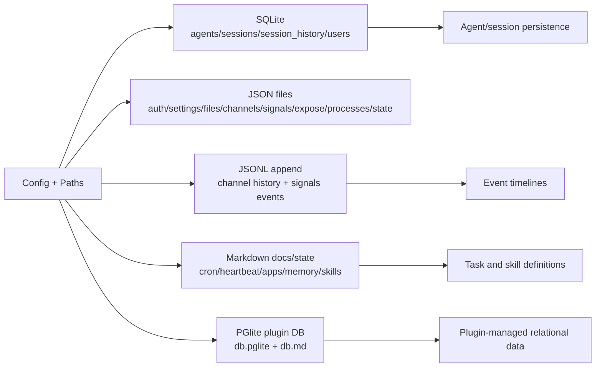

# Daycare Storage Types Reference

This document is the storage source of truth for Daycare persistence.

## Overview

Daycare persists data using five mechanisms:

| Mechanism | Format | Primary location |
| --- | --- | --- |
| SQLite | relational tables | `config.dbPath` (default: `<dataDir>/daycare.db`) |
| JSON files | structured objects | `configDir`, `dataDir`, `workspaceDir`, and plugin `dataDir` |
| JSONL append files | one JSON object per line | legacy migration inputs only (`configDir/channels/*/history.jsonl`, `configDir/signals/events.jsonl`) |
| Markdown (+ frontmatter for some files) | markdown bodies and YAML-like metadata | cron/heartbeat/app/memory/skills files |
| PGlite | embedded Postgres directory | `<plugin dataDir>/db.pglite` |

## Config Path Wiring

Storage paths are derived from `Config`:

```ts
export type Config = {
  settingsPath: string;
  configDir: string;
  dataDir: string;
  agentsDir: string;
  usersDir: string;
  dbPath: string;
  filesDir: string;
  authPath: string;
  socketPath: string;
  workspaceDir: string;
  // ...
};
```

Resolved by `sources/config/configResolve.ts`:

- `configDir = dirname(settingsPath)`
- `dataDir = settings.engine.dataDir ?? DEFAULT_DAYCARE_DIR`
- `dbPath = settings.engine.dbPath ?? path.join(dataDir, "daycare.db")`
- `agentsDir = path.join(dataDir, "agents")`
- `usersDir = path.join(dataDir, "users")`
- `authPath = path.join(dataDir, "auth.json")`
- `workspaceDir = resolveWorkspaceDir(configDir, settings.assistant)`
- `filesDir = path.join(workspaceDir, "files")`

---

## Per-User Home Layout

Runtime user data is isolated under `usersDir`:

```text
<dataDir>/users/<userId>/
  skills/
  apps/
  home/
    desktop/
    documents/
    developer/
    knowledge/
      SOUL.md
      USER.md
      AGENTS.md
      TOOLS.md
      MEMORY.md
```

Global legacy locations (`<workspace>/files`, `<workspace>/apps`, `<dataDir>/*.md`) are still readable for migration
and backward compatibility, but new user-scoped flows resolve through `UserHome`.

```mermaid
flowchart LR
    A[Config.usersDir] --> B[UserHome(usersDir, userId)]
    B --> C[home/desktop]
    B --> D[home/knowledge/*.md]
    B --> E[skills]
    B --> F[apps]
```

---

## SQLite Storage

Source files:

- `packages/daycare/sources/storage/migrations/20260219_initial.ts`
- `packages/daycare/sources/storage/migrations/20260220_add_users.ts`
- `packages/daycare/sources/storage/migrations/20260220_users_bootstrap.ts`
- `packages/daycare/sources/storage/migrations/20260221_add_inbox.ts`
- `packages/daycare/sources/storage/migrations/migrationRun.ts`
- `packages/daycare/sources/storage/databaseTypes.ts`

Runtime DB settings (`packages/daycare/sources/storage/databaseOpen.ts`):

- `PRAGMA journal_mode=WAL;` (file DB only)
- `PRAGMA foreign_keys=ON;`

### Storage Facade and Repositories

All runtime SQLite access goes through `Storage` (`packages/daycare/sources/storage/storage.ts`), which owns one
persistent `DatabaseSync` connection and repository instances.

```mermaid
flowchart TD
    A[Storage.open dbPath] --> B[DatabaseSync connection]
    A --> C[UsersRepository cache: users + connector index]
    A --> D[AgentsRepository cache: agents]
    A --> E[SessionsRepository no cache]
    A --> F[HistoryRepository no cache]
    A --> G[SignalEventsRepository cache]
    A --> H[SignalSubscriptionsRepository cache]
    A --> I[DelayedSignalsRepository cache]
    A --> J[ChannelsRepository cache]
    A --> K[ChannelMessagesRepository no cache]
    A --> L[ExposeEndpointsRepository cache]
    A --> M[ProcessesRepository cache]
    A --> N[InboxRepository no cache]
```



Repository files:

- `packages/daycare/sources/storage/usersRepository.ts`
- `packages/daycare/sources/storage/agentsRepository.ts`
- `packages/daycare/sources/storage/sessionsRepository.ts`
- `packages/daycare/sources/storage/historyRepository.ts`
- `packages/daycare/sources/storage/signalEventsRepository.ts`
- `packages/daycare/sources/storage/signalSubscriptionsRepository.ts`
- `packages/daycare/sources/storage/delayedSignalsRepository.ts`
- `packages/daycare/sources/storage/channelsRepository.ts`
- `packages/daycare/sources/storage/channelMessagesRepository.ts`
- `packages/daycare/sources/storage/exposeEndpointsRepository.ts`
- `packages/daycare/sources/storage/processesRepository.ts`
- `packages/daycare/sources/storage/inboxRepository.ts`

Facade-level operations:

- `Storage.createUser(...)`
- `Storage.resolveUserByConnectorKey(...)`
- `Storage.createAgentWithSession(...)`
- `Storage.appendHistory(...)`

Cache behavior:

- `UsersRepository` keeps write-through caches for `userId -> user` and `connectorKey -> userId`
- `AgentsRepository` keeps a write-through `agentId -> agent` cache
- `SignalEventsRepository` keeps a write-through `eventId -> signal event` cache
- `SignalSubscriptionsRepository` keeps write-through caches for subscription matching and lookups
- `DelayedSignalsRepository` keeps a write-through delayed-signal cache
- `ChannelsRepository` keeps write-through caches for channels and members
- `ExposeEndpointsRepository` keeps a write-through endpoint cache
- `ProcessesRepository` keeps a write-through process cache
- `SessionsRepository`, `HistoryRepository`, and `InboxRepository` are DB-only (no cache)

### Durable Inbox Table Added in 20260221

The durable inbox migration adds one queue table used by `AgentSystem` and `Agent`:

- `inbox`

Rows are inserted before enqueue, replayed on boot, and deleted after item handling.



### Subsystem Tables Added in 20260222

The signals, channels, expose, and processes migrations add:

- `signals_events`, `signals_subscriptions`, `signals_delayed`
- `channels`, `channel_members`, `channel_messages`
- `expose_endpoints`
- `processes`

All new tables include mandatory `user_id` for user scoping.



### SQL Schemas

```sql
CREATE TABLE IF NOT EXISTS agents (
  id TEXT PRIMARY KEY,
  type TEXT NOT NULL,
  descriptor TEXT NOT NULL,
  active_session_id TEXT,
  permissions TEXT NOT NULL,
  tokens TEXT,
  stats TEXT NOT NULL DEFAULT '{}',
  lifecycle TEXT NOT NULL DEFAULT 'active',
  created_at INTEGER NOT NULL,
  updated_at INTEGER NOT NULL
);

CREATE TABLE IF NOT EXISTS sessions (
  id TEXT PRIMARY KEY,
  agent_id TEXT NOT NULL,
  inference_session_id TEXT,
  created_at INTEGER NOT NULL,
  reset_message TEXT,
  FOREIGN KEY (agent_id) REFERENCES agents(id) ON DELETE CASCADE
);

CREATE INDEX IF NOT EXISTS idx_sessions_agent_id ON sessions(agent_id);

CREATE TABLE IF NOT EXISTS session_history (
  id INTEGER PRIMARY KEY AUTOINCREMENT,
  session_id TEXT NOT NULL,
  type TEXT NOT NULL,
  at INTEGER NOT NULL,
  data TEXT NOT NULL,
  FOREIGN KEY (session_id) REFERENCES sessions(id) ON DELETE CASCADE
);

CREATE INDEX IF NOT EXISTS idx_session_history_session ON session_history(session_id);

CREATE TABLE IF NOT EXISTS users (
  id TEXT PRIMARY KEY,
  is_owner INTEGER NOT NULL DEFAULT 0,
  created_at INTEGER NOT NULL,
  updated_at INTEGER NOT NULL
);

CREATE TABLE IF NOT EXISTS user_connector_keys (
  id INTEGER PRIMARY KEY AUTOINCREMENT,
  user_id TEXT NOT NULL REFERENCES users(id) ON DELETE CASCADE,
  connector_key TEXT NOT NULL UNIQUE
);

CREATE INDEX IF NOT EXISTS idx_user_connector_keys_user_id
  ON user_connector_keys(user_id);

CREATE UNIQUE INDEX IF NOT EXISTS idx_users_single_owner
  ON users(is_owner)
  WHERE is_owner = 1;

CREATE TABLE IF NOT EXISTS inbox (
  id TEXT PRIMARY KEY,
  agent_id TEXT NOT NULL,
  posted_at INTEGER NOT NULL,
  type TEXT NOT NULL,
  data TEXT NOT NULL
);

CREATE INDEX IF NOT EXISTS idx_inbox_agent_order
  ON inbox(agent_id, posted_at);

-- Added in bootstrap migration when missing:
ALTER TABLE agents ADD COLUMN user_id TEXT NOT NULL DEFAULT '<owner-user-id>';
CREATE INDEX IF NOT EXISTS idx_agents_user_id ON agents(user_id);

CREATE TABLE IF NOT EXISTS _migrations (
  name TEXT PRIMARY KEY,
  applied_at INTEGER NOT NULL
);
```

### Persisted SQLite Row Types

```ts
export type DatabaseAgentRow = {
  id: string;
  user_id: string;
  type: AgentDescriptor["type"];
  descriptor: string;         // JSON string of AgentDescriptor
  active_session_id: string | null;
  permissions: string;        // JSON string of SessionPermissions
  tokens: string | null;      // JSON string of AgentTokenEntry
  stats: string;              // JSON string of AgentTokenStats
  lifecycle: AgentLifecycleState;
  created_at: number;
  updated_at: number;
};

export type DatabaseSessionRow = {
  id: string;
  agent_id: string;
  inference_session_id: string | null;
  created_at: number;
  reset_message: string | null;
};

export type DatabaseSessionHistoryRow = {
  id: number;
  session_id: string;
  type: string; // AgentHistoryRecord["type"]
  at: number;
  data: string; // JSON string of record payload without { type, at }
};

export type DatabaseInboxRow = {
  id: string;
  agent_id: string;
  posted_at: number;
  type: string;
  data: string; // JSON serialized AgentInboxItem
};

export type DatabaseUserRow = {
  id: string;
  is_owner: number; // 0 | 1
  created_at: number;
  updated_at: number;
};

export type DatabaseUserConnectorKeyRow = {
  id: number;
  user_id: string;
  connector_key: string;
};
```

### Parsed Domain Record Types

```ts
export type AgentDbRecord = {
  id: string;
  userId: string;
  type: AgentDescriptor["type"];
  descriptor: AgentDescriptor;
  activeSessionId: string | null;
  permissions: SessionPermissions;
  tokens: AgentTokenEntry | null;
  stats: AgentTokenStats;
  lifecycle: AgentLifecycleState;
  createdAt: number;
  updatedAt: number;
};

export type SessionDbRecord = {
  id: string;
  agentId: string;
  inferenceSessionId: string | null;
  createdAt: number;
  resetMessage: string | null;
};

export type UserDbRecord = {
  id: string;
  isOwner: boolean;
  createdAt: number;
  updatedAt: number;
};

export type UserConnectorKeyDbRecord = {
  id: number;
  userId: string;
  connectorKey: string;
};

export type UserWithConnectorKeysDbRecord = UserDbRecord & {
  connectorKeys: UserConnectorKeyDbRecord[];
};
```

### Nested Types Persisted in SQLite JSON Columns

```ts
export type AgentDescriptor =
  | { type: "user"; connector: string; userId: string; channelId: string }
  | { type: "cron"; id: string; name?: string }
  | { type: "system"; tag: string }
  | { type: "subagent"; id: string; parentAgentId: string; name: string }
  | {
      type: "app";
      id: string;
      parentAgentId: string;
      name: string;
      systemPrompt: string;
      appId: string;
    }
  | {
      type: "permanent";
      id: string;
      name: string;
      username?: string;
      description: string;
      systemPrompt: string;
      workspaceDir?: string;
    };

export type SessionPermissions = {
  workspaceDir?: string;
  workingDir: string;
  writeDirs: string[];
  readDirs: string[];
  network: boolean;
  events: boolean;
};

export type AgentTokenSize = {
  input: number;
  output: number;
  cacheRead: number;
  cacheWrite: number;
  total: number;
};

export type AgentTokenSnapshotSize = AgentTokenSize;

export type AgentTokenEntry = {
  provider: string;
  model: string;
  size: AgentTokenSnapshotSize;
};

export type AgentTokenStats = Record<string, Record<string, AgentTokenSize>>;

export type AgentLifecycleState = "active" | "sleeping" | "dead";
```

Session history uses `AgentHistoryRecord`:

```ts
export type FileReference = {
  id: string;
  name: string;
  mimeType: string;
  size: number;
  path: string;
};

export type ToolResultPrimitive = string | number | boolean | null;
export type ToolResultRow = Record<string, ToolResultPrimitive>;
export type ToolResultShallowObject = Record<string, ToolResultPrimitive | ToolResultRow[]>;

export type ToolExecutionResult<
  TResult extends ToolResultShallowObject = ToolResultShallowObject
> = {
  toolMessage: ToolResultMessage;
  typedResult: TResult;
};

export type AgentHistoryRecord =
  | { type: "user_message"; at: number; text: string; files: FileReference[] }
  | {
      type: "assistant_message";
      at: number;
      text: string;
      files: FileReference[];
      toolCalls: ToolCall[];
      tokens: AgentTokenEntry | null;
    }
  | {
      type: "tool_result";
      at: number;
      toolCallId: string;
      output: ToolExecutionResult;
    }
  | {
      type: "rlm_start";
      at: number;
      toolCallId: string;
      code: string;
      preamble: string;
    }
  | {
      type: "rlm_tool_call";
      at: number;
      toolCallId: string;
      snapshot: string;
      printOutput: string[];
      toolCallCount: number;
      toolName: string;
      toolArgs: unknown;
    }
  | {
      type: "rlm_tool_result";
      at: number;
      toolCallId: string;
      toolName: string;
      toolResult: string;
      toolIsError: boolean;
    }
  | {
      type: "rlm_complete";
      at: number;
      toolCallId: string;
      output: string;
      printOutput: string[];
      toolCallCount: number;
      isError: boolean;
      error?: string;
    }
  | {
      type: "assistant_rewrite";
      at: number;
      assistantAt: number;
      text: string;
      reason: "run_python_say_after_trim" | "run_python_failure_trim";
    }
  | { type: "note"; at: number; text: string };
```

### SQLite Example Values

```json
{
  "agents": {
    "id": "ag_123",
    "user_id": "usr_1",
    "type": "user",
    "descriptor": "{\"type\":\"user\",\"connector\":\"telegram\",\"userId\":\"42\",\"channelId\":\"chat-42\"}",
    "active_session_id": "ses_99",
    "permissions": "{\"workingDir\":\"/Users/steve/.daycare/workspace\",\"writeDirs\":[],\"readDirs\":[],\"network\":false,\"events\":false}",
    "tokens": "{\"provider\":\"openai\",\"model\":\"gpt-5\",\"size\":{\"input\":100,\"output\":40,\"cacheRead\":0,\"cacheWrite\":0,\"total\":140}}",
    "stats": "{\"openai\":{\"gpt-5\":{\"input\":100,\"output\":40,\"cacheRead\":0,\"cacheWrite\":0,\"total\":140}}}",
    "lifecycle": "active",
    "created_at": 1739999000000,
    "updated_at": 1739999050000
  }
}
```

```json
{
  "session_history": {
    "id": 1,
    "session_id": "ses_99",
    "type": "note",
    "at": 1739999051000,
    "data": "{\"text\":\"Agent booted\"}"
  }
}
```

### SQLite Relationships

```mermaid
erDiagram
  USERS ||--o{ USER_CONNECTOR_KEYS : "has"
  AGENTS ||--o{ SESSIONS : "owns"
  SESSIONS ||--o{ SESSION_HISTORY : "appends"
  USERS o|..o{ AGENTS : "logical via agents.user_id"

  USERS {
    TEXT id PK
    INTEGER is_owner
    INTEGER created_at
    INTEGER updated_at
  }

  USER_CONNECTOR_KEYS {
    INTEGER id PK
    TEXT user_id FK
    TEXT connector_key UNIQUE
  }

  AGENTS {
    TEXT id PK
    TEXT user_id
    TEXT type
    TEXT descriptor
    TEXT active_session_id
    TEXT permissions
    TEXT tokens
    TEXT stats
    TEXT lifecycle
    INTEGER created_at
    INTEGER updated_at
  }

  SESSIONS {
    TEXT id PK
    TEXT agent_id FK
    TEXT inference_session_id
    INTEGER created_at
    TEXT reset_message
  }

  SESSION_HISTORY {
    INTEGER id PK
    TEXT session_id FK
    TEXT type
    INTEGER at
    TEXT data
  }
```

---

## JSON File Storage

## Auth Config

Path:

- `config.authPath` (`<dataDir>/auth.json`)

Source:

- `packages/daycare/sources/auth/store.ts`

Type:

```ts
export type AuthEntry = {
  type?: "apiKey" | "oauth" | "token";
  apiKey?: string;
  token?: string;
  [key: string]: unknown;
};

export type AuthConfig = Record<string, AuthEntry>;
```

Example:

```json
{
  "openai": { "type": "apiKey", "apiKey": "sk-***" },
  "github-copilot": {
    "type": "oauth",
    "accessToken": "gho_***",
    "refreshToken": "***"
  }
}
```

## Settings

Path:

- `config.settingsPath` (default: `~/.daycare/settings.json`)

Source:

- `packages/daycare/sources/settings.ts`

Type:

```ts
export type SettingsConfig = {
  features?: {
    say?: boolean;
    rlm?: boolean;
    noTools?: boolean;
  };
  engine?: {
    socketPath?: string;
    dataDir?: string;
    dbPath?: string;
  };
  assistant?: {
    workspaceDir?: string;
    systemPrompt?: string;
  };
  agents?: {
    emergencyContextLimit?: number;
  };
  security?: {
    appReviewerEnabled?: boolean;
  };
  plugins?: Array<{
    instanceId: string;
    pluginId: string;
    enabled?: boolean;
    settings?: Record<string, unknown>;
  }>;
  providers?: Array<{
    id: string;
    enabled?: boolean;
    model?: string;
    options?: Record<string, unknown>;
    image?: {
      enabled?: boolean;
      model?: string;
      size?: string;
      quality?: "standard" | "hd";
      endpoint?: string;
      apiKeyHeader?: string;
      apiKeyPrefix?: string;
    };
  }>;
  inference?: {
    providers?: Array<{
      id: string;
      model?: string;
      options?: Record<string, unknown>;
    }>;
  };
  cron?: {
    tasks?: CronTaskDefinition[];
  };
  memory?: {
    enabled?: boolean;
    maxEntries?: number;
  };
};
```

## Files Metadata

Paths:

- binary payload: `config.usersDir/<userId>/home/downloads/<fileId>__<sanitizedName>`

Source:

- `packages/daycare/sources/files/types.ts`
- `packages/daycare/sources/engine/files/fileFolder.ts`

Type:

```ts
export type StoredFile = {
  id: string;
  name: string;
  path: string;
  mimeType: string;
  size: number;
};
```

## Channels

Paths:

- `configDir/channels/<channel-name>/channel.json`

Source:

- `packages/daycare/sources/engine/channels/channelTypes.ts`
- `packages/daycare/sources/engine/channels/channelStore.ts`

Types:

```ts
export type ChannelMember = {
  agentId: string;
  username: string;
  joinedAt: number;
};

export type Channel = {
  id: string;
  name: string;
  leader: string;
  members: ChannelMember[];
  createdAt: number;
  updatedAt: number;
};
```

## Delayed Signals Store

Path:

- `configDir/signals/delayed.json`

Source:

- `packages/daycare/sources/engine/signals/signalTypes.ts`
- `packages/daycare/sources/engine/signals/delayedSignals.ts`

Types:

```ts
export type SignalSource =
  | { type: "system"; userId?: string }
  | { type: "agent"; id: string; userId?: string }
  | { type: "webhook"; id?: string; userId?: string }
  | { type: "process"; id?: string; userId?: string };

// Persisted delayed-signal source shape is narrower (no userId fields).
type DelayedSignalSourceStored =
  | { type: "system" }
  | { type: "agent"; id: string }
  | { type: "webhook"; id?: string }
  | { type: "process"; id?: string };

export type DelayedSignal = {
  id: string;
  type: string;
  deliverAt: number;
  source: DelayedSignalSourceStored;
  data?: unknown;
  repeatKey?: string;
  createdAt: number;
  updatedAt: number;
};

export type DelayedSignalStore = {
  version: 1;
  events: DelayedSignal[];
};
```

Example:

```json
{
  "version": 1,
  "events": [
    {
      "id": "sig_delay_1",
      "type": "internal.reminder",
      "deliverAt": 1740000000000,
      "source": { "type": "system" },
      "data": { "text": "follow up" },
      "createdAt": 1739999900000,
      "updatedAt": 1739999900000
    }
  ]
}
```

## Expose Endpoints

Path:

- `configDir/expose/endpoints/<endpoint-id>.json`

Source:

- `packages/daycare/sources/engine/expose/exposeTypes.ts`
- `packages/daycare/sources/engine/expose/exposes.ts`

Types:

```ts
export type ExposeTarget =
  | { type: "port"; port: number }
  | { type: "unix"; path: string };

export type ExposeMode = "public" | "local-network";

export type ExposeEndpointAuth = {
  enabled: true;
  passwordHash: string;
};

export type ExposeEndpoint = {
  id: string;
  target: ExposeTarget;
  provider: string;
  domain: string;
  mode: ExposeMode;
  auth: ExposeEndpointAuth | null;
  createdAt: number;
  updatedAt: number;
};
```

## Durable Processes

Path:

- `dataDir/processes/<process-id>/record.json`
- sibling files: `sandbox.json`, `process.log`

Source:

- `packages/daycare/sources/engine/processes/processes.ts`

Types:

```ts
export type ProcessOwner = {
  type: "plugin";
  id: string;
};

// Internal persisted type
type ProcessRecord = {
  version: number; // current = 2
  id: string;
  name: string;
  command: string;
  cwd: string;
  home: string | null;
  env: Record<string, string>;
  packageManagers: SandboxPackageManager[];
  allowedDomains: string[];
  allowLocalBinding: boolean;
  permissions: SessionPermissions;
  owner: ProcessOwner | null;
  keepAlive: boolean;
  desiredState: "running" | "stopped";
  status: "running" | "stopped" | "exited";
  pid: number | null;
  bootTimeMs: number | null;
  restartCount: number;
  restartFailureCount: number;
  nextRestartAt: number | null;
  createdAt: number;
  updatedAt: number;
  lastStartedAt: number | null;
  lastExitedAt: number | null;
  settingsPath: string;
  logPath: string;
};
```

## Cron and Heartbeat State

Paths:

- cron task state: `configDir/cron/<task-id>/STATE.json`
- heartbeat state: `configDir/heartbeat/.heartbeat-state.json`

Source:

- `packages/daycare/sources/engine/cron/cronTypes.ts`
- `packages/daycare/sources/engine/cron/ops/cronStore.ts`
- `packages/daycare/sources/engine/heartbeat/heartbeatTypes.ts`
- `packages/daycare/sources/engine/heartbeat/ops/heartbeatStore.ts`

Types:

```ts
export type CronTaskState = {
  lastRunAt?: string; // ISO timestamp
};

export type HeartbeatState = {
  lastRunAt?: string; // ISO timestamp
};
```

## App Permission State

Path:

- `workspaceDir/apps/<app-id>/state.json`

Source:

- `packages/daycare/sources/engine/apps/appPermissionStatePathBuild.ts`
- `packages/daycare/sources/engine/apps/appPermissionStateRead.ts`
- `packages/daycare/sources/engine/apps/appPermissionStateWrite.ts`

Persisted shape:

```ts
type AppPermissionState = {
  permissions?: string[]; // normalized permission tags
  updatedAt?: number;     // unix ms
};
```

Example:

```json
{
  "permissions": ["@read:/Users/steve/project", "@network"],
  "updatedAt": 1739999900123
}
```

## Upgrade Restart Pending Marker

Path:

- `<plugin dataDir>/restart-pending.json`

Source:

- `packages/daycare/sources/plugins/upgrade/upgradeRestartPendingTypes.ts`
- `packages/daycare/sources/plugins/upgrade/upgradeRestartPendingSet.ts`
- `packages/daycare/sources/plugins/upgrade/upgradeRestartPendingTake.ts`

Types:

```ts
export type MessageContext = {
  messageId?: string;
  permissionTags?: string[];
};

export type UpgradeRestartPending = {
  descriptor: AgentDescriptor;
  context: MessageContext;
  requestedAtMs: number;
  requesterPid: number;
  previousVersion?: string;
};
```

### JSON File Relationships



---

## JSONL Append Storage

## Channel History

Path:

- `configDir/channels/<channel-name>/history.jsonl`

Source:

- `packages/daycare/sources/engine/channels/channelTypes.ts`
- `packages/daycare/sources/engine/channels/channelStore.ts`

Type:

```ts
export type ChannelMessage = {
  id: string;
  channelName: string;
  senderUsername: string;
  text: string;
  mentions: string[];
  createdAt: number;
};
```

Example line:

```json
{"id":"msg_1","channelName":"ops","senderUsername":"alex","text":"deploy done","mentions":["sam"],"createdAt":1739999900000}
```

## Signal Events

Path:

- `configDir/signals/events.jsonl`

Source:

- `packages/daycare/sources/engine/signals/signalTypes.ts`
- `packages/daycare/sources/engine/signals/signals.ts`

Type:

```ts
export type Signal = {
  id: string;
  type: string;
  source: SignalSource;
  data?: unknown;
  createdAt: number;
};

export type ChannelSignalData = {
  channelName: string;
  messageId: string;
  senderUsername: string;
  text: string;
  mentions: string[];
  createdAt: number;
  history: ChannelMessage[];
};
```

Example line:

```json
{"id":"sig_1","type":"internal.heartbeat.tick","source":{"type":"system","userId":"usr_1"},"data":{"tasks":[{"id":"daily"}]},"createdAt":1739999900000}
```

---

## Markdown Storage (with and without frontmatter)

## Cron Task Files

Paths:

- `configDir/cron/<task-id>/TASK.md`
- `configDir/cron/<task-id>/MEMORY.md`
- `configDir/cron/<task-id>/files/` (task workspace)

Source:

- `packages/daycare/sources/engine/cron/cronTypes.ts`
- `packages/daycare/sources/engine/cron/ops/cronStore.ts`
- `packages/daycare/sources/engine/cron/ops/cronFrontmatterParse.ts`
- `packages/daycare/sources/engine/cron/ops/cronFrontmatterSerialize.ts`

`TASK.md` frontmatter maps to `CronTaskDefinition`:

```ts
export type CronTaskDefinition = {
  id: string;
  taskUid?: string;
  name: string;
  description?: string;
  schedule: string;
  code: string;
  agentId?: string;
  userId?: string;
  enabled?: boolean;
  deleteAfterRun?: boolean;
};
```

Frontmatter keys used:

- required: `name`, `schedule`, `taskId`
- optional: `description`, `enabled`, `agentId`/`agent_id`, `userId`/`user_id`, `deleteAfterRun`
- accepted legacy aliases: `cron`, `delete_after_run`, `oneOff`, `one_off`, `once`

Example `TASK.md`:

```md
---
name: Daily cleanup
schedule: "0 2 * * *"
enabled: true
taskId: abc123
agentId: agent_1
deleteAfterRun: false
---
Check temporary files and summarize deletions.
```

## Heartbeat Task Files

Paths:

- `configDir/heartbeat/<task-id>.md`
- `configDir/heartbeat/.heartbeat-state.json` (state JSON, documented above)

Source:

- `packages/daycare/sources/engine/heartbeat/heartbeatTypes.ts`
- `packages/daycare/sources/engine/heartbeat/ops/heartbeatStore.ts`
- `packages/daycare/sources/engine/heartbeat/ops/heartbeatParse.ts`

Type:

```ts
export type HeartbeatDefinition = {
  id: string;
  title: string;
  code: string;
  filePath: string;
  lastRunAt?: string;
};
```

Frontmatter keys used:

- `title` (preferred) or `name`
- markdown body is the code

Example:

```md
---
title: Morning status
---
Summarize open incidents and blocked tasks.
```

## App Manifest and Permissions

Paths:

- `workspaceDir/apps/<app-id>/APP.md`
- `workspaceDir/apps/<app-id>/PERMISSIONS.md`

Source:

- `packages/daycare/sources/engine/apps/appTypes.ts`
- `packages/daycare/sources/engine/apps/appManifestParse.ts`
- `packages/daycare/sources/engine/apps/appPermissionsParse.ts`
- `packages/daycare/sources/engine/apps/appPermissionsSerialize.ts`

Types:

```ts
export type AppManifest = {
  name: string;
  title: string;
  description: string;
  model?: string;
  systemPrompt: string;
};

export type AppRule = {
  text: string;
  addedBy?: string;
};

export type AppRuleSet = {
  allow: AppRule[];
  deny: AppRule[];
};

export type AppPermissions = {
  sourceIntent: string;
  rules: AppRuleSet;
};
```

`APP.md` example:

```md
---
name: deploy-check
title: Deploy Check
description: Validate deploy readiness
model: gpt-5
---
You are a deploy assistant focused on safety checks.
```

`PERMISSIONS.md` example:

```md
## Source Intent

Need read-only diagnostics plus optional network pings.

## Rules

### Allow
- @read:/Users/steve/project
- @network

### Deny
- @write:/
```

## Memory Plugin Entity Files

Paths:

- `<plugin dataDir>/INDEX.md`
- `<plugin dataDir>/<entity>.md`

Source:

- `packages/daycare/sources/plugins/memory/store.ts`

Frontmatter + body shape for `<entity>.md`:

```ts
type MemoryFrontmatter = {
  name?: string;
  description?: string;
};

// Body conventions:
// - prefix text (often "# <entity>")
// - repeated "## <record>" sections
// - section body is record content
```

Example:

```md
---
name: "Deployment Incidents"
description: "Recent deploy failures and mitigations"
---
# incidents

## incident-2026-02-01
Rollback required due to migration timeout.

## incident-2026-02-15
Outage caused by missing env var.
```

## Skill Files

Paths:

- core skills: `packages/daycare/sources/skills/**/SKILL.md` (case-insensitive match on disk)
- config skills: `<configured root>/**/SKILL.md`
- user skills: `~/.agents/skills/**/SKILL.md`
- plugin skills: plugin-registered absolute paths

Source:

- `packages/daycare/sources/engine/skills/skillTypes.ts`
- `packages/daycare/sources/engine/skills/skillResolve.ts`
- `packages/daycare/sources/engine/skills/skillListFromRoot.ts`

Frontmatter-derived metadata:

```ts
type SkillFrontmatter = {
  name?: string;
  description?: string;
  sandbox?: boolean;
  permissions?: string[];
};

export type AgentSkill = {
  id: string;
  name: string;
  description?: string | null;
  sandbox?: boolean;
  permissions?: string[];
  path: string;
  source: "core" | "config" | "plugin" | "user";
  pluginId?: string;
};
```

Example:

```md
---
name: SQL Migration Helper
description: Generate safe SQL migrations
sandbox: true
permissions:
  - "@read:/Users/steve/project"
---
Use this skill when planning schema migrations.
```

---

## PGlite Storage (Database Plugin)

Source:

- `packages/daycare/sources/plugins/database/plugin.ts`

Plugin storage files under plugin `dataDir`:

- `db.pglite/` (PGlite data directory)
- `db.md` (living schema/change documentation)

Notes:

- Schema is dynamic (managed by executed SQL statements).
- `db_sql` tool writes schema/documentation updates to `db.md`.
- No fixed TypeScript row types are defined in core for PGlite tables.

Example `db.md` sections:

```md
# Database Memory

## Schema
<!-- schema:start -->
### users
- id: text (not null, primary key)
- created_at: timestamp without time zone
<!-- schema:end -->

## Recent Changes
<!-- changes:start -->
- [2026-02-20] create users table
<!-- changes:end -->
```

---

## Storage Inventory

| Persisted type | Mechanism | Format | Path pattern | Source file(s) |
| --- | --- | --- | --- | --- |
| `DatabaseAgentRow` | SQLite | table row | `dbPath: agents` | `storage/databaseTypes.ts` |
| `AgentDbRecord` | SQLite | row mapping | `dbPath: agents` | `storage/databaseTypes.ts`, `storage/agentDbParse.ts` |
| `DatabaseSessionRow` | SQLite | table row | `dbPath: sessions` | `storage/databaseTypes.ts` |
| `SessionDbRecord` | SQLite | row mapping | `dbPath: sessions` | `storage/databaseTypes.ts`, `storage/sessionDbParse.ts` |
| `DatabaseSessionHistoryRow` | SQLite | table row | `dbPath: session_history` | `storage/databaseTypes.ts` |
| `AgentHistoryRecord` | SQLite | JSON-in-text (`data`) + typed columns | `dbPath: session_history` | `engine/agents/ops/agentTypes.ts`, `storage/sessionHistoryDbAppend.ts` |
| `DatabaseUserRow` | SQLite | table row | `dbPath: users` | `storage/databaseTypes.ts` |
| `UserDbRecord` | SQLite | row mapping | `dbPath: users` | `storage/databaseTypes.ts`, `storage/userDbParse.ts` |
| `DatabaseUserConnectorKeyRow` | SQLite | table row | `dbPath: user_connector_keys` | `storage/databaseTypes.ts` |
| `UserConnectorKeyDbRecord` | SQLite | row mapping | `dbPath: user_connector_keys` | `storage/databaseTypes.ts` |
| migration record | SQLite | table row | `dbPath: _migrations` | `storage/migrations/migrationRun.ts` |
| `AuthConfig` / `AuthEntry` | JSON | object | `authPath` | `auth/store.ts` |
| `SettingsConfig` | JSON | object | `settingsPath` | `settings.ts` |
| `StoredFile` | filesystem file | binary payload + filename metadata | `users/<userId>/home/downloads/<id>__<name>` | `files/types.ts`, `engine/files/fileFolder.ts` |
| `Channel` / `ChannelMember` | JSON | object | `configDir/channels/<name>/channel.json` | `engine/channels/channelTypes.ts` |
| `DelayedSignalStore` / `DelayedSignal` | JSON | object | `configDir/signals/delayed.json` | `engine/signals/delayedSignals.ts`, `engine/signals/signalTypes.ts` |
| `ExposeEndpoint` | JSON | object | `configDir/expose/endpoints/<id>.json` | `engine/expose/exposeTypes.ts`, `engine/expose/exposes.ts` |
| `ProcessRecord` | JSON | object | `dataDir/processes/<id>/record.json` | `engine/processes/processes.ts` |
| `CronTaskState` | JSON | object | `configDir/cron/<task>/STATE.json` | `engine/cron/cronTypes.ts`, `engine/cron/ops/cronStore.ts` |
| `HeartbeatState` | JSON | object | `configDir/heartbeat/.heartbeat-state.json` | `engine/heartbeat/heartbeatTypes.ts`, `engine/heartbeat/ops/heartbeatStore.ts` |
| app permission state | JSON | object | `workspaceDir/apps/<app>/state.json` | `engine/apps/appPermissionStateRead.ts`, `engine/apps/appPermissionStateWrite.ts` |
| `UpgradeRestartPending` | JSON | object | `<plugin dataDir>/restart-pending.json` | `plugins/upgrade/upgradeRestartPendingTypes.ts` |
| `ChannelMessage` | JSONL | append line | `configDir/channels/<name>/history.jsonl` | `engine/channels/channelTypes.ts`, `engine/channels/channelStore.ts` |
| `Signal` | JSONL | append line | `configDir/signals/events.jsonl` | `engine/signals/signalTypes.ts`, `engine/signals/signals.ts` |
| cron task doc | Markdown + frontmatter | file | `configDir/cron/<task>/TASK.md` | `engine/cron/ops/cronStore.ts` |
| cron memory | Markdown | file | `configDir/cron/<task>/MEMORY.md` | `engine/cron/ops/cronStore.ts` |
| heartbeat task doc | Markdown + frontmatter | file | `configDir/heartbeat/<task>.md` | `engine/heartbeat/ops/heartbeatStore.ts` |
| `AppManifest` | Markdown + frontmatter | file | `workspaceDir/apps/<app>/APP.md` | `engine/apps/appManifestParse.ts`, `engine/apps/appTypes.ts` |
| `AppPermissions` / `AppRuleSet` / `AppRule` | Markdown sections | file | `workspaceDir/apps/<app>/PERMISSIONS.md` | `engine/apps/appPermissionsParse.ts`, `engine/apps/appTypes.ts` |
| memory entity | Markdown (+ frontmatter) | file | `<plugin dataDir>/<entity>.md` | `plugins/memory/store.ts` |
| memory index | Markdown | file | `<plugin dataDir>/INDEX.md` | `plugins/memory/store.ts` |
| skill frontmatter metadata | Markdown + frontmatter | file | `**/SKILL.md` | `engine/skills/skillResolve.ts`, `engine/skills/skillTypes.ts` |
| PGlite database | PGlite | directory/files | `<plugin dataDir>/db.pglite/` | `plugins/database/plugin.ts` |
| PGlite docs | Markdown | file | `<plugin dataDir>/db.md` | `plugins/database/plugin.ts` |

---

## Storage Mechanisms Diagram


