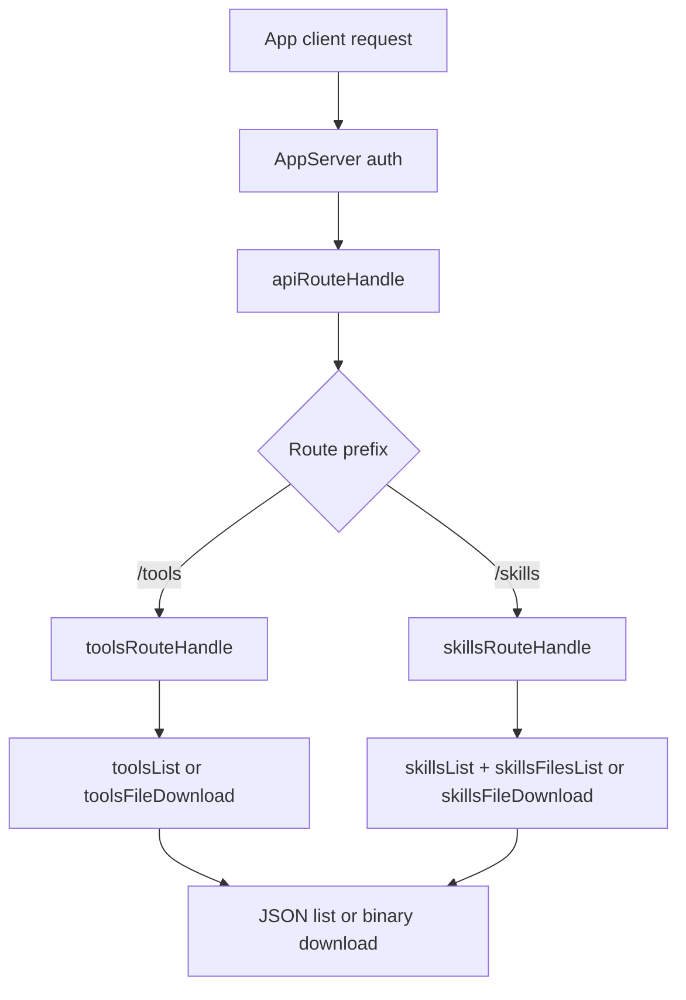

# Daycare App API: Tools and Skills Files

This change adds authenticated App API support for:

- listing all available tools exposed to agents
- listing all available skills with file metadata
- downloading tool definition files and skill files

## Endpoints

- `GET /tools`
  - returns all runtime tools
  - includes tool metadata and one downloadable virtual file: `definition.json`
- `GET /tools/:toolName/download`
  - downloads the tool definition JSON file

- `GET /skills`
  - returns all skills
  - includes skill metadata and all files found under each skill directory
  - each file includes a download method/path
- `GET /skills/:skillId/download?path=<skill-relative-file-path>`
  - downloads one file from the selected skill
  - path traversal outside the skill root is rejected

## Response Metadata

Every file entry now carries:

- `path`
- `size`
- `updatedAt`
- `download.method`
- `download.path`

## Flow

