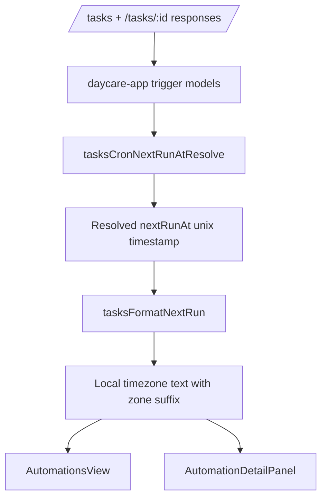

# App Automation Next Fire Local Time

## What changed

- Added a client-side cron resolver in `daycare-app` to compute the next fire unix timestamp from each trigger's `schedule`, `timezone`, and `enabled` state.
- Added local-time formatting with timezone labels for resolved cron fire times.
- Updated the automations list to show a `Next fire` line.
- Updated automation detail cards to show `Next fire` per cron trigger.

## Client flow

## Notes

- The app computes next fire times locally; no backend payload changes are required.
- Disabled cron triggers resolve to `not scheduled`.
- Formatting uses the device's local timezone for display, while cron matching still respects the trigger's configured timezone.
