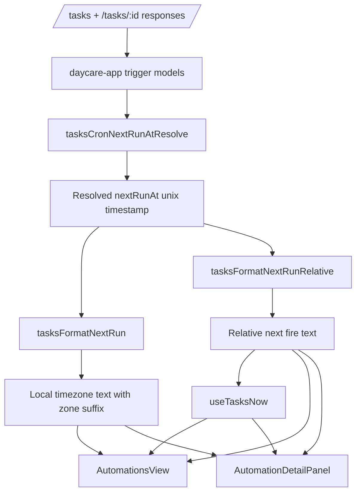

# App Automation Next Fire Local Time

## What changed

- Added a client-side cron resolver in `daycare-app` to compute the next fire unix timestamp from each trigger's `schedule`, `timezone`, and `enabled` state.
- Added local-time formatting with timezone labels for resolved cron fire times.
- Added relative `Next fire` text in seconds, minutes, hours, and days.
- Updated the automations list to show a `Next fire` line and sort by earliest upcoming fire time.
- Updated automation detail cards to show `Next fire` per cron trigger with both absolute local time and relative time.
- Added a live `useTasksNow()` hook that refreshes on second, minute, or hour boundaries based on the nearest upcoming fire time.

## Client flow

## Notes

- The app computes next fire times locally; no backend payload changes are required.
- Disabled cron triggers resolve to `not scheduled`.
- Formatting uses the device's local timezone for display, while cron matching still respects the trigger's configured timezone.
- Automation cards are ordered by earliest computed next fire time, with unscheduled items last.
- The live hook refreshes every second when the next fire is within a minute, every minute when it is within a day, and every hour otherwise.
