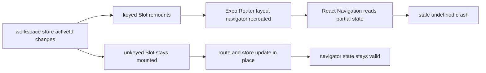

# App Slot Workspace Remount

The desktop and mobile app shells render Expo Router's `Slot` inside the `(app)` layout.

Keying that `Slot` by `activeId` remounted the layout navigator whenever the workspace store changed. On web, Expo Router 55 and React Navigation 7 could then rebuild the nested navigator with incomplete state, which surfaced as:

- `TypeError: Cannot read properties of undefined (reading 'stale')`
- stack frames in `Navigator.js`, `ModalStack`, and `SlotNavigator`

The fix is to let Expo Router own the `Slot` lifecycle and keep workspace switching in route updates and store state instead of forcing a navigator remount.

