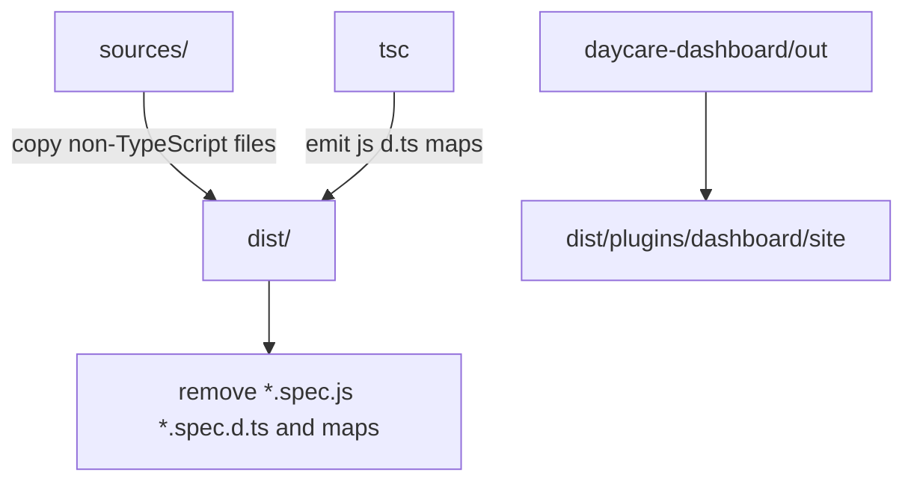

# Build Asset Sync

The Daycare package build now follows a simple rule:

- TypeScript emits compiled runtime files into `dist/`
- a post-build asset sync copies every non-TypeScript file from `sources/` into the matching `dist/` path
- generated spec artifacts like `*.spec.js` are removed from `dist/`

