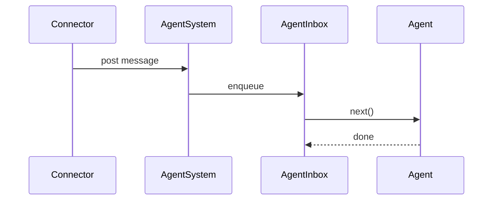

# Agents

Agents provide per-channel sequencing of messages. Each agent processes one message at a time via an inbox queue.

## Agent types

| Type | Description |
|------|-------------|
| `user` | Foreground connector conversation (Telegram/WhatsApp user) |
| `cron` | Scheduled task agent |
| `system` | Built-in tag-addressable agent |
| `subagent` | Background agent with a parent |
| `swarm` | Swarm-side agent serving one contacting user |
| `permanent` | Background agent with stable name and system prompt |

## Identity

Agent ids are cuid2 values mapped to:
- User descriptors (`connector + channelId + userId`) for foreground agents
- Cron trigger id for scheduled tasks
- System tags for system agents

## Message flow

Messages and files are queued and processed in order. The connector source is resolved from the agent descriptor when handling each message.

## Creating agents

### Background agents

`start_background_agent` posts the first message and returns immediately. Each call creates a new background agent with a fresh cuid2 id.

### Permanent agents

`create_permanent_agent` creates a reusable agent with a stable name, description, and system prompt. Permanent agents persist across restarts.

## Inter-agent communication

### Direct messages

`send_agent_message` posts a `system_message` to a target agent. System messages are wrapped in `<system_message origin="<agentId>">` tags. When no target is specified, the most recent foreground agent is used.

### Silent messages

Silent system messages are recorded in history and added to context, but do not trigger an inference step. They are picked up on the next inference run.

## Persistence

Each agent stores state under `.daycare/agents/<cuid2>/`:

| File | Purpose |
|------|---------|
| `descriptor.json` | Agent type and identity |
| `state.json` | Provider selection, permissions, timestamps, token stats |
| `history.jsonl` | Minimal user/assistant/tool records |

On restart, agents are loaded from disk and context is reconstructed from history after the most recent `start` or `reset` marker.

## Resetting agents

- `/reset` clears stored context and appends a `reset` marker in history
- The agent id is preserved across resets
- Connectors handle reset commands; the engine does not interpret slash commands

## Context management

- History records are expanded into inference context on restore
- Emergency context pruning triggers when estimated tokens exceed the limit (default 200k)
- Context compaction runs at 75% (warning) and 90% (critical) of the emergency limit
- Image payloads use a `"<image>"` placeholder for token estimation

## Fetch strategies

| Strategy | Resolution |
|----------|------------|
| `most-recent-foreground` | Most recent agent with a `user` descriptor |
