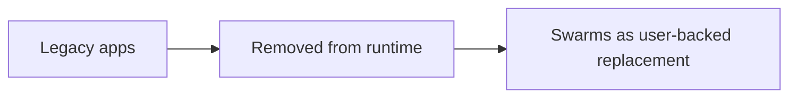

# Apps (Retired)

The legacy `APP.md` / `PERMISSIONS.md` app runtime has been removed.

Use swarms instead:
- [Swarms concept](swarms.md)
- `swarm_create` for provisioning
- `send_user_message({ nametag, ... })` for execution

