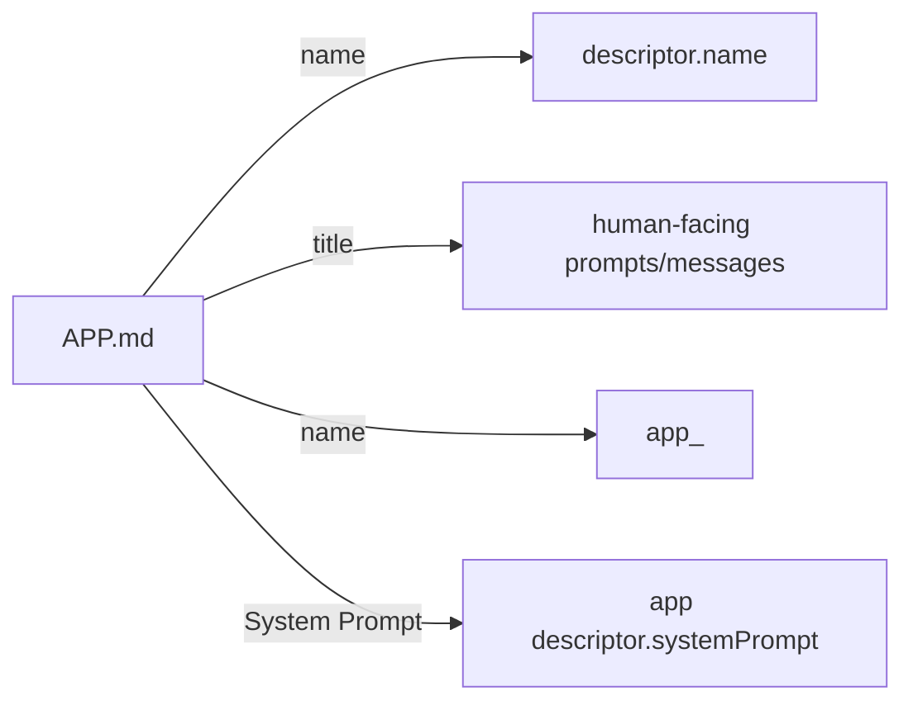
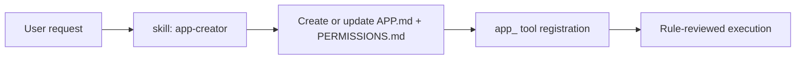

# Apps

Apps are sandboxed tool wrappers discovered from `<workspace>/apps/<app-id>/APP.md` and
`<workspace>/apps/<app-id>/PERMISSIONS.md`.

Each app registers as a callable tool: `app_<name>`.

## Why Apps

- Isolate semi-trusted capabilities behind explicit rules
- Run app logic in a dedicated app agent (`type: app`)
- Review every app tool call with a separate model before execution

## App Layout

```text
<workspace>/apps/
  <app-id>/
    APP.md
    PERMISSIONS.md
    data/
    scripts/
```

- `APP.md` defines app identity metadata (`name`, `title`, `description`, optional `model`) and the app system prompt in the markdown body.
- `PERMISSIONS.md` defines source intent text and allow/deny rules.
- `data/` is the only writable location for the app agent.
- Other agents are denied access to `workspace/apps/*`.

## Execution Flow

```mermaid
graph LR
  Caller[Agent] -->|app_<name>(prompt)| AppTool
  AppTool --> AppAgent[App Agent]
  AppAgent -->|tool call| Review[Review Middleware]
  Review -->|ALLOW| RealTool[read/write/edit/exec]
  Review -->|DENY| AppAgent
  AppAgent --> Caller
```

The app tool response includes the app `agentId` so the caller can continue
messaging that same app agent when needed.

## APP.md Contract

`APP.md` uses YAML frontmatter plus a required `## System Prompt` section in the markdown body.

Required frontmatter fields:

| Field | Purpose | Example |
|------|---------|---------|
| `name` | Username-style runtime app id (tool name uses this) | `github-reviewer` |
| `title` | Human-readable app title | `GitHub Reviewer` |
| `description` | Short tool description | `Reviews pull requests and drafts feedback` |

Optional frontmatter fields:

| Field | Purpose | Example |
|------|---------|---------|
| `model` | Preferred review model/provider selector | `gpt-4.1-mini` |

Name rules:

- `name`: username-style lowercase + optional `-` or `_` separators (for example `github_reviewer`)
- `title`: free-form human-readable text

Required markdown body section:

- `## System Prompt`: app runtime behavior prompt used as the app agent system prompt.

### APP.md Example 1: GitHub Reviewer

```markdown
---
name: github-reviewer
title: GitHub Reviewer
description: Reviews pull requests and drafts actionable feedback
model: gpt-4.1-mini
---

## System Prompt

You review pull requests and produce actionable feedback with concrete next steps.
```

### APP.md Example 2: Incident Summarizer

```markdown
---
name: incident_summarizer
title: Incident Summarizer
description: Builds concise incident timelines and status summaries
---

## System Prompt

You summarize incident artifacts into timelines, impact, and current status.
```

### APP.md Example 3: Release Notes Draft

```markdown
---
name: release-notes-draft
title: Release Notes Draft Assistant
description: Drafts release notes from git history and changelog files
model: default
---

## System Prompt

You draft release notes grouped by feature area with user-facing language.
```

### APP.md Example 4: SQL Report Builder

```markdown
---
name: sql_report_builder
title: SQL Report Builder
description: Runs approved SQL queries and formats markdown reports
---

## System Prompt

You execute approved read-only SQL and convert results into concise markdown reports.
```

### APP.md Example 5: API Contract Checker

```markdown
---
name: api-contract-checker
title: API Contract Checker
description: Compares OpenAPI schemas and flags breaking changes
---

## System Prompt

You compare API schemas and report compatibility risks with concrete evidence.
```

## PERMISSIONS.md Contract

Required sections:

1. `## Source Intent`
2. `## Rules`
3. `### Allow` under `## Rules`
4. `### Deny` under `## Rules`

Rules should be concrete and testable. Prefer exact scopes over broad language.

### PERMISSIONS.md Example 1: GitHub Reviewer

```markdown
## Source Intent

Review pull requests safely and provide actionable feedback without modifying repository history.

## Rules

### Allow
- Read files in the workspace
- Run read-only git commands (`git status`, `git diff`, `git log`, `git show`)
- Write intermediate notes only under `workspace/apps/github-reviewer/data/`

### Deny
- Force push or rewrite git history
- Delete files
- Write outside `workspace/apps/github-reviewer/data/`
```

### PERMISSIONS.md Example 2: Incident Summarizer

```markdown
## Source Intent

Summarize incidents using logs and notes while preserving source systems.

## Rules

### Allow
- Read incident markdown and log exports
- Create summary artifacts under `workspace/apps/incident-summarizer/data/`

### Deny
- Modify source log files
- Access secrets files (`.env`, key files, token stores)
- Execute network calls unless explicitly granted
```

### PERMISSIONS.md Example 3: Release Notes Draft

```markdown
## Source Intent

Generate draft release notes from commit history and changelog content.

## Rules

### Allow
- Read git history and changelog files
- Write drafts to `workspace/apps/release-notes-draft/data/`

### Deny
- Edit production source files
- Create or modify git tags
- Run destructive shell commands
```

### PERMISSIONS.md Example 4: SQL Report Builder

```markdown
## Source Intent

Run approved analytical SQL and convert results into markdown reports.

## Rules

### Allow
- Execute read-only SQL statements
- Read query templates from app scripts
- Write reports under `workspace/apps/sql-report-builder/data/`

### Deny
- Run DDL or DML (`DROP`, `ALTER`, `INSERT`, `UPDATE`, `DELETE`)
- Export raw data outside app data directory
- Access unrelated app folders
```

### PERMISSIONS.md Example 5: API Contract Checker

```markdown
## Source Intent

Detect API contract drift and summarize breaking changes.

## Rules

### Allow
- Read OpenAPI specs and generated client schema files
- Write comparison reports to `workspace/apps/api-contract-checker/data/`

### Deny
- Modify API spec source files
- Commit changes to git
- Call external APIs during validation
```

## Rule Management

`app_rules` supports asymmetric confirmation:

- `add_deny`: no confirmation
- `add_allow`: requires `confirmed=true`
- `remove_deny`: requires `confirmed=true`
- `remove_allow`: no confirmation

Security-tightening actions do not require confirmation; security-loosening actions do.

## Mapping to Runtime Descriptor



## App Creator Skill

Daycare includes a core `app-creator` skill at
`packages/daycare/sources/skills/app-creator/SKILL.md` for creating and iterating
on app definitions.

Use it when building or updating:
- `APP.md` frontmatter + `## System Prompt`
- `PERMISSIONS.md` source intent + rule sets
- app allow/deny rule sets
- app folder layout (`data/`, optional `scripts/`)


