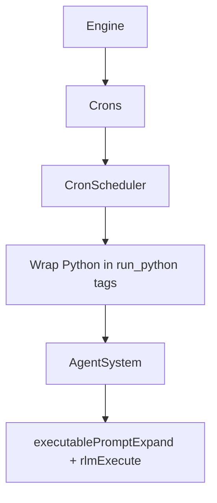

# Cron

Cron tasks store Python code that runs on a repeating schedule. Each task is stored in SQLite and has its own agent.

## Task storage

Rows live in `tasks_cron`:
- `id` (task slug), `task_uid` (cuid2 descriptor id)
- `name`, `description`, `schedule`, `prompt` (Python code)
- `agent_id`, `user_id`
- `enabled`, `delete_after_run`
- `last_run_at` (unix ms)

## Task format

Cron tasks store Python code that runs when the schedule fires:

```python
# Generate daily report
result = daily_report_generate()
print(result)
```

All agent tools are available as Python functions. Call `skip()` to abort inference.

### Fields

| Field | Required | Description |
|-------|----------|-------------|
| `name` | yes | Human-readable task name |
| `schedule` | yes | 5-field cron expression (`minute hour day month weekday`) |
| `code` | yes | Python code to execute |
| `enabled` | no | Set to `false` to disable |
| `description` | no | Short description |
| `deleteAfterRun` | no | When `true`, delete the task after it runs once |
| `agentId` | no | Route to an existing agent id (defaults to the cron agent) |

## Execution model



- Each task runs in its own agent (the `taskId` cuid2) unless `agentId` routes elsewhere.
- When a schedule triggers, the Python code is wrapped in `<run_python>` tags and sent as a system message.
- The executable-prompt pipeline handles execution via Monty/RLM.

## Tools

| Tool | Description |
|------|-------------|
| `cron_add` | Create a new task with Python code |
| `cron_read_task` | Read a task's description and code |
| `cron_delete_task` | Delete a task from disk and scheduler |
