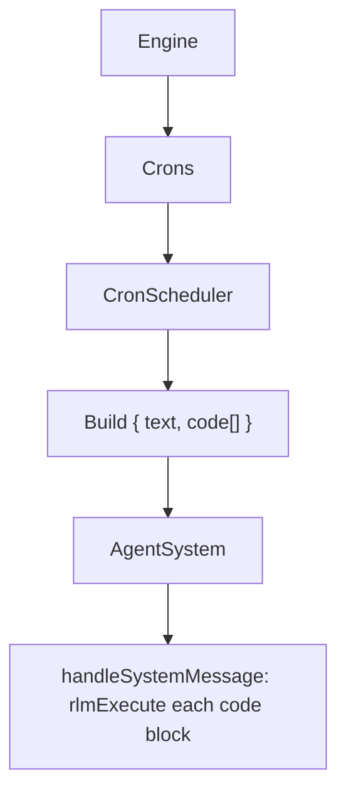

# Cron

Cron uses trigger rows (`tasks_cron`) that run linked unified tasks (`tasks`) on a repeating schedule.

## Task storage

Rows live in `tasks_cron`:
- `id` (trigger id; `cuid2` by default), `task_id` (required reference to `tasks.id`)
- `name`, `description`, `schedule`, `code` (legacy copy for compatibility)
- `agent_id`, `user_id`
- `enabled`, `delete_after_run`
- `last_run_at` (unix ms)

## Task format

Cron tasks store Python code that runs when the schedule fires:

```python
# Generate daily report
result = daily_report_generate()
print(result)
```

All agent tools are available as Python functions. Call `skip()` to abort inference.

### Trigger fields

| Field | Required | Description |
|-------|----------|-------------|
| `schedule` | yes | 5-field cron expression (`minute hour day month weekday`) |
| `enabled` | no | Set to `false` to disable |
| `deleteAfterRun` | no | When `true`, delete the task after it runs once |
| `agentId` | no | Route to an existing agent id (defaults to the cron agent) |

## Execution model



- Each trigger executes linked task code from `tasks.code` via the cron system agent unless `agentId` routes elsewhere.
- When a schedule triggers, the Python code is sent as a `code[]` array in the system message.
- `handleSystemMessage` executes each code block directly via `rlmExecute` with a 30s timeout.

## Tools

| Tool | Description |
|------|-------------|
| `task_create` | Create a task and optional cron trigger |
| `task_read` | Read a task and linked triggers |
| `task_delete` | Delete task and all linked triggers |
| `task_trigger_add` | Attach a cron trigger to an existing task |
| `task_trigger_remove` | Remove a cron trigger |
