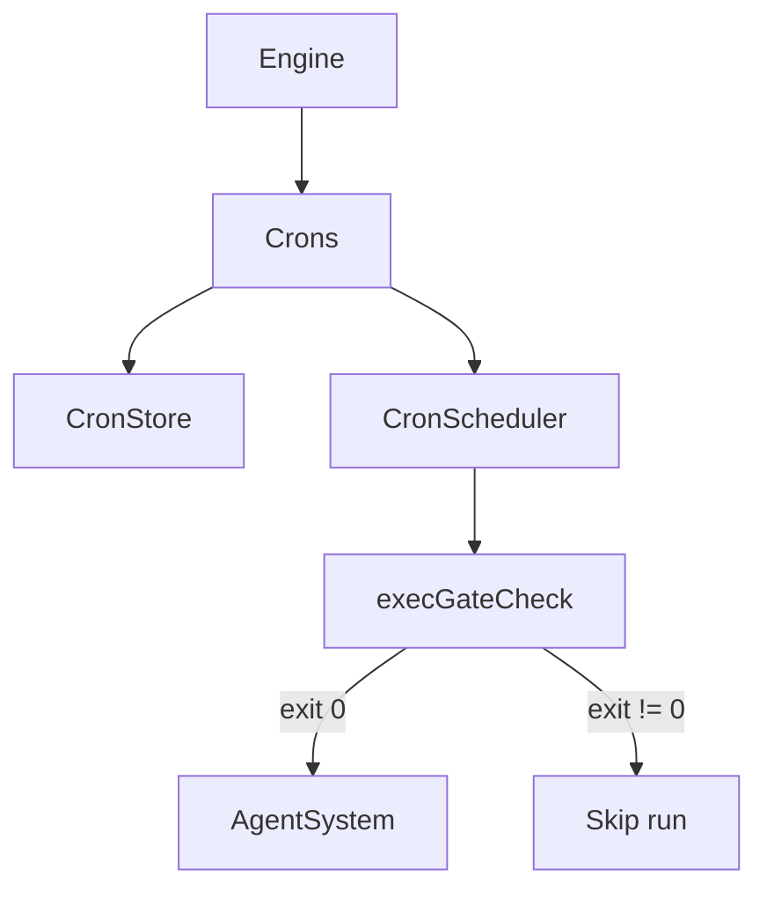

# Cron

Cron tasks are scheduled prompts that run on a repeating schedule. Each task is stored as a Markdown file on disk, has its own agent, memory, and workspace.

## Task storage

Tasks live under `<config>/cron/<task-id>/`:

| File | Purpose |
|------|---------|
| `TASK.md` | YAML frontmatter + prompt body |
| `MEMORY.md` | Persistent task memory (initialized to `No memory`) |
| `files/` | Workspace directory for file operations |

Task directory names should be human-friendly slugs (e.g. `create-image-in-morning`).

## Task format

```markdown
---
taskId: clx9rk1p20000x5p3j7q1x8z1
name: Daily Report
schedule: "0 9 * * *"
enabled: true
gate:
  command: "curl -fsS https://api.example.com/healthz >/dev/null"
  allowedDomains:
    - api.example.com
---

Generate the daily status report and summarize any blockers.
```

### Frontmatter fields

| Field | Required | Description |
|-------|----------|-------------|
| `taskId` | yes | cuid2 identifier; tasks without a valid taskId are ignored |
| `name` | yes | Human-readable task name |
| `schedule` | yes | 5-field cron expression (`minute hour day month weekday`) |
| `enabled` | no | Set to `false` to disable |
| `description` | no | Short description used by `cron_read_task` |
| `deleteAfterRun` | no | When `true`, delete the task after it runs once |
| `agentId` | no | Route to an existing agent id (defaults to the cron agent) |
| `gate` | no | Exec gate config that must succeed before the task runs |

## Execution model



- Each task runs in its own agent (the `taskId` cuid2) unless `agentId` routes elsewhere.
- When a schedule triggers, the task prompt is sent as a message to that agent.
- The system prompt includes the cron task metadata and the memory file location.

## Exec gate

The optional `gate` runs a shell command before the LLM to decide if the cron should run. Exit code `0` means "run"; non-zero means "skip." Gate output is appended to the prompt under `[Gate output]`.

Gate options:

| Field | Description |
|-------|-------------|
| `command` | Shell command to run |
| `permissions` | Permission tags required (validated against target agent) |
| `allowedDomains` | Explicit domain allowlist for network access |
| `packageManagers` | Language presets (`node`, `python`, `rust`, etc.) that auto-allow ecosystem hosts |
| `home` | Absolute path to remap HOME for the gate command |

## Tools

| Tool | Description |
|------|-------------|
| `cron_add` | Create a new task on disk |
| `cron_read_task` | Read a task's description and prompt |
| `cron_read_memory` | Read a task's `MEMORY.md` |
| `cron_write_memory` | Overwrite or append to a task's `MEMORY.md` |
| `cron_delete_task` | Delete a task from disk and scheduler |
