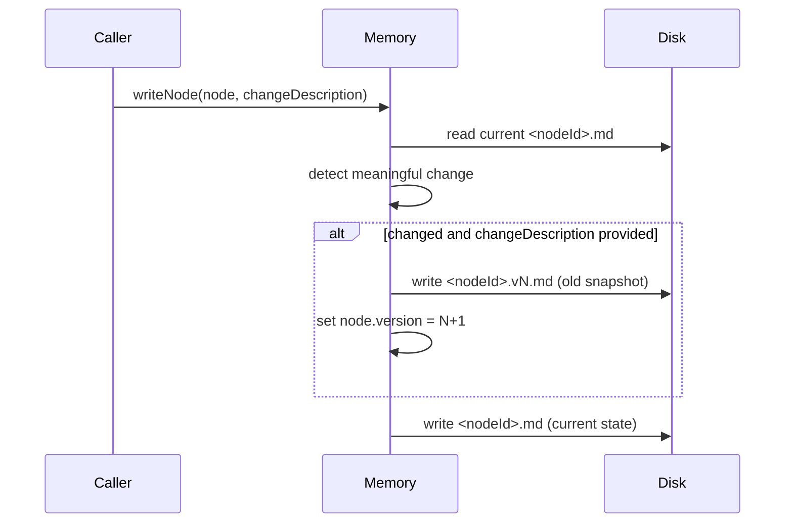
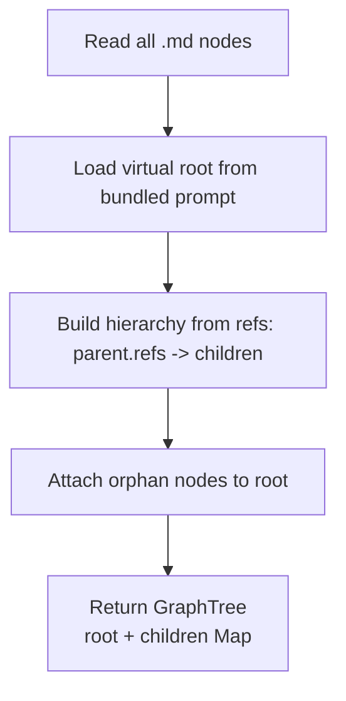

# Graph Memory

Graph memory stores user knowledge as markdown nodes in `~/.daycare/users/<userId>/memory/graph/`.
The root node (`__root__`) is virtual — its content comes from a bundled prompt in source code and is never stored on disk.
Every other node is `<nodeId>.md` with frontmatter and markdown content.
Node updates are versioned as immutable snapshots in the same folder.

## Node Structure


## Root Node

The root node is read-only and always present. Its content is loaded from `sources/prompts/memory/MEMORY_ROOT.md`.
Node IDs are auto-generated as cuid2 values. The root node cannot be updated via the write tool.

## Parent-Child Hierarchy

Hierarchy is determined by refs: a parent node's `refs` list its children.
When creating a node, the caller specifies `parents` (required, at least one).
For non-root parents the engine reads the parent, adds the new node ID to its refs, and writes it back.
When `__root__` is specified as a parent, no ref update occurs — root is virtual and has no stored refs.
The tree builder attaches any node not referenced by another node to root automatically.

## Append Data Flow

```mermaid
flowchart LR
    Caller[Any caller\n(tool/worker/agent)] -->|append(userId, nodeId, content)| Memory[Memory facade]
    Memory -->|readNode| Disk[(memory/graph/*.md)]
    Memory -->|update updatedAt + append body| Memory
    Memory -->|writeNode| Disk
```

## Node Versioning

Every node starts at `version: 1`. On meaningful updates (title, description, parents, refs, or content changes) with a
`changeDescription`, the previous state is saved as `<nodeId>.v<N>.md` and the active node increments to `N+1`.
Version files include full node frontmatter/content plus `changeDescription`.



`graphStoreRead` excludes `*.v<N>.md` files so snapshots never appear as active graph nodes.

## Tree Projection



## Notes

- API responses convert `Map<string, GraphNode[]>` into plain JSON objects for the dashboard.
- `Memory.append()` is the generic write path for all producers.
- Node IDs are cuid2 values auto-generated by the engine.
