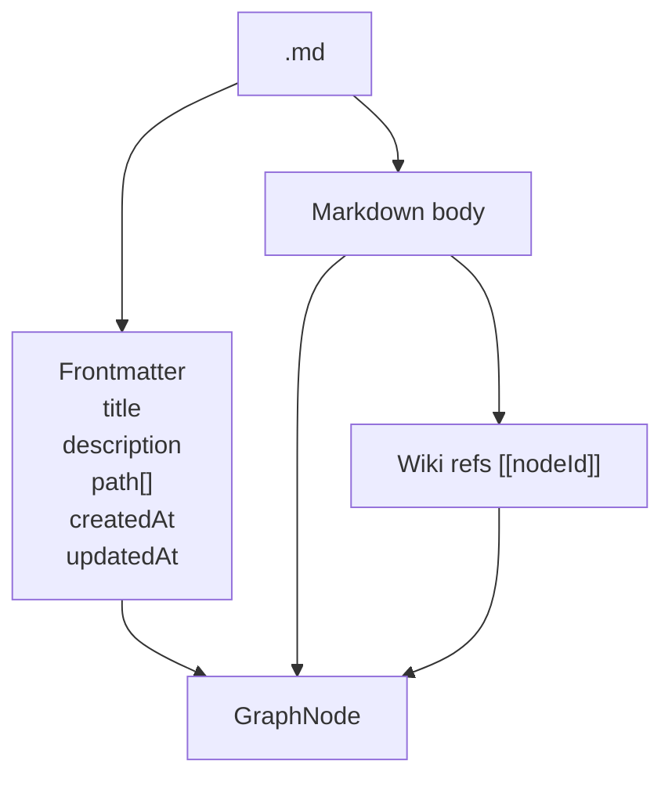

# Graph Memory

Graph memory stores user knowledge as markdown nodes in `~/.daycare/users/<userId>/home/memory/`.
`__root__.md` is the root summary node, and every other node is `<nodeId>.md` with frontmatter and markdown content.

## Node Structure



## Append Data Flow

```mermaid
flowchart LR
    Caller[Any caller\n(tool/worker/agent)] -->|append(userId, nodeId, content)| Memory[Memory facade]
    Memory -->|readNode| Disk[(memory/*.md)]
    Memory -->|update updatedAt + append body| Memory
    Memory -->|writeNode| Disk
```

## Tree Projection

```mermaid
flowchart TD
    A[Read all .md nodes] --> B[Ensure __root__.md exists]
    B --> C[Create folder nodes from frontmatter.path segments]
    C --> D[Build hierarchy edges parent -> child]
    D --> E[Add cross-ref edges from refs [[id]]]
    E --> F[Attach inbound-zero nodes to root]
    F --> G[Return GraphTree\nroot + children Map]
```

## Notes

- Folder nodes are synthesized in-memory as `__folder__:<path>` ids for visualization.
- API responses convert `Map<string, GraphNode[]>` into plain JSON objects for the dashboard.
- `Memory.append()` is the generic write path for all producers.
