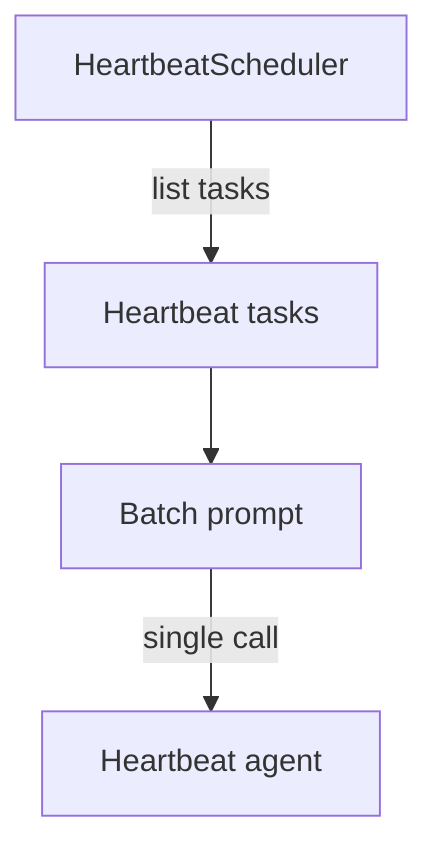

# Heartbeats

Heartbeat prompts are stored on disk and executed as a single batch on a fixed interval. Unlike cron tasks (which run independently), heartbeat tasks are collected and run together in one inference call.

## Storage

Heartbeat files live under `<config>/heartbeat/`:

| File | Purpose |
|------|---------|
| `<task-id>.md` | YAML frontmatter + prompt body |
| `.heartbeat-state.json` | Shared state for last run timestamp |

## Task format

```markdown
---
title: Check internet
---

Notify that the internet is down.
```

### Frontmatter fields

| Field | Required | Description |
|-------|----------|-------------|
| `title` | yes | Task title |

## Execution model



- All passing heartbeat prompts run together as a single background agent batch.
- The batch re-runs at a fixed interval or when invoked manually.
- A single `system:heartbeat` agent handles all heartbeat runs.

## Tools

| Tool | Description |
|------|-------------|
| `heartbeat_add` | Create or update a heartbeat prompt |
| `heartbeat_run` | Run the batch immediately |
| `heartbeat_remove` | Delete a heartbeat prompt |
| `topology` | View heartbeat tasks with agents, cron tasks, and signal subscriptions |
