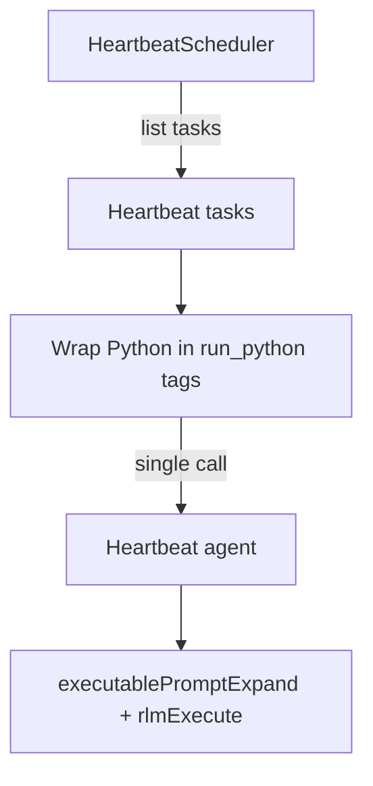

# Heartbeats

Heartbeat tasks store Python code in SQLite and execute it as a single batch on a fixed interval. Unlike cron tasks (which run independently), heartbeat tasks are collected and run together.

## Storage

Heartbeat rows live in `tasks_heartbeat`:
- `id`, `title`, `prompt` (Python code)
- `last_run_at` (unix ms)
- `created_at`, `updated_at`

## Task format

Heartbeat tasks store Python code that runs on each tick:

```python
# Check if service is responsive
result = http_fetch(url="https://example.com/health")
if result["status"] != 200:
    print("Service is down!")
else:
    skip()  # nothing to report
```

All agent tools are available as Python functions. Call `skip()` to abort inference when there is nothing to report.

## Execution model



- All heartbeat tasks run together as a single background agent batch.
- The batch re-runs at a fixed interval or when invoked manually.
- A single `system:heartbeat` agent handles all heartbeat runs.
- Python code is wrapped in `<run_python>` tags internally before execution.

## Tools

| Tool | Description |
|------|-------------|
| `heartbeat_add` | Create or update a heartbeat task with Python code |
| `heartbeat_run` | Run the batch immediately |
| `heartbeat_remove` | Delete a heartbeat task |
| `topology` | View heartbeat tasks with agents, cron tasks, and signal subscriptions |
