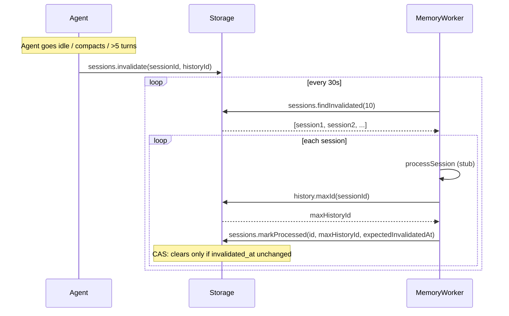

# Memory Collection

Memory collection is the first phase of the memory system. It marks agent sessions for processing when they become "stale" (idle, overflowed, or reset), then a background worker picks them up and processes them.

## Invalidation Triggers

A session is marked for processing (`invalidated_at` set to a history record id) when any of these occur:

1. **Agent goes idle** (sleep) - the session has no more pending messages
2. **Turn count exceeds 5** - more than 5 history records have been appended since the last processing
3. **Compaction or reset** - the old session is invalidated before a new one is created

## Schema

Two columns on the `sessions` table:

| Column | Type | Description |
|--------|------|-------------|
| `invalidated_at` | `INTEGER NULL` | `session_history.id` of the last record at invalidation time. NULL = not pending. |
| `processed_until` | `INTEGER NULL` | `session_history.id` of the last processed record. NULL = nothing processed yet. |

## Worker

`MemoryWorker` polls every 30 seconds for sessions where `invalidated_at IS NOT NULL`. For each session:

1. Process the session (stub - to be replaced with LLM-based extraction)
2. Read the max history id
3. CAS update: clear `invalidated_at` and set `processed_until`, but only if `invalidated_at` hasn't changed

The CAS (compare-and-swap) prevents clearing a session that received new messages during processing.

## Flow

## Files

| File | Purpose |
|------|---------|
| `storage/migrations/20260224_add_memory_columns.ts` | Adds `invalidated_at` and `processed_until` columns |
| `storage/sessionsRepository.ts` | `invalidate()`, `findInvalidated()`, `markProcessed()` methods |
| `storage/historyRepository.ts` | `countSinceId()`, `maxId()` methods |
| `storage/storage.ts` | Auto-invalidation in `appendHistory()` after >5 records |
| `engine/memory/memoryWorker.ts` | Timer-based polling worker |
| `engine/agents/agentSystem.ts` | Invalidation on agent sleep |
| `engine/agents/agent.ts` | Invalidation on compaction and reset |
| `engine/engine.ts` | Worker lifecycle (start/stop) |
