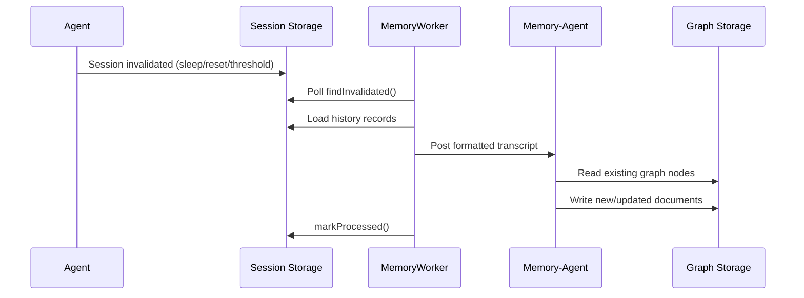

# Memory

The memory system processes agent conversations and persists durable knowledge to the graph for cross-session recall.

## Architecture



### Components

| Component | File | Role |
|-----------|------|------|
| MemoryWorker | `engine/memory/memoryWorker.ts` | Timer-based poller (30s) that routes invalidated sessions |
| Memory-Agent | descriptor `{ type: "memory-agent", id }` | Per-source-agent agent that receives transcripts and updates graph documents |
| formatHistoryMessages | `engine/memory/infer/utils/formatHistoryMessages.ts` | Converts history records to markdown transcript |
| Graph Store | `engine/memory/graph/` | Markdown files with YAML frontmatter for structured knowledge |

### Memory-Agent Descriptor

```typescript
{ type: "memory-agent"; id: string }
// id = source agent this memory-agent processes for
```

- **One memory-agent per source agent** — lazily created on first encounter
- **System prompt**: `prompts/memory/MEMORY_AGENT.md` (full replacement, no standard sections)
- **Sessions never invalidated** — prevents recursive memory processing
- **Cache key**: `/memory-agent/<sourceAgentId>`
- **Purpose**: reads transcripts, reads existing graph, writes new/updated documents

### Session Invalidation Flow

Sessions are invalidated at four points:

1. **End turn threshold** — after 5+ turns (`agent.ts:invalidateSessionIfNeeded`)
2. **Session reset** — manual or emergency reset (`agent.ts:handleReset`)
3. **Context compaction** — old session archived (`agent.ts:applyCompactionSummary`)
4. **Agent sleep** — idle timeout (`agentSystem.ts:sleepIfIdle`)

Memory-agent descriptors skip all four invalidation points.

### Memory Worker Tick

Each 30-second tick:

1. Query up to 10 invalidated sessions
2. For each session:
   - Skip if agent is a `memory-agent` (mark processed, continue)
   - Load unprocessed history records since `processedUntil`
   - Format as markdown transcript
   - Post as `system_message` to `{ type: "memory-agent", id: agentId }`
   - Mark session as processed

## Storage Layout

Memory graph files live under `<usersDir>/<userId>/memory/`.

Each graph node is a markdown file with YAML frontmatter:

```markdown
---
title: "Node Title"
description: "Short description"
path: ["category", "subcategory"]
createdAt: 1708000000000
updatedAt: 1708000000000
---

Document content here.
```

## Memory Files

| File | Purpose |
|------|---------|
| `USER.md` | User facts, preferences, timezone, communication style |
| `SOUL.md` | Agent personality and behavioral refinements |
| `AGENTS.md` | Workspace operating rules, session routines |
| `TOOLS.md` | Learned tool knowledge, pitfalls, patterns |
| `memory/*.md` | Graph nodes for topics, people, projects |
