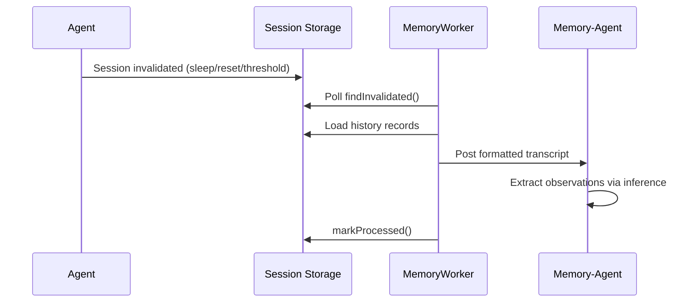

# Memory

The memory system extracts observations from agent conversations and persists them for cross-session recall.

## Architecture



### Components

| Component | File | Role |
|-----------|------|------|
| MemoryWorker | `engine/memory/memoryWorker.ts` | Timer-based poller (30s) that routes invalidated sessions |
| Memory-Agent | descriptor `{ type: "memory-agent", id }` | Per-source-agent agent that receives transcripts and extracts observations |
| formatHistoryMessages | `engine/memory/infer/utils/formatHistoryMessages.ts` | Converts history records to markdown transcript |

### Memory-Agent Descriptor

```typescript
{ type: "memory-agent"; id: string }
// id = source agent this memory-agent processes for
```

- **One memory-agent per source agent** — lazily created on first encounter
- **System prompt**: `prompts/memory/MEMORY_AGENT.md` (full replacement, no standard sections)
- **Sessions never invalidated** — prevents recursive memory processing
- **Cache key**: `/memory-agent/<sourceAgentId>`

### Session Invalidation Flow

Sessions are invalidated at four points:

1. **End turn threshold** — after 5+ turns (`agent.ts:invalidateSessionIfNeeded`)
2. **Session reset** — manual or emergency reset (`agent.ts:handleReset`)
3. **Context compaction** — old session archived (`agent.ts:applyCompactionSummary`)
4. **Agent sleep** — idle timeout (`agentSystem.ts:sleepIfIdle`)

Memory-agent descriptors skip all four invalidation points.

### Memory Worker Tick

Each 30-second tick:

1. Query up to 10 invalidated sessions
2. For each session:
   - Skip if agent is a `memory-agent` (mark processed, continue)
   - Load unprocessed history records since `processedUntil`
   - Format as markdown transcript
   - Post as `system_message` to `{ type: "memory-agent", id: agentId }`
   - Mark session as processed

## Storage layout

Memory files live under `<usersDir>/<userId>/memory/`.

## Observation Format

The memory-agent extracts observations as XML:

```xml
<observations>
<observation>
<text>Dense observation text.</text>
<context>Relevant surrounding context.</context>
</observation>
</observations>
```

## Entity Tools

| Tool | Parameters | Description |
|------|------------|-------------|
| `memory_create_entity` | `entity`, `name`, `description` | Create or update an entity file and add to INDEX.md |
| `memory_upsert_record` | `entity`, `record`, `content` | Add or update a `## <record>` section |
| `memory_list_entities` | `limit` (optional) | List entities with short name/description |
