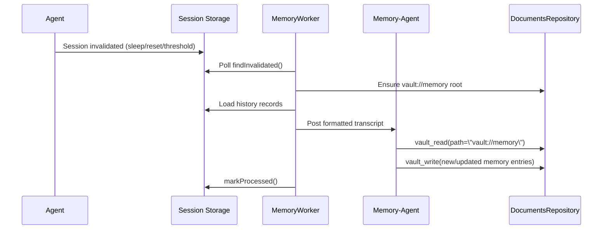

# Memory

The memory system processes agent conversations and persists durable knowledge to the vault tree for cross-session recall.

## Architecture


```mermaid
sequenceDiagram
    participant A as Agent
    participant S as Session Storage
    participant MW as MemoryWorker
    participant MA as Memory-Agent
    participant D as DocumentsRepository

    A->>S: Session invalidated (sleep/reset/threshold)
    MW->>S: Poll findInvalidated()
    MW->>D: Ensure vault://memory root
    MW->>S: Load history records
    MW->>MA: Post formatted transcript
    MA->>D: vault_read(path=\"vault://memory\")
    MA->>D: vault_write(new/updated memory entries)
    MW->>S: markProcessed()
```

### Components

| Component | File | Role |
|-----------|------|------|
| MemoryWorker | `engine/memory/memoryWorker.ts` | Timer-based poller (30s) that routes invalidated sessions |
| Memory-Agent | descriptor `{ type: "memory-agent", id }` | Per-source-agent agent that receives transcripts and updates memory vault entries |
| formatHistoryMessages | `engine/memory/infer/utils/formatHistoryMessages.ts` | Converts history records to markdown transcript |
| Vault Storage | `storage/documentsRepository.ts` | Versioned vault storage with parent/link/body references |

### Memory-Agent Descriptor

```typescript
{ type: "memory-agent"; id: string }
// id = source agent this memory-agent processes for
```

- **One memory-agent per source agent** — lazily created on first encounter
- **System prompt**: `prompts/memory/MEMORY_AGENT.md` (full replacement, no standard sections)
- **Sessions never invalidated** — prevents recursive memory processing
- **Cache key**: `/memory-agent/<sourceAgentId>`
- **Purpose**: reads transcripts, reads existing memory vault entries, writes new/updated entries

### Session Invalidation Flow

Sessions are invalidated at four points:

1. **End turn threshold** — after 5+ turns (`agent.ts:invalidateSessionIfNeeded`)
2. **Session reset** — manual or emergency reset (`agent.ts:handleReset`)
3. **Context compaction** — old session archived (`agent.ts:applyCompactionSummary`)
4. **Agent sleep** — idle timeout (`agentSystem.ts:sleepIfIdle`)

Memory-agent descriptors skip all four invalidation points.

### Memory Worker Tick

Each 30-second tick:

1. Query up to 10 invalidated sessions
2. For each session:
   - Skip if agent is a `memory-agent` (mark processed, continue)
   - Load unprocessed history records since `processedUntil`
   - Format as markdown transcript
   - Post as `system_message` to `{ type: "memory-agent", id: agentId }`
   - Mark session as processed

## Storage Layout

Memory vault entries are stored in the `documents` and `document_references` tables.

- Root memory node path: `vault://memory`
- Child memory nodes: `vault://memory/<slug>/...`
- Writes go through `vault_write`; reads go through `vault_read`
