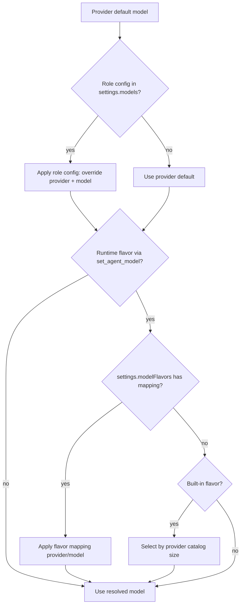
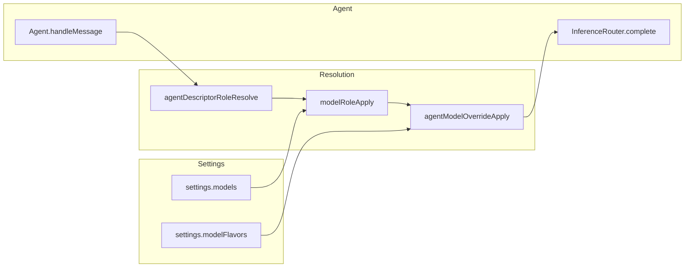

# Role And Flavor Model Configuration

## Overview

Daycare supports two persistent model configuration layers in `settings.json`:

- `models`: role-specific overrides (`user`, `memory`, `memorySearch`, `subagent`, `heartbeat`)
- `modelFlavors`: flavor mappings used by `set_agent_model`

Role overrides use `<providerId>/<modelName>` values.
Flavor mappings use `{ model, description }`.

## Settings Format

```json
{
    "models": {
        "user": "anthropic/claude-sonnet-4-5",
        "memory": "openai/gpt-5-mini",
        "memorySearch": "openai/gpt-5-mini",
        "subagent": "anthropic/claude-haiku-4-5",
        "heartbeat": "openai/gpt-5-mini"
    },
    "modelFlavors": {
        "coding": {
            "model": "openai/codex-mini",
            "description": "Optimized for code generation"
        },
        "research": {
            "model": "google/gemini-2.5-pro",
            "description": "Best for search and extraction work"
        }
    }
}
```

Built-in flavors (`small`, `normal`, `large`) always exist and include hardcoded descriptions.
If a built-in flavor is not mapped in `modelFlavors`, Daycare resolves it from provider catalogs by size.

## Roles

| Role key | Agent descriptor types | Description |
|---|---|---|
| `user` | `user`, `permanent` | User-facing chat agents |
| `memory` | `memory-agent` | Agents that extract observations from transcripts |
| `memorySearch` | `memory-search` | Agents that search the memory graph |
| `subagent` | `subagent`, `app` | Background child agents |
| `heartbeat` | `system` (tag: `heartbeat`) | Periodic heartbeat agents |

Cron agents and non-heartbeat system agents have no dedicated role and always use the provider default.

## Precedence



1. **Runtime flavor override** (`set_agent_model` with built-in or custom flavor name) — highest priority, ephemeral per-agent session
2. **Flavor mapping config** (`settings.modelFlavors`) — persistent mapping for flavor values
3. **Settings role config** (`settings.models[role]`) — persistent role defaults
4. **Provider default** — the model configured on the provider entry

## CLI

```bash
# View current role + flavor assignments
daycare models --list

# Interactive: configure a role assignment or flavor assignment
daycare models

# With custom settings path
daycare models -s /path/to/settings.json
```

The interactive mode validates selected provider/model values before saving.

## Architecture



| Component | File | Role |
|---|---|---|
| `ModelRoleConfig` / `ModelFlavorConfig` | `packages/daycare/sources/settings.ts` | Settings types for role and flavor overrides |
| `modelRoleApply` | `packages/daycare/sources/providers/modelRoleApply.ts` | Applies configured `provider/model` override |
| `agentModelOverrideApply` | `packages/daycare/sources/engine/agents/ops/agentModelOverrideApply.ts` | Applies runtime flavor and `modelFlavors` mapping |
| `set_agent_model` tool | `packages/daycare/sources/engine/modules/tools/agentModelSetToolBuild.ts` | Runtime flavor override (`small|normal|large` + custom) |
| `modelsCommand` | `packages/daycare/sources/commands/models.ts` | CLI for role + flavor assignments |
