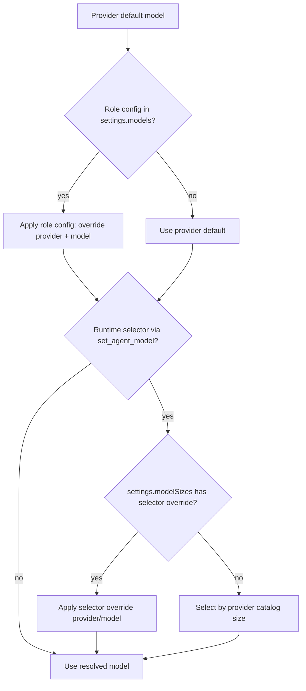
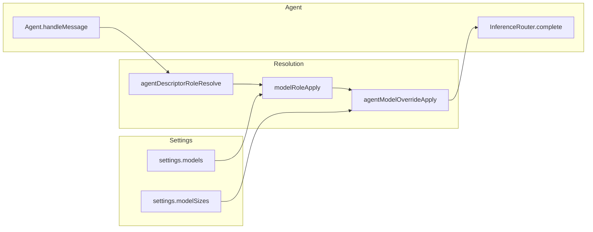

# Role And Selector Model Configuration

## Overview

Daycare supports two persistent model configuration layers in `settings.json`:

- `models`: role-specific overrides (`user`, `memory`, `memorySearch`, `subagent`, `heartbeat`)
- `modelSizes`: selector-specific overrides (`small`, `normal`, `large`) used by `set_agent_model`

Both use `<providerId>/<modelName>` values.

## Settings Format

```json
{
    "models": {
        "user": "anthropic/claude-sonnet-4-5",
        "memory": "openai/gpt-5-mini",
        "memorySearch": "openai/gpt-5-mini",
        "subagent": "anthropic/claude-haiku-4-5",
        "heartbeat": "openai/gpt-5-mini"
    },
    "modelSizes": {
        "small": "openai/gpt-5-mini",
        "normal": "anthropic/claude-sonnet-4-5",
        "large": "anthropic/claude-opus-4-5"
    }
}
```

If `modelSizes` is omitted, selectors resolve from provider model catalogs by size.

## Roles

| Role key | Agent descriptor types | Description |
|---|---|---|
| `user` | `user`, `permanent` | User-facing chat agents |
| `memory` | `memory-agent` | Agents that extract observations from transcripts |
| `memorySearch` | `memory-search` | Agents that search the memory graph |
| `subagent` | `subagent`, `app` | Background child agents |
| `heartbeat` | `system` (tag: `heartbeat`) | Periodic heartbeat agents |

Cron agents and non-heartbeat system agents have no dedicated role and always use the provider default.

## Precedence



1. **Runtime selector override** (`set_agent_model` with `small|normal|large`) — highest priority, ephemeral per-agent session
2. **Selector mapping config** (`settings.modelSizes`) — persistent mapping for selector values
3. **Settings role config** (`settings.models[role]`) — persistent role defaults
4. **Provider default** — the model configured on the provider entry

## CLI

```bash
# View current role + selector assignments
daycare models --list

# Interactive: configure a role assignment or selector assignment
daycare models

# With custom settings path
daycare models -s /path/to/settings.json
```

The interactive mode validates selected provider/model values before saving.

## Architecture



| Component | File | Role |
|---|---|---|
| `ModelRoleConfig` / `ModelSizeConfig` | `packages/daycare/sources/settings.ts` | Settings types for role and selector overrides |
| `modelRoleApply` | `packages/daycare/sources/providers/modelRoleApply.ts` | Applies configured `provider/model` override |
| `agentModelOverrideApply` | `packages/daycare/sources/engine/agents/ops/agentModelOverrideApply.ts` | Applies runtime selector and `modelSizes` mapping |
| `set_agent_model` tool | `packages/daycare/sources/engine/modules/tools/agentModelSetToolBuild.ts` | Runtime selector override (`small|normal|large`) |
| `modelsCommand` | `packages/daycare/sources/commands/models.ts` | CLI for role + selector assignments |
