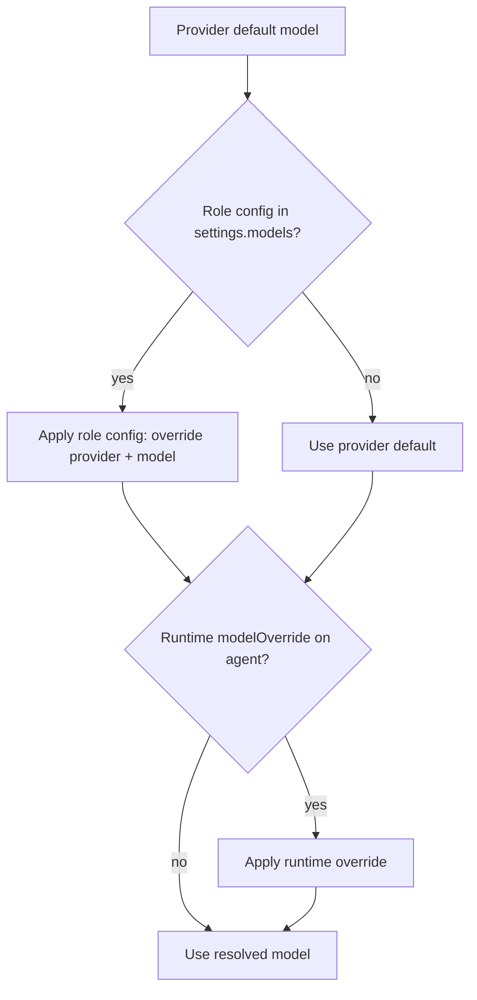
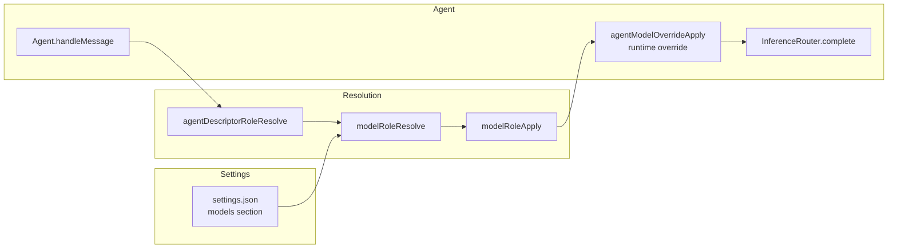

# Per-Role Model Configuration

## Overview

Daycare supports configuring which inference model each agent role uses. By default, all agents use the provider's default model (the first configured provider and its `model` field). The `models` section in `settings.json` allows overriding the model for specific roles.

## Settings Format

```json
{
    "models": {
        "user": "anthropic/claude-sonnet-4-20250514",
        "memory": "openai/gpt-4o-mini",
        "memorySearch": "openai/gpt-4o-mini",
        "subagent": "anthropic/claude-haiku-4-5-20251001",
        "heartbeat": "openai/gpt-4o-mini"
    }
}
```

Each value uses `<providerId>/<modelName>` format. The provider must be configured and active. Omitted roles use the provider default.

## Roles

| Role key | Agent descriptor types | Description |
|---|---|---|
| `user` | `user`, `permanent` | User-facing chat agents |
| `memory` | `memory-agent` | Agents that extract observations from transcripts |
| `memorySearch` | `memory-search` | Agents that search the memory graph |
| `subagent` | `subagent`, `app` | Background child agents |
| `heartbeat` | `system` (tag: `heartbeat`) | Periodic heartbeat agents |

Cron agents and non-heartbeat system agents have no dedicated role and always use the provider default.

## Precedence



1. **Runtime override** (`set_agent_model` tool) — highest priority, ephemeral per-agent session
2. **Settings role config** (`settings.models[role]`) — persistent, applies to all agents of that role
3. **Provider default** — the model configured on the provider entry

## CLI

```bash
# View current model assignments
daycare models --list

# Interactive: select a role and model
daycare models

# With custom settings path
daycare models -s /path/to/settings.json
```

The interactive mode validates the selected model by making a micro inference call before saving.

## Architecture



| Component | File | Role |
|---|---|---|
| `ModelRoleConfig` | `settings.ts` | Type for the `models` settings section |
| `modelRoleResolve` | `providers/modelRoleResolve.ts` | Parses `provider/model` string, validates provider |
| `modelRoleApply` | `providers/modelRoleApply.ts` | Applies role config to provider list |
| `agentDescriptorRoleResolve` | `engine/agents/ops/agentDescriptorRoleResolve.ts` | Maps descriptor to role key |
| `modelsCommand` | `commands/models.ts` | CLI command for managing role assignments |
