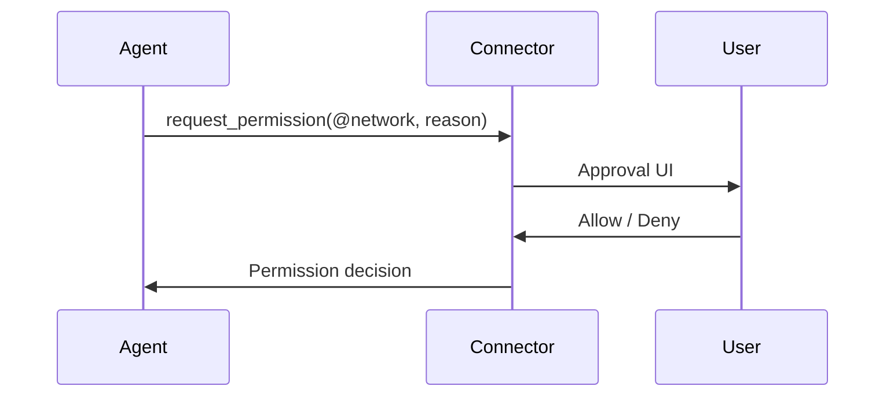

# Networking & Permissions

Daycare uses a permission system to control agent access to the filesystem and network. Permissions are granted per-agent and can be requested interactively.

## Permission types

| Tag | Description |
|-----|-------------|
| `@read:<path>` | Allow reading files under the given absolute path |
| `@write:<path>` | Allow writing files under the given absolute path (implies read) |
| `@network` | Allow outbound network access |

## How permissions work

Each agent has a `SessionPermissions` object that tracks:
- `readDirs` - allowed read paths
- `writeDirs` - allowed write paths
- `network` - whether network access is enabled
- `workingDir` - the agent's workspace directory

When a `@write:<path>` permission is granted, the path is also added to `readDirs` automatically.

## Requesting permissions

Agents call `request_permission` when they need access they don't have. The request is routed to the user via the active connector (e.g., Telegram inline buttons, WhatsApp text replies).

- Foreground agents request directly
- Background agents route through the most recent foreground agent
- Permission decisions are delivered asynchronously; agents continue unblocked work while waiting

## Granting permissions between agents

Agents can share permissions using `grant_permission`. The grant succeeds only when the source agent already holds the permission. Every grant requires a justification.

## Exec/process scoped permissions

When `exec` or `process_start` runs a command, it builds a restricted permission scope:
- `workingDir` stays the same
- `writeDirs` and `network` are cleared by default
- Explicit permission tags in the call are validated against the caller's permissions before applying

## Scheduled task permissions

Cron and heartbeat tasks do not carry their own permission tags. They run with the target agent's existing permissions. Gate permissions are validated against the agent's permissions; if missing, a system message is posted and the task still runs.

## Web search & fetch

All web search/fetch tools require `@network` permission. Available tools:

| Tool | Plugin | Description |
|------|--------|-------------|
| `web_search` | brave-search | Brave Search API |
| `anthropic_search` | anthropic-search | Claude-powered web search |
| `openai_search` | openai-search | GPT-powered web search |
| `gemini_search` | gemini-search | Google Gemini with Search Grounding |
| `perplexity_search` | perplexity-search | Perplexity Sonar search |
| `exa_search` | exa-ai | Neural/fast/deep search modes |
| `anthropic_fetch` | anthropic-fetch | URL content extraction via Claude |
| `firecrawl_fetch` | firecrawl | Clean content extraction via Firecrawl |
| `web_fetch` | web-fetch | Plain HTTP GET (no JavaScript) |
