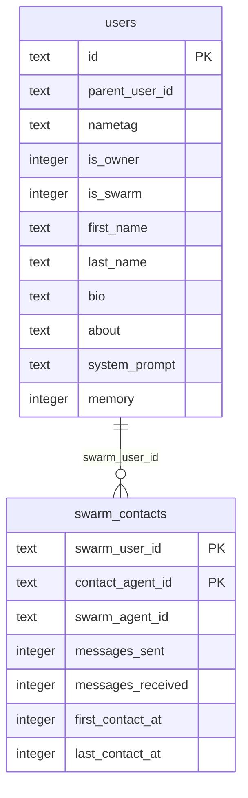
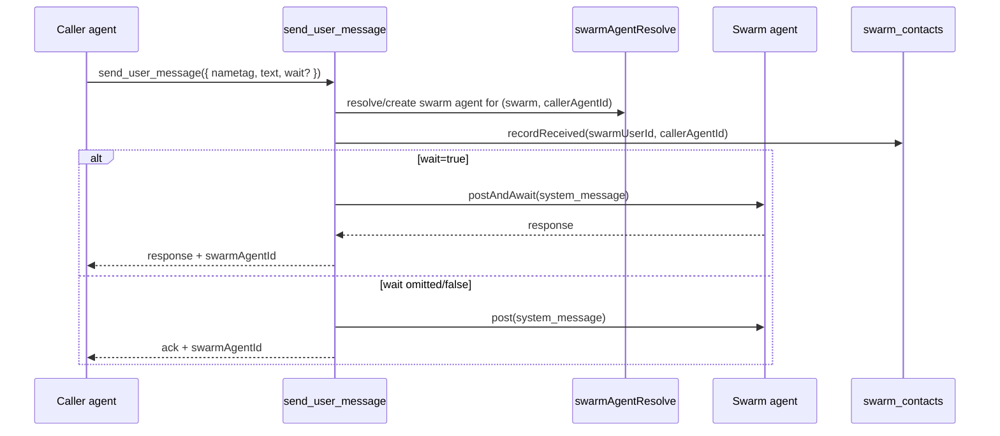

# Swarms

Swarms are user-scoped agents owned by another user.

## What a swarm is

- A swarm is a `users` row with `is_swarm = 1` and `parent_user_id = <ownerUserId>`.
- Owners create swarms with `swarm_create`.
- Agents talk to swarms through `send_user_message({ nametag, text, wait? })`.
- Each swarm resolves to a persistent swarm-side agent id per contact.

## Data model

## Message flow

## Proactive messaging boundary

Swarms can call `send_agent_message`:

- Same-user targets are allowed.
- Cross-user targets must exist in `swarm_contacts`.
- Unknown cross-user targets are rejected with:
  `Can only message agents that have contacted this swarm`.

## Filesystem and memory

- Swarm home is created at `<usersDir>/<swarmUserId>/home/`.
- `SOUL.md` is seeded from `users.system_prompt`.
- Memory is opt-in via `users.memory` (default `false`).
- Owner sandboxes mount each swarm home at `/share/swarm/<nametag>/`.
