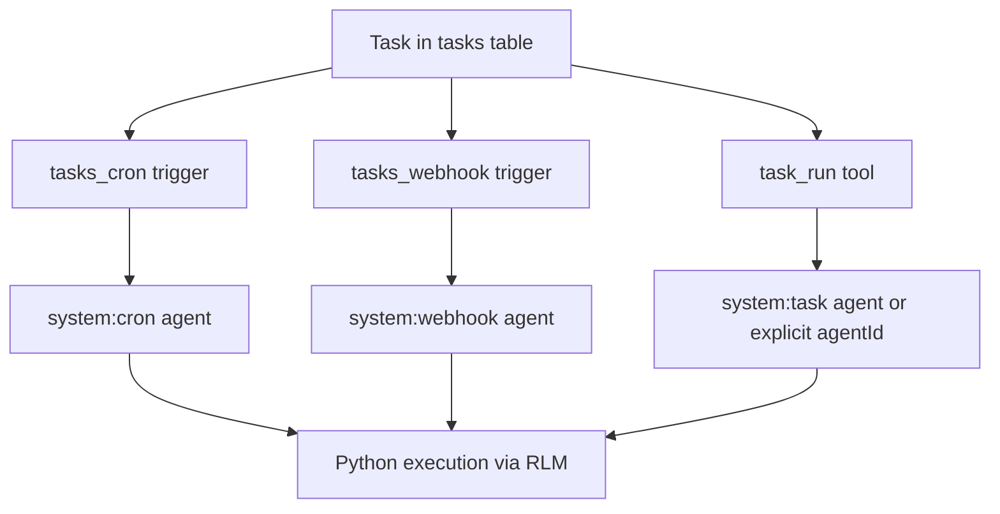

# Unified Tasks

Daycare now uses a unified task model:
- `tasks` stores Python code and task metadata (`title`, `description`)
- tasks are soft-deleted (`deleted_at`) so historical ids are never reused
- `tasks_cron` stores cron triggers
- `tasks_webhook` stores webhook triggers
- triggers reference tasks through `task_id`
- task ids are slug ids generated from task titles (e.g. `daily-check`, `daily-check-2`)
- trigger ids are arbitrary `cuid2` ids

A single task can be:
- run manually with `task_run`
- scheduled with a cron trigger
- scheduled with a webhook trigger
- scheduled by both cron and webhook at the same time

## Code execution model

Task `code` is Python that runs via RLM with full tool access. Two patterns:

1. **Produce a prompt** — print or return text. The output becomes context for the agent's next LLM turn, so the agent reasons and acts on it.
   ```python
   status = topology()
   print("Check the topology below and report any stuck agents.")
   print(status)
   ```

2. **Do the work and skip** — call tools directly, then call `skip()` to suppress the LLM turn. Use this when the task is fully mechanical and needs no reasoning.
   ```python
   data = memory_search(query="daily-metrics")
   send_agent_message(agent_id="reporter", message=str(data))
   skip()
   ```

If `skip()` is not called, all Python output is provided to the LLM as context. If `skip()` is called, the agent never wakes — the code ran and that's it.



Trigger-facing shape:
- cron trigger: `id`, `type: "cron"`, `schedule`
- webhook trigger: `id`, `type: "webhook"`

## Tools

- `task_create`: create task and optional triggers
- `task_read`: read task and linked triggers
- `task_update`: update task fields
- `task_delete`: remove task and all triggers
- `task_run`: run task immediately
- `task_trigger_add`: add cron or webhook trigger
- `task_trigger_remove`: remove cron or webhook trigger
