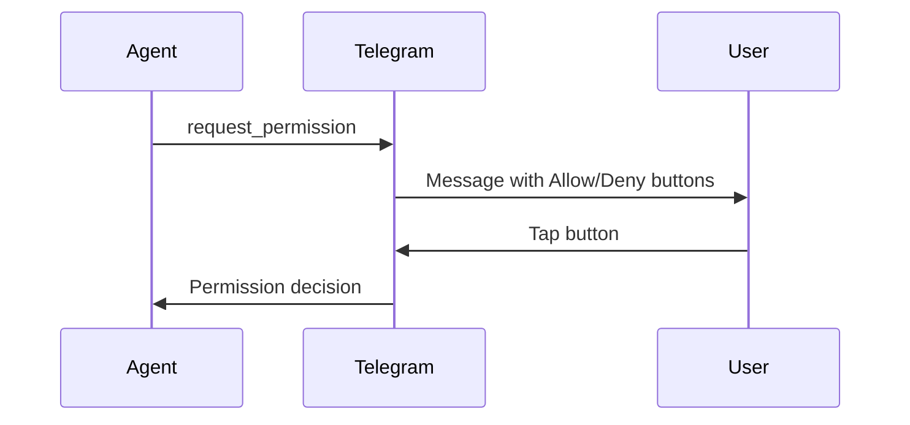

# Telegram

Connect Daycare to Telegram via the Bot API with long polling. Only processes private chats.

## Setup

1. Create a bot via [@BotFather](https://t.me/BotFather)
2. Run `daycare add` and select the Telegram plugin
3. Enter the bot token when prompted
4. Add allowed Telegram user IDs to the settings

## Configuration

```json
{
  "instanceId": "telegram",
  "pluginId": "telegram",
  "enabled": true,
  "settings": {
    "allowedUids": [123456789],
    "polling": true,
    "clearWebhook": true
  }
}
```

### Settings

| Setting | Type | Default | Description |
|---------|------|---------|-------------|
| `allowedUids` | number[] | required | Telegram user IDs allowed to interact |
| `polling` | boolean | `true` | Enable/disable long polling |
| `clearWebhook` | boolean | `true` | Clear Telegram webhook before polling starts |
| `statePath` | string | auto | Override path for `lastUpdateId` storage |

## Authentication

Credentials are stored in `.daycare/auth.json`:

```json
{ "telegram": { "type": "token", "token": "123456:ABC-DEF..." } }
```

## Capabilities

| Feature | Supported |
|---------|-----------|
| Send/receive text | Yes |
| Send/receive files | Yes (photos, documents) |
| Typing indicators | Yes |
| Emoji reactions | Yes |
| Inline permission buttons | Yes |

## Message formatting

- Outgoing text uses **MarkdownV2** parse mode
- The system prompt instructs the model to follow MarkdownV2 rules
- Permission prompts are formatted with MarkdownV2-safe escaping
- If Telegram rejects a message due to parse errors, the connector retries without `parse_mode`

## Slash commands

Commands are registered with Telegram on startup (scoped to private chats):

| Command | Description |
|---------|-------------|
| `/reset` | Clear agent message history for the current user |
| `/stop` | Abort the current inference for the current user |
| `/context` | Show token usage snapshot |

## Permission handling

Permission requests render as inline keyboard buttons. After a decision, the message is edited in-place to show the result. Background agents route permission requests through the most recent foreground agent.



## Message splitting

Large responses are split to respect Telegram API limits:
- Text messages: 4096 character limit
- Captions: 1024 character limit
- Files with captions are handled separately

## Polling behavior

- Persists `lastUpdateId` to avoid reprocessing messages after restart
- On HTTP 409 conflict (another bot instance), clears webhook once and retries
- Backoff and retry are managed by the Telegram library
- Group/supergroup/channel messages are ignored
