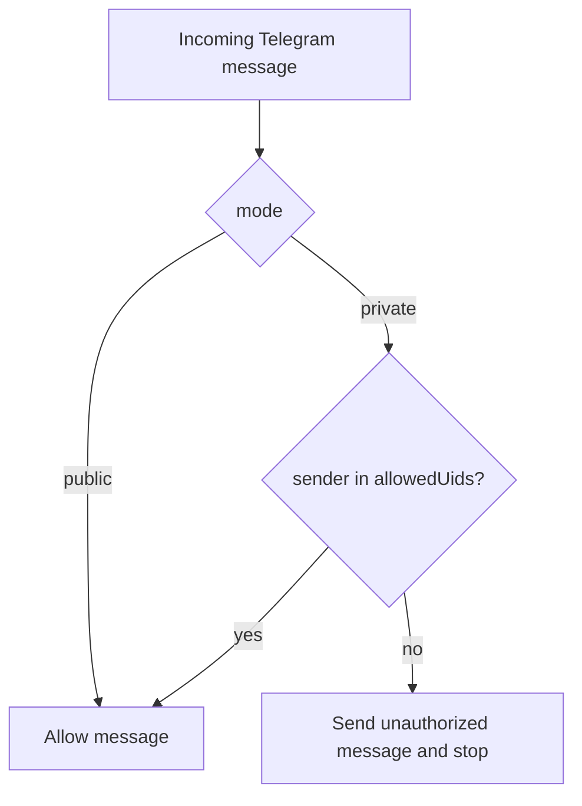
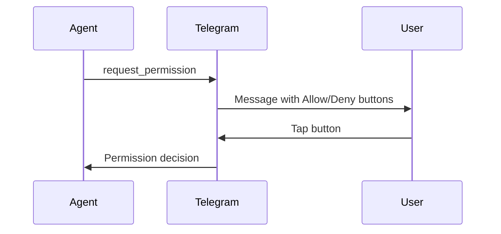

# Telegram

Connect Daycare to Telegram via the Bot API with long polling. Only processes private chats.

## Setup

1. Create a bot via [@BotFather](https://t.me/BotFather)
2. Run `daycare add` and select the Telegram plugin
3. Enter the bot token when prompted
4. Choose access mode (`private` or `public`); add allowed Telegram user IDs when using `private`

## Configuration

```json
{
  "instanceId": "telegram",
  "pluginId": "telegram",
  "enabled": true,
  "settings": {
    "mode": "private",
    "allowedUids": [123456789],
    "sendReplies": false,
    "sendRepliesInGroups": true,
    "polling": true,
    "clearWebhook": true
  }
}
```

### Settings

| Setting | Type | Default | Description |
|---------|------|---------|-------------|
| `mode` | `"private" \| "public"` | `"private"` | Access policy for Telegram users |
| `allowedUids` | number[] | required in `private`, optional in `public` | Telegram user IDs allowed to interact |
| `sendReplies` | boolean | `false` | Include `reply_to_message_id` for all chats when context has a source message id |
| `sendRepliesInGroups` | boolean | `true` | Include `reply_to_message_id` for group/supergroup chats when context has a source message id |
| `polling` | boolean | `true` | Enable/disable long polling |
| `clearWebhook` | boolean | `true` | Clear Telegram webhook before polling starts |
| `statePath` | string | auto | Override path for `lastUpdateId` storage |

### Access modes

- `private` mode: only users in `allowedUids` are allowed. Unapproved users receive:
  `🚫 You are not authorized to use this bot. Please contact the system administrator to request access.`
- `public` mode: all Telegram users are allowed and `allowedUids` can be omitted.



## Authentication

Credentials are stored in `.daycare/auth.json`:

```json
{ "telegram": { "type": "token", "token": "123456:ABC-DEF..." } }
```

## Capabilities

| Feature | Supported |
|---------|-----------|
| Send/receive text | Yes |
| Send/receive files | Yes (photos, documents, voice, audio, stickers) |
| Typing indicators | Yes |
| Emoji reactions | Yes |
| Inline permission buttons | Yes |

## Message formatting

- Outgoing text uses **MarkdownV2** parse mode
- The system prompt instructs the model to follow MarkdownV2 rules
- Permission prompts are formatted with MarkdownV2-safe escaping
- If Telegram rejects a message due to parse errors, the connector retries without `parse_mode`

## Slash commands

Core commands are registered with Telegram (scoped to private chats), and plugins can add more commands dynamically:

| Command | Description |
|---------|-------------|
| `/reset` | Clear agent message history for the current user |
| `/context` | Show token usage snapshot |
| `/compact` | Compact the current conversation context |
| `/abort` | Abort the current inference for the current user |

When the Upgrade plugin is enabled, it also contributes:
- `/upgrade` to install the latest `daycare-cli` and restart PM2.
- `/restart` to restart the configured PM2 Daycare process without running upgrade install.

## Permission handling

Permission requests render as inline keyboard buttons. After a decision, the message is edited in-place to show the result. Background agents route permission requests through the most recent foreground agent.



## Message splitting

Large responses are split to respect Telegram API limits:
- Text messages: 4096 character limit
- Captions: 1024 character limit
- Files with captions are handled separately

## Incoming file dedupe

- Incoming Telegram file attachments are cached by Telegram `file_id` in connector memory.
- The cache is persisted in connector `statePath`, so restarts keep the same `file_id` dedupe behavior.
- When the same `file_id` appears again, the connector reuses the existing stored file reference and skips re-download.

## Polling behavior

- Persists `lastUpdateId` to avoid reprocessing messages after restart
- On HTTP 409 conflict (another bot instance), clears webhook once and retries
- Backoff and retry are managed by the Telegram library
- Group/supergroup/channel messages are ignored
