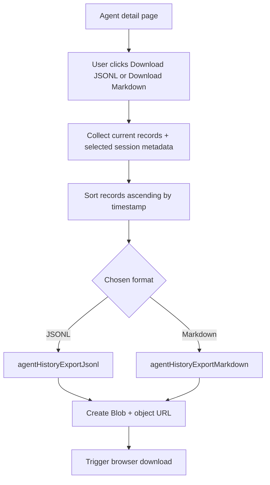

# Dashboard Session Log Exports

The agent detail dashboard view now supports downloading the currently loaded session history in two formats:

- `JSONL` for machine processing (`.jsonl`)
- `Markdown` for human-readable review (`.md`)

Both exports use the same session-filtered records shown in the history list.

## Data and format behavior

- Export source is the selected session in `Agent detail`.
- If no session is selected, export uses the currently loaded fallback history records.
- Records are exported in chronological order (oldest to newest).
- File names include agent id, session id (or `latest`), and an ISO timestamp.

## Export flow

