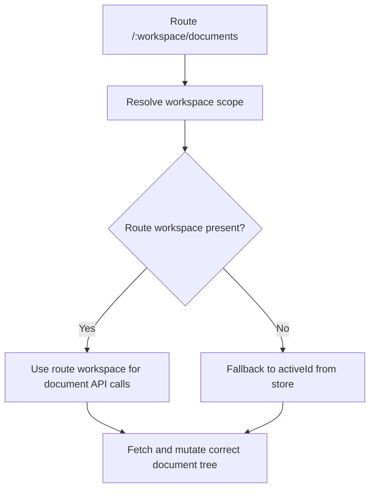

# Documents Refresh Scope Fix

The documents screen was issuing fetch and mutation requests against `activeId` from the workspace store.
During route refreshes, that store can lag behind the URL workspace and temporarily point at a different scope.
When that happened, the documents tree reloaded from the wrong workspace and only the system subtree appeared.

The fix makes the documents screen prefer the workspace from the current route and only fall back to `activeId`
when no route workspace is available.

