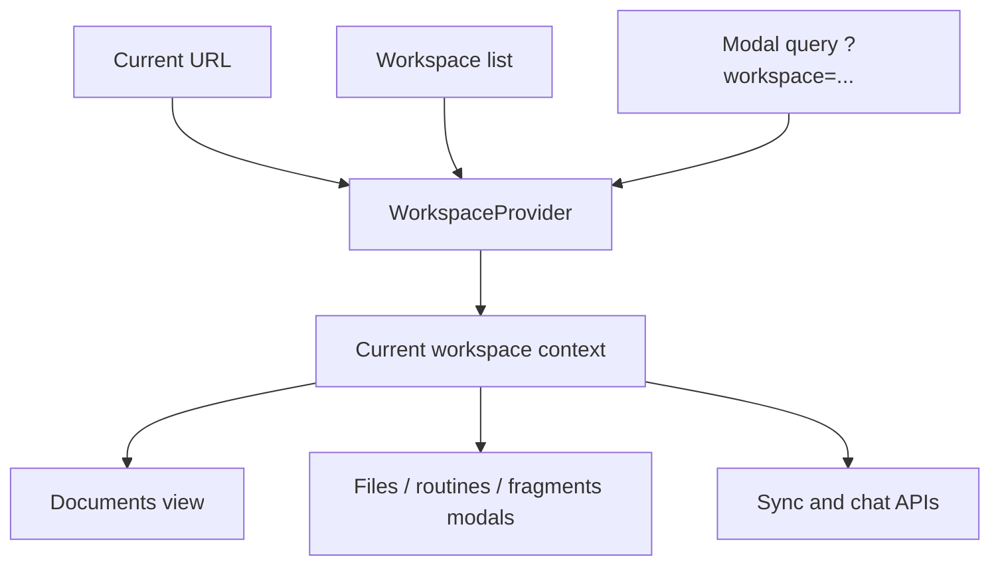

# Documents Refresh Scope Fix

The documents refresh bug came from treating the current workspace as mutable store state.
That made document fetches depend on `activeId`, which could drift from the route during refreshes and briefly
scope requests to the wrong workspace.

The fix removes `activeId` and `setActive` from the app workspace store and replaces them with a route-backed
`WorkspaceProvider`. Screens now read the current workspace from context, and modal routes keep workspace scope
explicit via a `workspace` query param.

