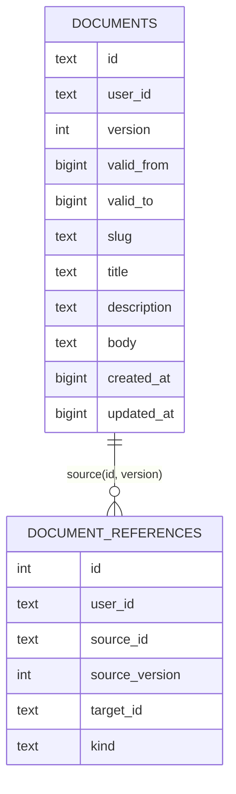
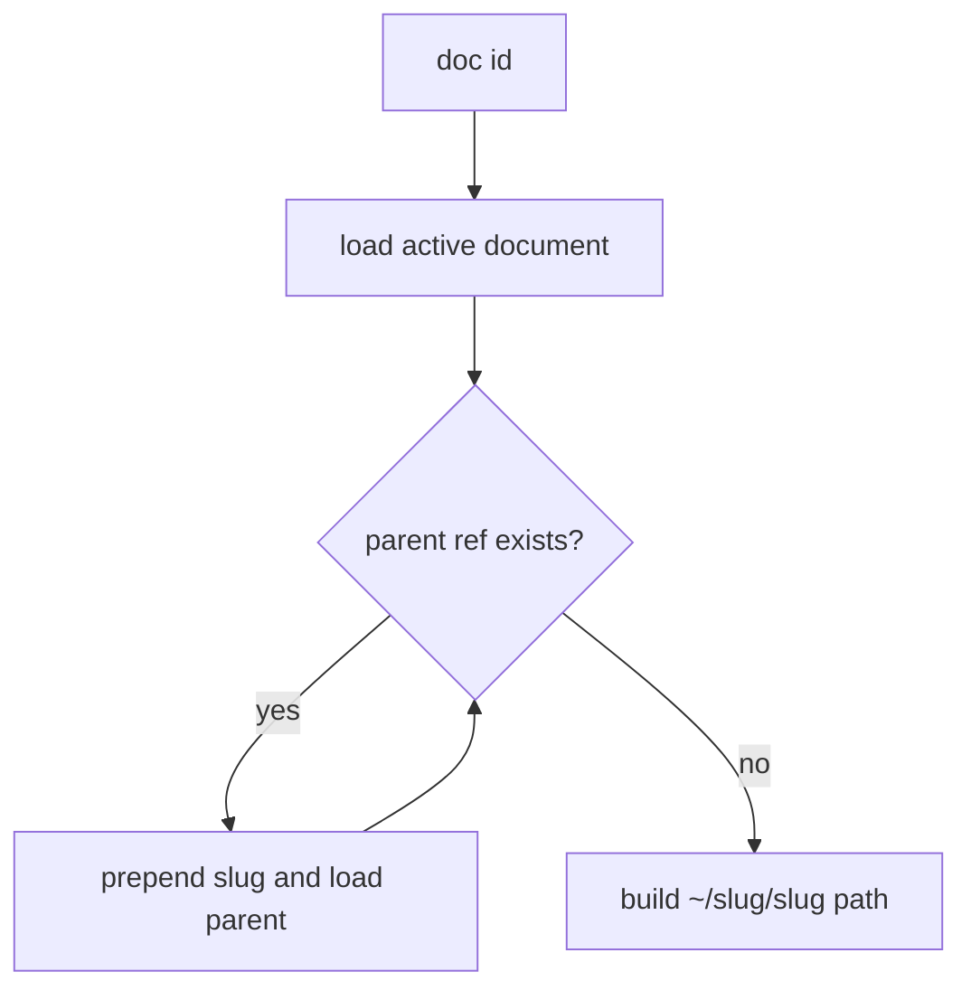
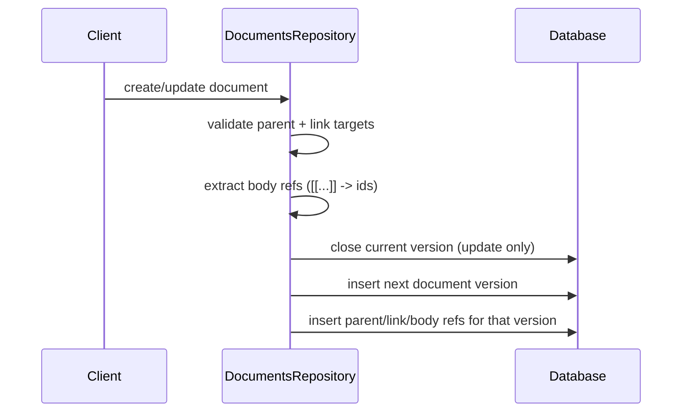

# Daycare Document Store

The document store provides versioned, user-scoped markdown documents with hierarchical paths and explicit references.

## Tables

- `documents` uses temporal versioning: `(user_id, id, version)`.
- `document_references` rows are immutable per source version.
- `kind` values are `parent`, `link`, `body`.

## Path Resolution

- Paths are computed from active `parent` references.
- Roots have no `parent` reference and resolve to `~/slug`.

## Version + Reference Lifecycle

- Updating a document creates a new version and a new set of refs.
- Old reference rows remain tied to old versions.
- Delete is blocked when an active document has `parent` or `link` reference to the target.
- Parent links are validated as acyclic before writes; cycle-creating updates are rejected.
- Concurrent writes to the same `(user, parent, slug)` scope are serialized to preserve sibling slug uniqueness.
