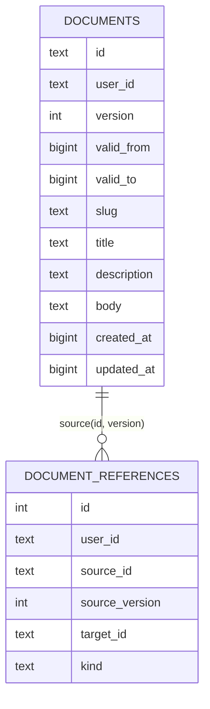
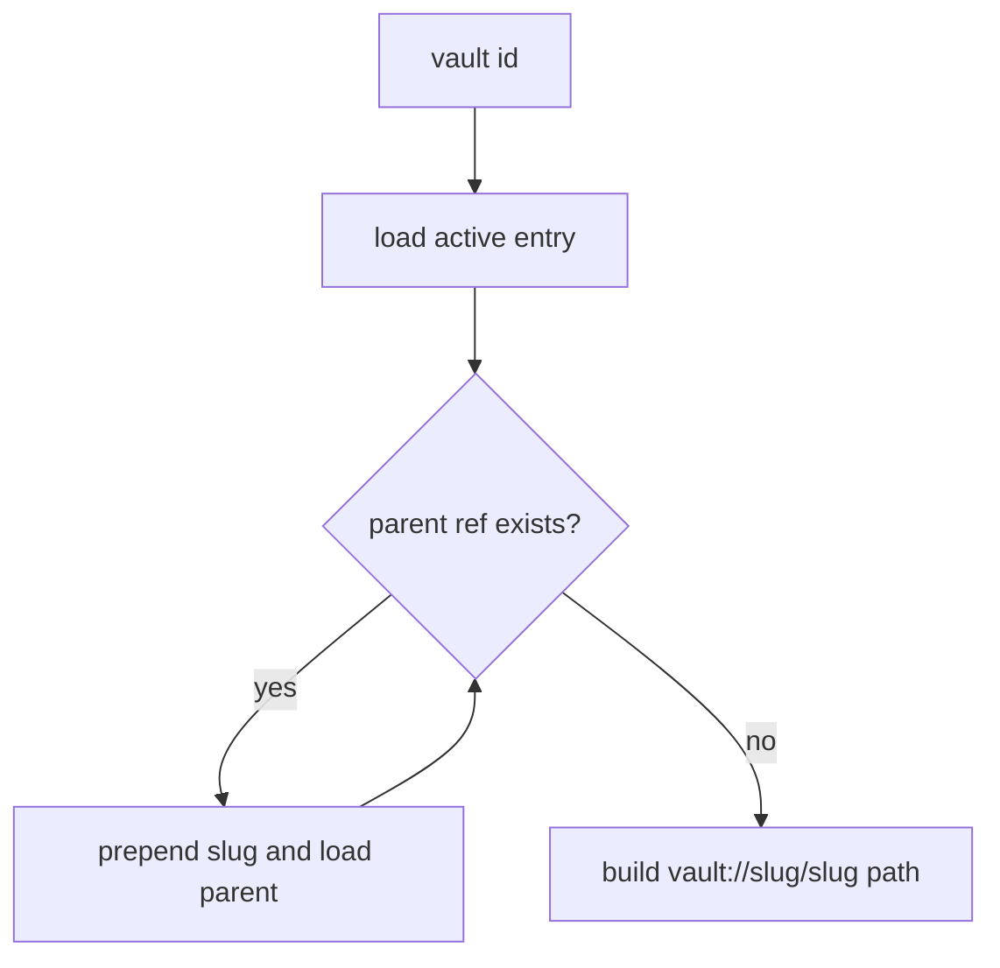
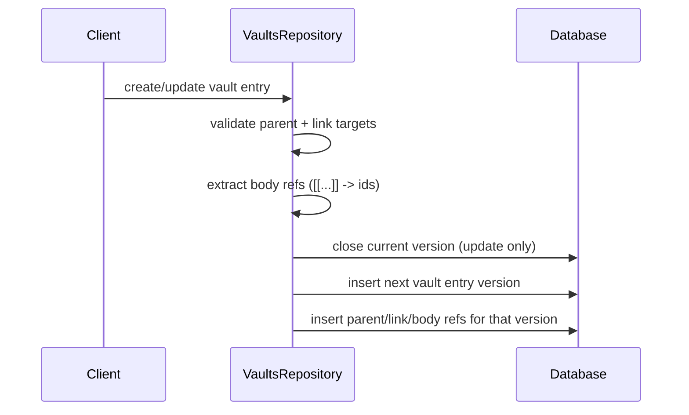
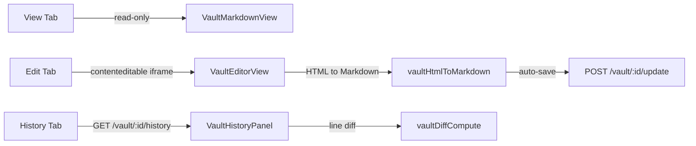

# Daycare Vault

The vault provides versioned, user-scoped markdown entries with hierarchical paths and explicit references.

## Tables

```mermaid
erDiagram
    DOCUMENTS {
        text id
        text user_id
        int version
        bigint valid_from
        bigint valid_to
        text slug
        text title
        text description
        text body
        bigint created_at
        bigint updated_at
    }

    DOCUMENT_REFERENCES {
        int id
        text user_id
        text source_id
        int source_version
        text target_id
        text kind
    }

    DOCUMENTS ||--o{ DOCUMENT_REFERENCES : "source(id, version)"
```

- `documents` uses temporal versioning: `(user_id, id, version)`.
- `document_references` rows are immutable per source version.
- `kind` values are `parent`, `link`, `body`.
- Public vault paths use `vault://...`, but storage still stays in the `documents` tables.

## Path Resolution

```mermaid
flowchart TD
    A[vault id] --> B[load active entry]
    B --> C{parent ref exists?}
    C -->|yes| D[prepend slug and load parent]
    D --> C
    C -->|no| E[build vault://slug/slug path]
```

- Paths are computed from active `parent` references.
- Roots have no `parent` reference and resolve to `vault://slug`.

## Version + Reference Lifecycle

```mermaid
sequenceDiagram
    participant Client
    participant Repo as VaultsRepository
    participant DB as Database

    Client->>Repo: create/update vault entry
    Repo->>Repo: validate parent + link targets
    Repo->>Repo: extract body refs ([[...]] -> ids)
    Repo->>DB: close current version (update only)
    Repo->>DB: insert next vault entry version
    Repo->>DB: insert parent/link/body refs for that version
```

- Updating a vault entry creates a new version and a new set of refs.
- Old reference rows remain tied to old versions.
- Delete is blocked when an active vault entry has `parent` or `link` reference to the target.
- Parent links are validated as acyclic before writes; cycle-creating updates are rejected.
- Concurrent writes to the same `(user, parent, slug)` scope are serialized to preserve sibling slug uniqueness.

## API Endpoints

| Method | Path | Description |
|--------|------|-------------|
| GET | `/vault/tree` | All active vault entries as a flat array with parentId |
| GET | `/vault/:id` | Single vault entry with parentId resolved |
| GET | `/vault/:id/history` | All versions of a vault entry (newest first) |
| POST | `/vault/create` | Create a new vault entry |
| POST | `/vault/:id/update` | Update vault entry fields |
| POST | `/vault/:id/delete` | Soft-delete a vault entry (blocked if referenced) |

## Vault Viewer

The vault viewer (`VaultView`) provides three tabs:

- **View** — renders the markdown body as themed HTML
- **Edit** — WYSIWYG editor using `contenteditable` in an iframe with a formatting toolbar; auto-saves with debounce
- **History** — shows all vault entry versions with timestamps and inline diffs between consecutive versions

```mermaid
flowchart LR
    A[View Tab] -->|read-only| B[VaultMarkdownView]
    C[Edit Tab] -->|contenteditable iframe| D[VaultEditorView]
    D -->|HTML to Markdown| E[vaultHtmlToMarkdown]
    E -->|auto-save| F[POST /vault/:id/update]
    G[History Tab] -->|GET /vault/:id/history| H[VaultHistoryPanel]
    H -->|line diff| I[vaultDiffCompute]
```

Protected vault entries (memory/system/people subtrees) hide the Edit tab.
