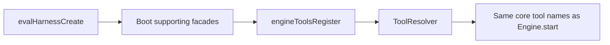
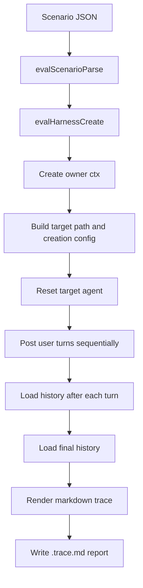
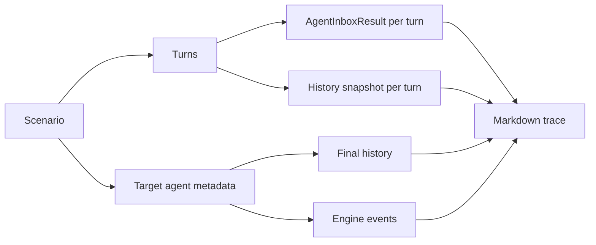

# Eval Harness

## Purpose

The eval harness provides a lightweight, headless way to run scripted conversations against a real in-process Daycare agent and inspect the result as a markdown trace.

It is intended for:

- regression checks while changing prompts, tools, or agent loop behavior
- human review of tool use, `run_python` execution, and side effects
- reproducible smoke tests that do not require HTTP, `portless`, or a long-lived engine process
- fast local debugging with deterministic mock inference

It is not intended to replace end-to-end app or connector tests. It focuses on agent behavior inside the runtime.

## Command

Run from the repo root:

```bash
yarn eval path/to/scenario.json
```

Optional explicit output file:

```bash
yarn eval path/to/scenario.json path/to/output.trace.md
```

Default behavior:

- reads a JSON scenario file
- resolves relative scenario and output paths from the shell directory where `yarn eval` is invoked
- boots an in-process `AgentSystem`
- uses live configured inference providers by default
- creates or resolves the target agent from the scenario
- sends all turns synchronously with `postAndAwait()`
- collects history and engine events
- writes `<scenario-name>.trace.md` next to the scenario file
- prints a short summary to stdout

The script defaults its own log level to `silent` unless `DAYCARE_LOG_LEVEL` or `LOG_LEVEL` is already set. This keeps the CLI output focused on the eval summary instead of normal engine debug logs.

## Design Constraints

The harness intentionally keeps runtime state small and disposable:

- storage uses in-memory PGlite through `storageOpenTest()`
- the runtime still gets a temp data directory for user homes, auth files, and delayed signal state
- no HTTP server is started
- no `portless` proxy is required
- the CLI uses live configured providers unless a scenario defines scripted inference or a caller explicitly opts into mock mode

This means eval runs stay isolated, but still exercise the real agent system, live provider routing, inbox processing, history persistence, and event emission paths.

## Tool Surface

The harness now registers the same built-in core tool catalog as the main engine runtime.

That includes:

- task, background, and agent control tools
- vault, fragment, signal, and observation tools
- workspace, channel, friend, secret, and mini-app tools
- image, speech, media, PDF, Mermaid, and PSQL tools

The provider registries still start empty unless the run loads plugins or test doubles, so generation tools can be present in the catalog even when no concrete provider is available.



## High-Level Flow



## Scenario Format

Basic shape:

```json
{
    "name": "greeting-test",
    "agent": {
        "kind": "agent",
        "path": "test-agent"
    },
    "turns": [
        { "role": "user", "text": "Hello, what can you do?" },
        { "role": "user", "text": "Create a reminder for tomorrow" }
    ]
}
```

Rules:

- `name` is required
- `name` must not contain `/`
- `agent.kind` is required
- `agent.path` is required
- `agent.path` must be a single path segment, not a full agent path
- `turns` must contain at least one turn
- every turn must currently be a user turn
- every turn must contain non-empty `text`

Optional scripted inference:

- `inference.type: "scripted"` lets a scenario provide deterministic mock model behavior
- `inference.calls` is the ordered list of inference completions for the run
- each call contains `branches`, evaluated in order
- a branch may match on `whenSystemPromptIncludes`
- a matching branch returns either a text `message` or a `toolCall`

Example:

```json
{
    "name": "subagent-first",
    "agent": {
        "kind": "connector",
        "path": "telegram"
    },
    "turns": [{ "role": "user", "text": "Investigate the onboarding failures." }],
    "inference": {
        "type": "scripted",
        "calls": [
            {
                "branches": [
                    {
                        "whenSystemPromptIncludes": [
                            "be subagent-first for almost every non-trivial request"
                        ],
                        "toolCall": {
                            "id": "tool-1",
                            "name": "start_background_agent",
                            "arguments": {
                                "prompt": "Investigate the onboarding failures."
                            }
                        }
                    },
                    {
                        "message": "inline fallback"
                    }
                ]
            }
        ]
    }
}
```

### Supported Agent Kinds

The current scenario format supports direct path-addressable kinds only:

- `connector`
- `agent`
- `app`
- `cron`
- `task`
- `subuser`
- `supervisor`

These all map cleanly from:

- a user id resolved by the harness
- one `kind`
- one path segment from `agent.path`

### Why Some Kinds Are Not Supported Yet

Nested or derived agent kinds such as `sub`, `memory`, `compactor`, and `search` need extra parent context or allocation logic that is not representable with the current minimal scenario shape.

Those are intentionally out of scope for the first version so the format stays simple and predictable.

## Agent Path Resolution

The harness does not accept raw full paths in the scenario. Instead it builds canonical runtime paths from `agent.kind` and `agent.path`.

Examples:

- `{"kind":"agent","path":"writer"}` → `/<owner>/agent/writer`
- `{"kind":"cron","path":"daily-check"}` → `/<owner>/cron/daily-check`
- `{"kind":"task","path":"cleanup"}` → `/<owner>/task/cleanup`
- `{"kind":"connector","path":"telegram"}` → `/<owner>/telegram`

For `supervisor`, the scenario still carries a `path` field for consistency, but the runtime path is the singleton supervisor path under the owner user.

## Runtime Behavior

Each run performs the following sequence:

1. Parse the scenario JSON.
2. Boot a fresh in-process eval harness.
3. Resolve the owner user context from test storage.
4. Build the target `AgentPath` and `AgentCreationConfig`.
5. Send a `reset` item to initialize the target agent and fresh session state.
6. Send each user turn in order using `AgentSystem.postAndAwait()`.
7. Capture a history snapshot after each turn.
8. Capture final history after all turns complete.
9. Collect all engine events emitted during the run window.
10. Render the final markdown report.

### Why `reset` Runs First

The reset step guarantees:

- the agent exists
- the session is fresh
- the trace is easier to reason about
- previous persisted state does not leak into a new eval run

## Trace Contents

An eval trace contains:

- scenario metadata
- target agent id
- target agent path
- total start/end timestamps
- reset/setup timing
- per-turn results from `postAndAwait()`
- per-turn history snapshots
- final history
- engine events captured during the run

Conceptually:



## Markdown Output

The renderer is designed for human review, not machine parsing.

Sections:

- header with scenario name, target agent, timestamps, duration, and reset time
- `## History` with rendered history records
- `## Events` with timestamped engine events and payloads
- `## Footer` with token totals, event counts, and history count

### History Rendering

Current mappings:

- `user_message` → `### User`
- `assistant_message` → `### Assistant` plus rendered tool calls when present
- `assistant_rewrite` → `#### Assistant Rewrite`
- `rlm_start` → `#### Code Execution` plus a code fence
- `rlm_tool_call` → blockquoted tool call line
- `rlm_tool_result` → blockquoted tool result line, truncated when long
- `rlm_complete` → blockquoted final execution output line
- `note` → blockquoted note line

### Token Summary

The footer aggregates token usage from assistant history records when token accounting is present. This gives a compact view of inference cost/size without forcing a reader to inspect every assistant record.

### Event Counts

The footer also summarizes engine event types captured during the run. This is useful for spotting changes in side effects such as:

- extra `agent.sleep` / `agent.woke` transitions
- missing `agent.created`
- unexpected signal scheduling

## Example

Scenario:

```json
{
    "name": "hello-world",
    "agent": {
        "kind": "agent",
        "path": "hello-agent"
    },
    "turns": [
        { "role": "user", "text": "Say hello in one sentence." }
    ]
}
```

Command:

```bash
yarn eval ./tmp/hello-world.json
```

Expected output behavior:

- summary printed to stdout
- `./tmp/hello-world.trace.md` created
- report includes at least one `### User` and one `### Assistant` section

## Implementation Files

Core files:

- `packages/daycare/sources/eval/evalScenario.ts`
- `packages/daycare/sources/eval/evalHarness.ts`
- `packages/daycare/sources/eval/evalRun.ts`
- `packages/daycare/sources/eval/evalTraceRender.ts`
- `packages/daycare/sources/eval/evalCli.ts`
- `packages/daycare/scripts/evalRun.mjs`

Supporting docs:

- `packages/daycare/sources/eval/README.md`
- `packages/daycare/doc/EVAL_HARNESS.md`

## Testing Strategy

The eval module has adjacent tests for:

- scenario validation
- harness boot
- scenario execution
- trace rendering
- CLI file I/O behavior

Repo expectations still apply:

- use in-memory PGlite in tests
- keep tests next to the files under test
- keep tests minimal and deterministic

## Troubleshooting

### The scenario parser rejects my kind

Use one of the currently supported direct kinds:

- `connector`
- `agent`
- `app`
- `cron`
- `task`
- `subuser`
- `supervisor`

If you need `memory`, `search`, or `sub`, the scenario format needs to be extended first.

### The output file name is unexpected

The default output is based on `scenario.name`, not the input filename.

Example:

- input file: `foo.json`
- scenario name: `bar`
- output file: `bar.trace.md`

### I want engine debug logs during the run

Set a log level explicitly before invoking the command:

```bash
DAYCARE_LOG_LEVEL=debug yarn eval path/to/scenario.json
```

### I want richer model responses

`yarn eval` uses live configured providers by default. Use scenario-defined scripted inference when you want deterministic prompt-sensitive tool use through the CLI, or pass a custom `InferenceRouter` into `evalHarnessCreate()` programmatically for more complex cases.

## Future Extensions

Good next steps if the harness grows:

- assertions embedded in scenario files
- batch scenario execution
- richer filtering/formatting for large event logs
- support for nested agent kinds that require parent context
- trace diffing between two runs
