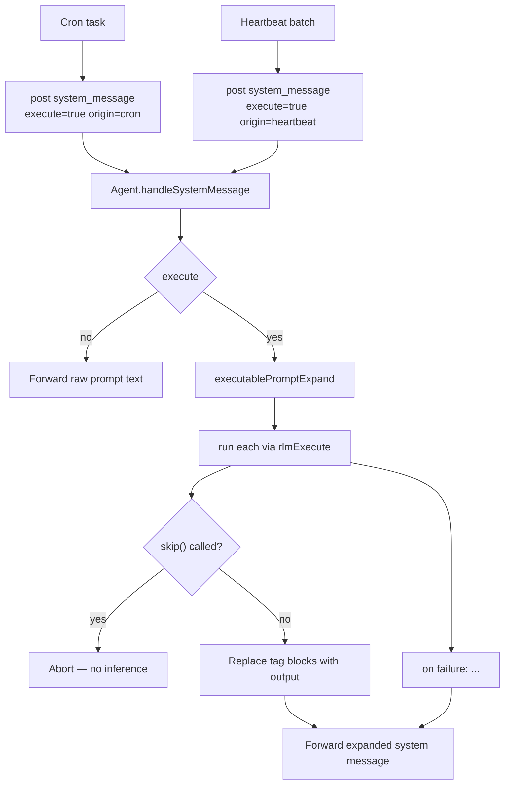
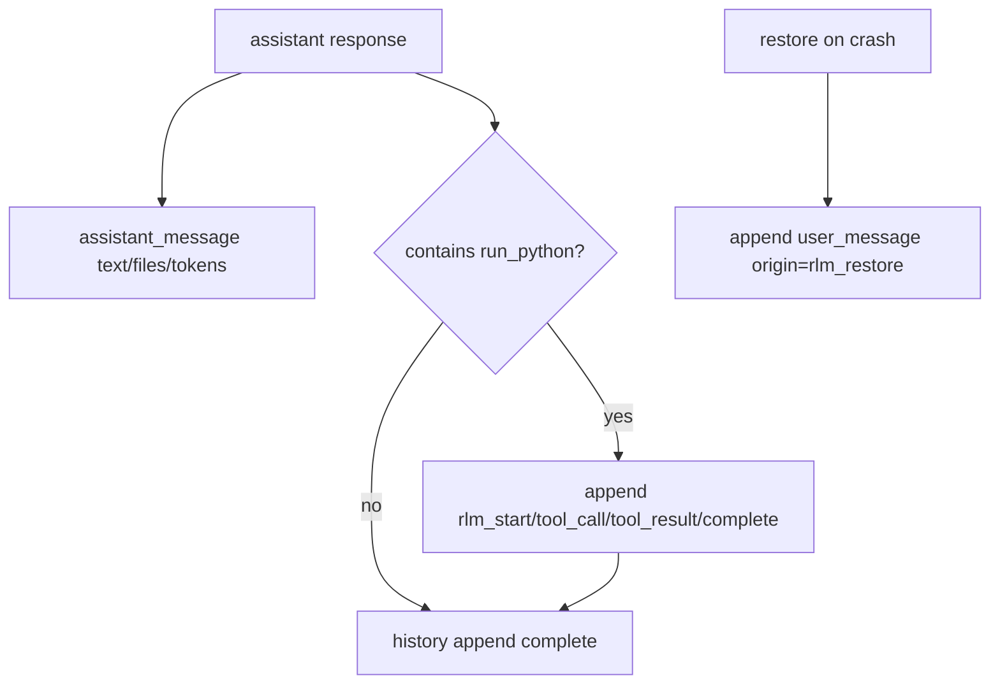

# Executable Prompts

Cron and heartbeat prompts now use existing `system_message` inbox items with an optional `execute` flag.

## Flow

## Skip during expansion

Calling `skip()` inside a `<run_python>` block during prompt expansion aborts the entire system message. No inference runs and `handleSystemMessage` returns `null`. Remaining `<run_python>` blocks are not executed.
`skip()` is exposed as an inline-RLM control function (synthetic runtime function), not as a separately registered classical tool.

## History persistence

Agent history no longer stores classical tool-calling message records (`tool_result`) or assistant `toolCalls`.
Only user/assistant text plus RLM checkpoint records are persisted.

