# Executable Prompts

Cron and heartbeat prompts now use existing `system_message` inbox items with an optional `execute` flag.

## Flow

```mermaid
flowchart TD
  Cron[Cron task] --> PostCron["post system_message<br/>execute=true origin=cron"]
  Heartbeat[Heartbeat batch] --> PostHeartbeat["post system_message<br/>execute=true origin=heartbeat"]
  PostCron --> Agent[Agent.handleSystemMessage]
  PostHeartbeat --> Agent
  Agent --> Gate{features.rlm && execute}
  Gate -- no --> Raw[Forward raw prompt text]
  Gate -- yes --> Expand[executablePromptExpand]
  Expand --> Run["run each <run_python> via rlmExecute"]
  Run --> Skip{"skip() called?"}
  Skip -- yes --> Abort[Abort — no inference]
  Skip -- no --> Replace[Replace tag blocks with output]
  Run --> Error["on failure: <exec_error>...</exec_error>"]
  Replace --> Forward[Forward expanded system message]
  Error --> Forward
```

## Skip during expansion

Calling `skip()` inside a `<run_python>` block during prompt expansion aborts the entire system message. No inference runs and `handleSystemMessage` returns `null`. Remaining `<run_python>` blocks are not executed.
