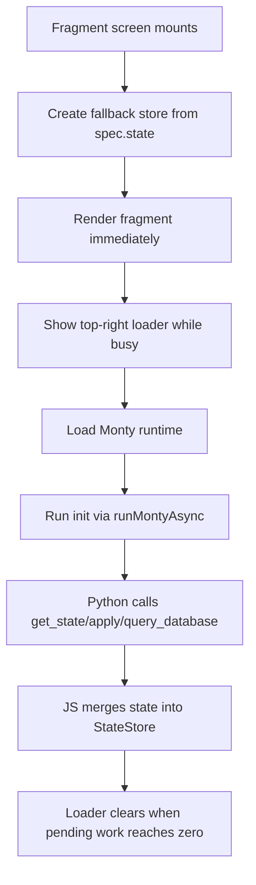

# Fragment Python Runtime

The fragment runtime now uses async-capable external functions instead of passing state into Python action signatures.

## Runtime Flow



## Python API

```mermaid
flowchart LR
    A[get_state()] --> B[Read current store snapshot]
    C[apply({...})] --> D[Deep-merge patch into store]
    E[apply(lambda state: {...})] --> F[Evaluate lambda in Python]
    F --> D
    G[await query_database(dbId, sql, params)] --> H[POST /databases/:id/query]
    H --> I[Rows returned to Python]
```

## Notes

- `init()` may be synchronous or async.
- Action functions receive `params` only.
- `spec.state` renders immediately, then Python can refine it asynchronously.
- Busy state covers both initial mount work and later action-triggered work.
