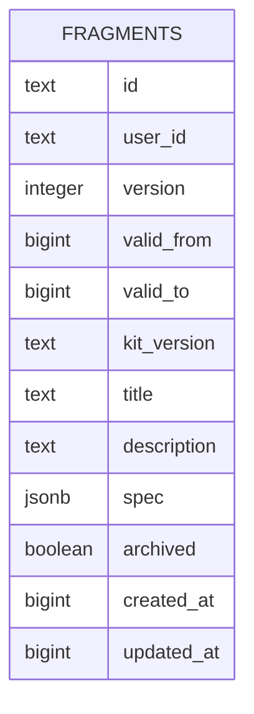
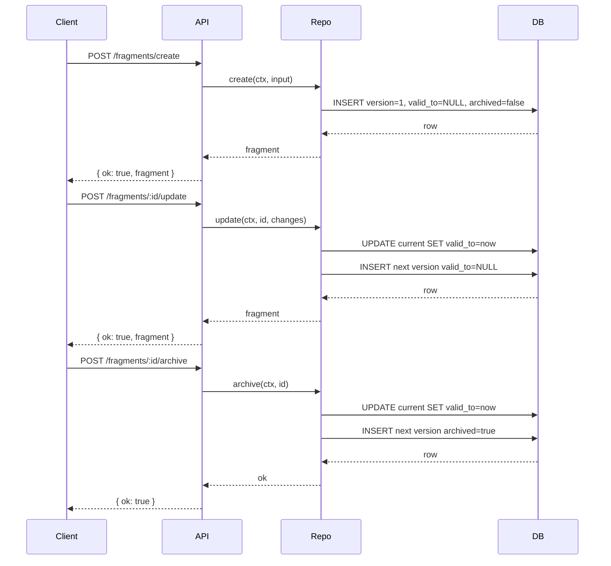

# Fragments System

Fragments are versioned JSON UI specs stored in the `fragments` table. They are user-scoped, soft-archivable, and event-sourced through `version`/`validFrom`/`validTo`.

## Data Model

Each row stores:

- `id`, `userId`: logical fragment identity and owner
- `version`, `validFrom`, `validTo`: temporal versioning fields
- `kitVersion`: widget catalog version used to author the spec
- `title`, `description`: human-readable metadata
- `spec`: JSON render spec payload
- `archived`: soft-archive flag (`true` means hidden from list endpoints)
- `createdAt`, `updatedAt`: unix timestamps in milliseconds



## API Endpoints

- `GET /fragments`: list active non-archived fragments
- `GET /fragments/:id`: fetch latest fragment version, including archived
- `POST /fragments/create`: create a new fragment
- `POST /fragments/:id/update`: write next version for a fragment
- `POST /fragments/:id/archive`: archive via version advance (`archived=true`)

## LLM Tools

Core tools expose fragment CRUD to all agents:

- `fragment_create`: create a new fragment (`title`, `kitVersion`, `spec`, optional `description`)
- `fragment_update`: update an existing fragment by `fragmentId` with partial fields
- `fragment_archive`: archive a fragment by `fragmentId`

Tool return contracts:

- `fragment_create` -> `{ summary, fragmentId, version }`
- `fragment_update` -> `{ summary, fragmentId, version }`
- `fragment_archive` -> `{ summary, fragmentId }`

## Create-Fragment Skill

The `create-fragment` skill is generated from:

- Template header: `packages/daycare/sources/prompts/SKILL_TEMPLATE.md`
- Widget catalog prompt: `widgetsCatalog.prompt()` in `packages/daycare-app/sources/widgets/widgets.ts`
- Export script: `npx tsx packages/daycare-app/scripts/exportFragmentSkill.ts`
- Output: `packages/daycare/sources/skills/software-development/create-fragment/SKILL.md`

```mermaid
flowchart TD
    A[SKILL_TEMPLATE.md] --> C[exportFragmentSkill.ts]
    B[widgetsCatalog.prompt()] --> C
    C --> D[skills/software-development/create-fragment/SKILL.md]
    D --> E[Skills loader]
    E --> F[LLM can call fragment_create/update/archive]
```

## Version Flow



## TodoList Component

The fragment catalog now includes a state-bound `TodoList` component for interactive todos with drag reordering.

- `props.items` is expected as a state binding (for example `{ "$bindState": "/todos" }`)
- supports row features: checkbox, title edit, icons, counter, pill, hint, toggle icon
- supports inline separators in the same list via `type: "separator"`
- emits: `move`, `press`, `toggle`, `toggleIcon`, `change`

## Fragment Python

Fragments can include an optional root-level `code` string with Python source executed in the app via `react-native-monty`.

- `init()` returns the initial state object for the fragment. When present, it overrides `spec.state`.
- Action functions such as `increment(state, params)` are invoked by `on` bindings and must return the next top-level state object.
- Runtime limits are capped at `5` seconds and `10 MB` per execution.
- Fragment saves are verified with backend Monty parsing, and any referenced custom action names must resolve successfully before create/update is accepted.
- If `code` is missing or blank, fragments fall back to static `spec.state ?? {}` behavior.

Example:

```json
{
    "root": "main",
    "state": { "count": 0 },
    "code": "def init():\n    return {\"count\": 1}\n\ndef increment(state, params):\n    return {\"count\": state[\"count\"] + params.get(\"amount\", 1)}",
    "elements": {
        "main": {
            "type": "Button",
            "props": { "label": "Increment" },
            "on": {
                "press": {
                    "action": "increment",
                    "params": { "amount": 1 }
                }
            },
            "children": []
        }
    }
}
```

```mermaid
flowchart TD
    A[Fragment spec] --> B{code present?}
    B -- no --> C[createStateStore spec.state]
    B -- yes --> D[load Monty runtime once]
    D --> E{init defined?}
    E -- no --> C
    E -- yes --> F[run init()]
    F --> G[createStateStore init result]
    G --> H[build proxy handlers]
    H --> I[UI action binding]
    I --> J[run action(state, params)]
    J --> K[merge returned top-level keys into state store]
```
