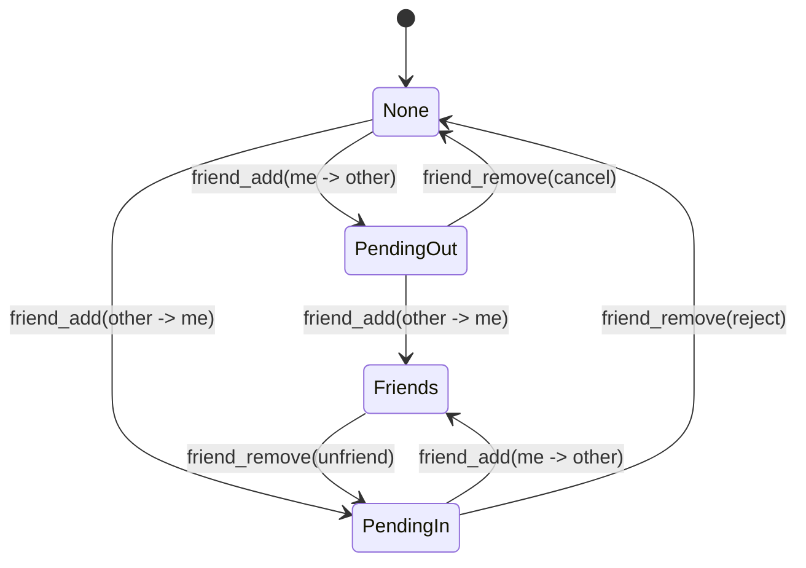

# Friends System

The friends system provides three tools:
- `friend_add(nametag)`
- `friend_remove(nametag)`
- `friend_send(nametag, message)`

It no longer supports subuser-share flows.

## Relationship lifecycle

## Data model

`connections` keeps one canonical row per user pair (`user_a_id < user_b_id`):
- `requested_a`, `requested_b`
- `requested_a_at`, `requested_b_at`

Mutual friendship means both request flags are true.

## Messaging

- `friend_send` requires a mutual friendship (`requested_a = 1` and `requested_b = 1`).
- Cross-user delivery goes through `AgentSystem.postToUserAgents()`.
- Friend notifications use `origin="friend:<nametag>"` system messages.
