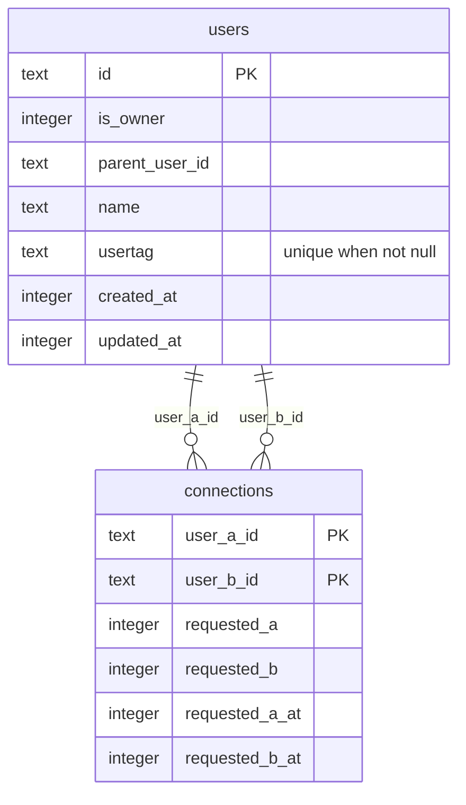
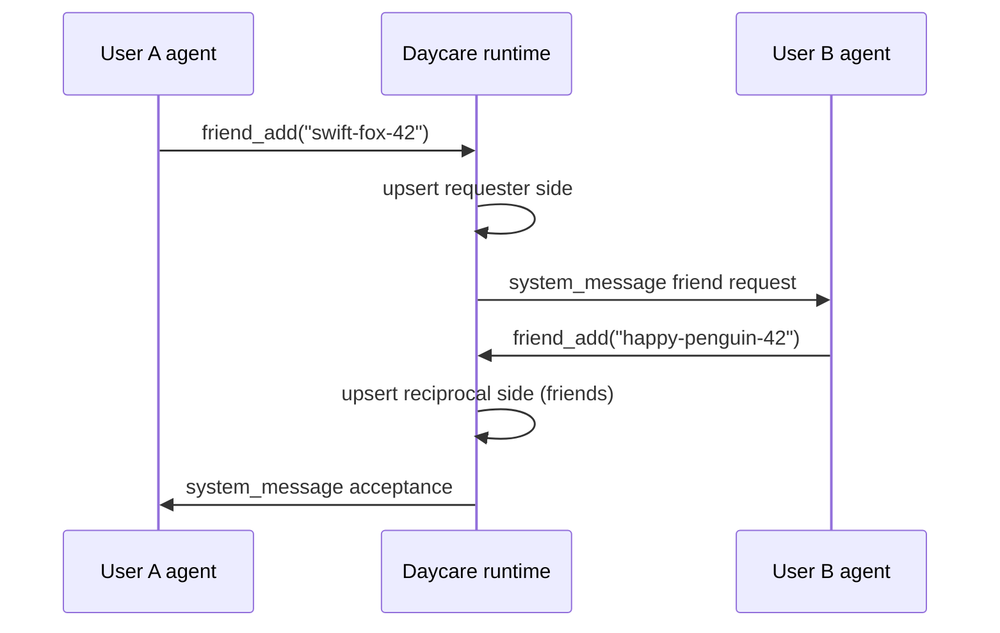
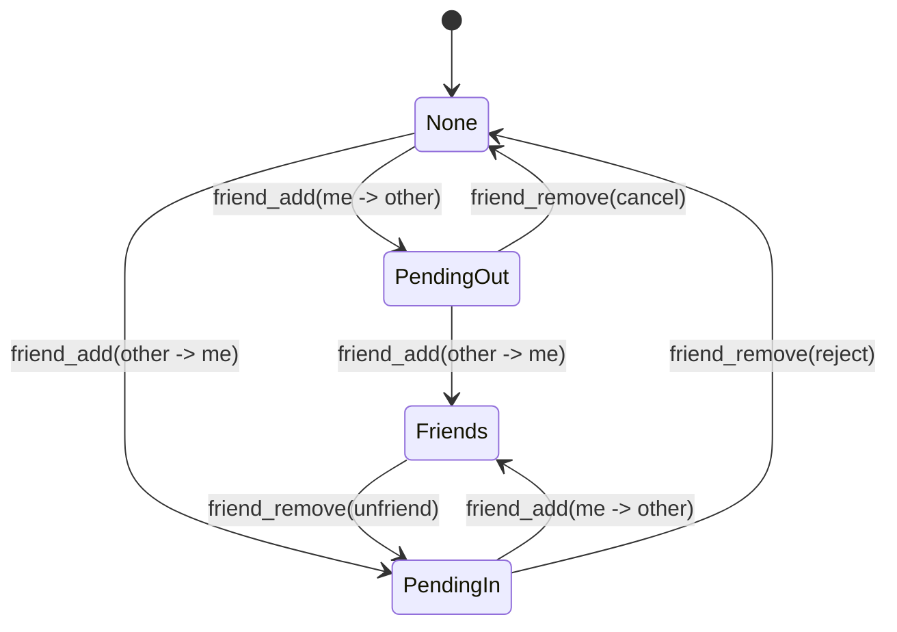

# Friends System

The Friends system adds three user tools:
- `friend_add(usertag)`
- `friend_remove(usertag)`
- `friend_send(usertag, message)`

It is built on:
- `users.usertag` (unique, nullable for legacy records)
- `connections` table with one canonical row per user pair (`user_a_id < user_b_id`)
- `AgentSystem.postToUserAgents()` for cross-user frontend delivery

## Data model

## Friend request flow

## Relationship states

## Messaging behavior

- Friend notifications are delivered as `<system_message origin="friend:<usertag>">...`.
- `friend_send` requires both request flags set (`requested_a = 1` and `requested_b = 1`).
- Payload text in friend messages is XML-escaped before embedding in the system message body.
