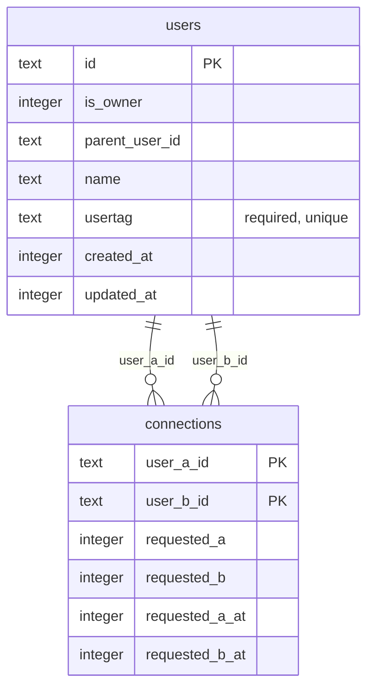
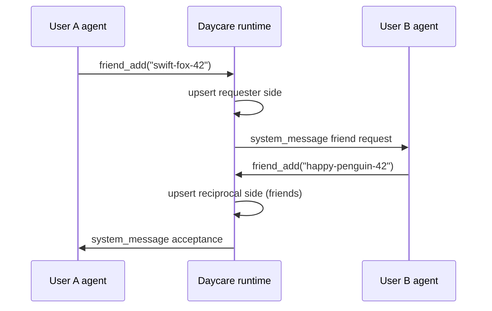
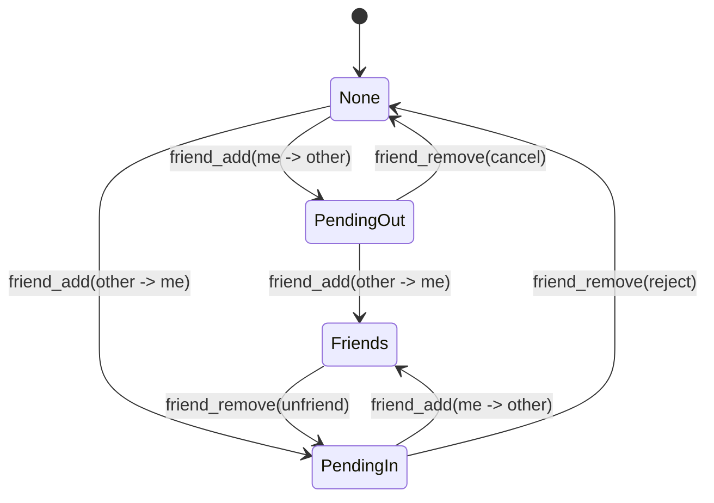
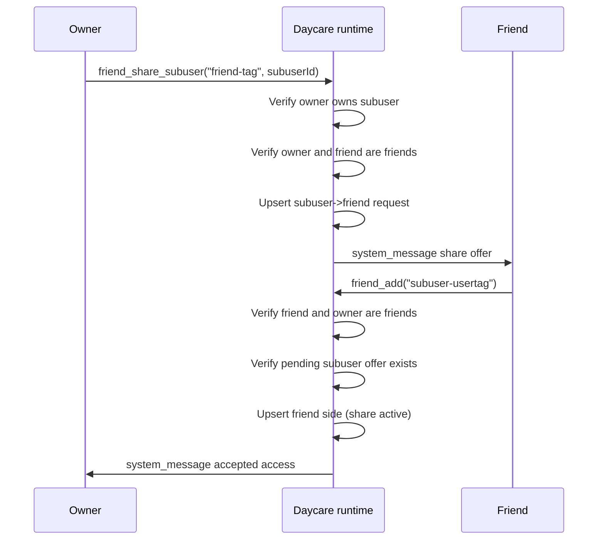
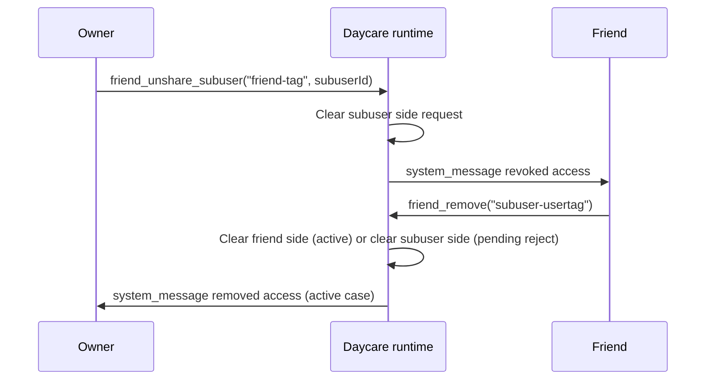

# Friends System

The Friends system adds three user tools:
- `friend_add(usertag)`
- `friend_remove(usertag)`
- `friend_send(usertag, message)`
- `friend_share_subuser(friendUsertag, subuserId)`
- `friend_unshare_subuser(friendUsertag, subuserId)`

It is built on:
- `users.usertag` (required, unique)
- `connections` table with one canonical row per user pair (`user_a_id < user_b_id`)
- `AgentSystem.postToUserAgents()` for cross-user frontend delivery

## Data model

## Friend request flow

## Relationship states

## Messaging behavior

- Friend notifications are delivered as `<system_message origin="friend:<usertag>">...`.
- `friend_send` requires both request flags set (`requested_a = 1` and `requested_b = 1`).
- Payload text in friend messages is XML-escaped before embedding in the system message body.

## Subuser sharing

Owners can share subusers with existing friends by reusing the same `connections` table.
A share is represented by a connection row between `subuser_id` and `friend_id`.

- Pending share: subuser side requested (`requested_subuser = 1`, friend side `0`)
- Active share: both sides requested (`1/1`)
- Acceptance: friend runs `friend_add("<subuser-usertag>")`
- Removal/reject: friend runs `friend_remove("<subuser-usertag>")`
- Owner revoke: `friend_unshare_subuser(...)`

## Shared subuser messaging and topology

- `friend_send("<subuser-usertag>", message)` delivers to the shared subuser gateway agent when share is active.
- Topology for non-subuser callers now includes:
  - `## Friends (N)`
  - per-friend tree items:
    - `→ shared out` for caller-owned subusers shared to that friend
    - `← shared in` for that friend's subusers shared to caller
    - `status=active|pending` and gateway agent id
