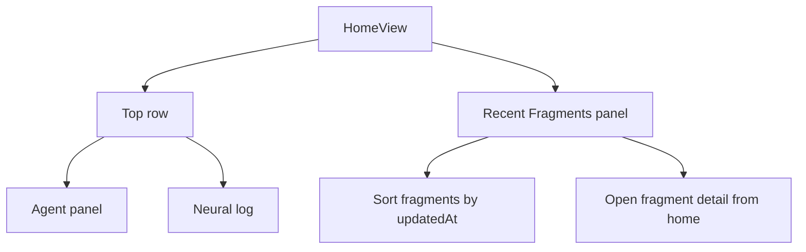

# Home Recent Fragments

## Goal

Simplify the home screen so only the top two dashboard panels remain, then surface the most relevant fragment list directly underneath them.

## What Changed

- Removed the lower home dashboard panels and ticker from the home route.
- Switched the home page root container to `ItemList` so it follows the shared max-width layout convention.
- Added a `Recent Fragments` panel that fetches fragment data, sorts by `updatedAt`, and links to each fragment detail view.

## Result

- Home now shows the agent panel and neural log as the first row.
- `Recent Fragments` sits immediately under that row and becomes the only secondary section on the page.
- Fragment discovery stays available on home without carrying the old activity, routines, and ticker blocks.

## Diagram

