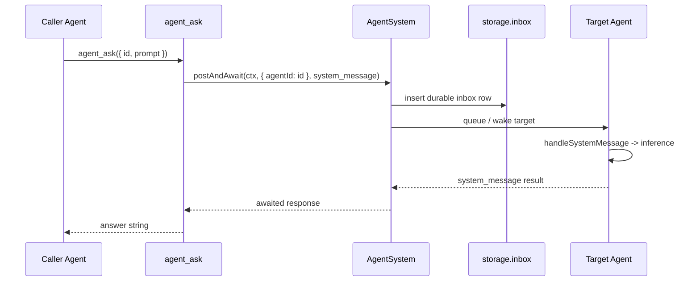

# agent_ask Tool

`agent_ask` sends a prompt to another agent and waits for the reply text in the same tool call.

## Delivery Contract

- The tool uses `AgentSystem.postAndAwait(...)` with a `system_message`.
- `AgentSystem.enqueueEntry(...)` writes the inbox row to `storage.inbox` before it is queued in memory.
- If the target agent is sleeping or unloaded, the row is still durable and is replayed on restore.
- Self-targeting is rejected to avoid deadlocking the caller on its own inbox.

## Key Files

| File | Purpose |
|------|---------|
| `packages/daycare/sources/engine/modules/tools/agentAskTool.ts` | Tool definition and response handling |
| `packages/daycare/sources/engine/agents/agentSystem.ts` | Durable enqueue and `postAndAwait` |
| `packages/daycare/sources/engine/agents/agent.ts` | `system_message` execution and reply generation |
