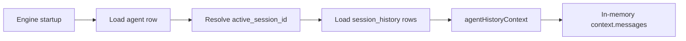

# Agent Context Restore

Agent runtime context is no longer persisted. `context.messages` is rebuilt from
the active SQLite session history on startup.

Context restore source of truth:
- `agents.active_session_id` selects the active session.
- `session_history` rows for that session are loaded in append order.
- `agentHistoryContext()` rebuilds prompt-visible messages from history records.
- if no active session/history exists, context starts empty.

