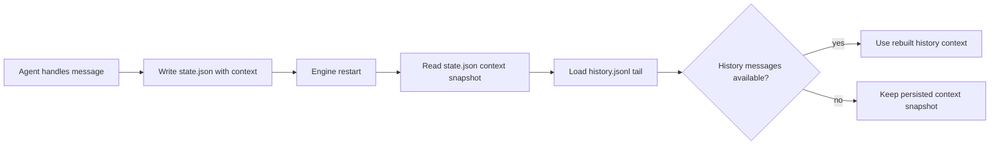

# Agent Context Restore

Agent `state.json` now stores `context.messages` so restart can keep a durable context snapshot.
On restore, history reconstruction still takes priority, but an empty history load no longer wipes the persisted context.

