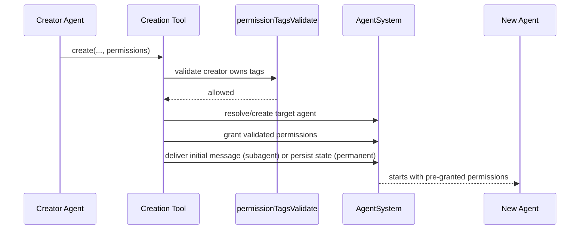

# Agent Creation Permission Pre-Grants

`start_background_agent` and `create_permanent_agent` now accept an optional
`permissions` list (`@network`, `@read:<abs-path>`, `@write:<abs-path>`).
Creation validates that the creator already has every requested permission
before any grants are applied.

## Flow

## Notes

- Validation runs against the creator's current permissions, matching `grant_permission` semantics.
- Subagent creation grants permissions before posting the first prompt.
- Permanent agent create/update applies validated tags directly into persisted `state.json`.
